# Foundation and Tools {#ch:fondation}

^[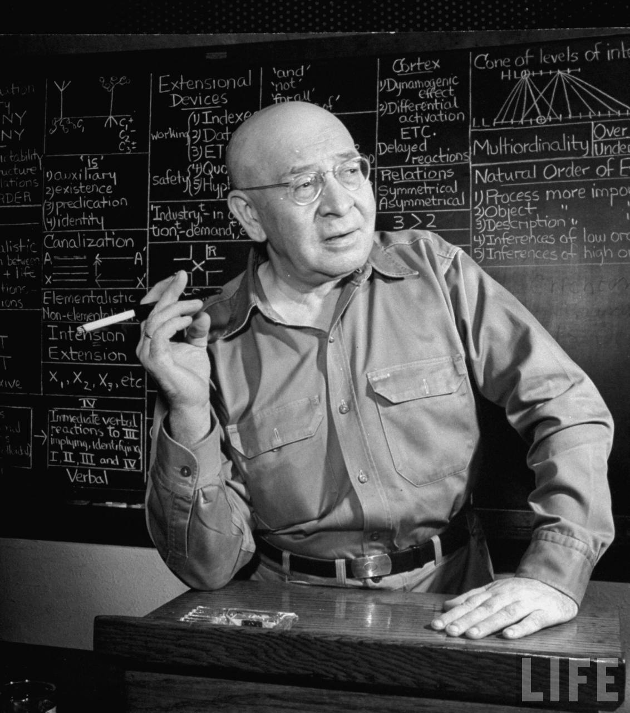 Alfred Korzybski [-@korzybski_science_1933, ch. 4 pp. 58]]

> _"A map *is not* the territory it represents, but, if correct, it has a *similar structure* to the territory, which accounts for its usefulness."_

Mathematics and logic are at the heart of all formal sciences, including computer science. The boundary between mathematics and computer science is quite blurry. Indeed, computer science is applied mathematics and mathematics are abstract computer science. Both cannot be separated when needing a formal description of a new model.

In mathematics, a *foundation* is an *axiomatic theory* that is consistent and well-defined. It can also be called a **model**. For a foundation to be generative of a subset of mathematics, it must define all the supported notions.
<!--First it is interesting to note that some parts of mathematics are simply incompatible with others. This is due to the variation of their axioms that makes some formalism allow what others forbids. The choice of axioms is as important as it is arbitrary.-->

<!--Since we need to use existing mathematical structures that are beyond the expressivity of the classical mathematics ^[Hypergraphs (see @sec:hypergraph) are fundamentally incompatible with the @axi:fondation of ZFC.], we need a non-classical foundation. There are several existing ones but since we only use a subset of their possibilities, it is more efficient to create a simpler foundation that fits our use.-->

In this chapter, we define a new formalism as well as a proposed foundation that lies on the bases of the type theory and lambda calculus. With this formalism, we define the classical set theory (which is the foundation for classical mathematics). The contribution is mainly in the axiomatic system, and functional algebra. The rest is simply an explanation, using our formalism, of existing mathematical notions and structures commonly used in computer science. **This formalism is used for all the formulas later on this document.**
<!--^[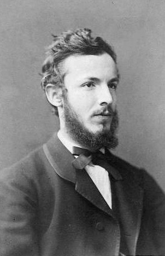 @cantor_property_1874]-->

## Existing Model Properties

<!--Some of the most important problems in mathematics are the consistency and formalization issues. Research on these issues starts at the end of the 19^th^ century, with Cantor inventing set theory. Then after a crisis in the beginning of the 20^th^ century with Russel's paradox and Gödel's incompletude theorem, revised versions of the set theory become one of the foundations of mathematics. The most accepted version is the Zermelo-Fraenkel axiomatic set theory with the axiom of Choice (ZFC) ^[@fraenkel_foundations_1973, @ciesielski_set_1997]. This effort leads to a formalization of mathematics itself, at least to a certain degree.-->

Any knowledge must be expressed using an encoding support (medium) like a language. Natural languages are quite expressive and allow for complex abstract ideas to be communicated between individuals. However, in science we encounter the first issues with such a language. It is culturally biased and improperly conveys formal notions and proof constructs. Indeed, natural languages are not meant to be used for rigorous mathematical proofs.
This is one of the main conclusions of the works of @korzybski_science_1958 on "general semantics". The original goal of Korzybski was to pinpoint the errors that led humans to fight each other in World War I. He affirmed that the language is unadapted to convey information reliably about objective facts or scientific notions.
 There is a discrepancy between the natural language and the underlying structure of the reality.
<!--This issue is exacerbated in mathematics as the ambiguity in the definition of a term can be the cause for a contradiction and make the entire theory inconsistent.-->

<!-- _"Mathematics may be defined as the subject in which we never know what we are talking about, nor whether what we are saying is true."_ ^[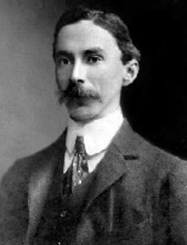 @russell_mysticism_1917] -->

<!--Mathematics is meant to be above those definition issues. Indeed, most of mathematics is defined with a well-formed foundation and their validity has been tested over decades if not centuries. A branch of mathematics is even dedicated to do analysis of theories and their properties and behaviors. This domain is called **model theory** [@robinson_introduction_1963].-->

<!--Indeed, there are some undesirable properties for a theory. Indeed, if the definition of a theory must rely on an external dependency, it can make the definition ambiguous or the circularity in the definitions can cause them to be formally undefined. @Fig:theory illustrates how the main current mathematical theories are linked and how they all present implicit circularity.-->

<!--This issue is quite trivial to fix, we simply need to explicitly state the dependencies of a theory while defining it. Indeed, the task of removing all circularity seems to be quite difficult if not impossible. The main reason being a property of formalism.-->

In the following sections we describe a few inherent properties of formalism and mathematical reasoning that are useful to consider when defining a theory.

### Abstraction

> **abstraction** (n.d.): _The process of formulating generalized ideas or concepts by extracting common qualities from specific examples_ ^[@collinsenglishdictionary_abstraction_2014]

The idea behind abstraction is to simplify the representation of complex instances. This mechanism is at the base of any knowledge representation system. Indeed, it is unnecessarily expensive to try to represent all properties of an object. An efficient way to reduce that knowledge representation is to prune away all irrelevant properties while also only keeping the ones that will be used in the context. *This means that abstraction is a losy process* since information is lost when abstracting from an object.

Since this is done using a language as a medium, this language is a *host language*. Abstraction will refer to an instance using a *term* (also called symbol) of the host language. If the host language is expressive enough, it is possible to do abstraction on an object that is already abstract. The number of layers abstraction needed for a term is called its *abstraction level*. Very general notions have a higher abstraction level and we represent reality using the null abstraction level. In practice abstraction uses terms of the host language to bind to a referenced instance in a lower abstraction level. This forms a structure that is strongly hierarchical with higher abstraction level terms on top.

::: example
We can describe an individual organism with a name that is associated to this specific individual. If we name a dog "Rex" we abstract a lot of information about a complex, dynamic living being. We can also abstract from a set of qualities of the specimen to build higher abstraction. For example, its species would be _Canis lupus familiaris_ from the _Canidae_ family. Sometimes several terms can be used at the same abstraction level like the commonly used denomination "dog" in this case. ^[]
:::

Terms are only a part of that structure. It is possible to combine several terms into a *formula* (also called proposition, expression or statements).

### Formalization

> **formal** (adj.): _Relating to or involving outward form or structure, often in contrast to content or meaning._ ^[@americanheritagedictionary_formal_2011]

A formalization is the act to make formal. The word "formal" comes from Latin _fōrmālis_, from _fōrma_, meaning form, shape or structure. This is the same base as for the word "formula". In mathematics and *formal sciences* the act of formalization is to reduce knowledge down to formulas. Like stated previously, a formula combines several terms. But a formula must follow rules at different levels:

* *Lexical* by using terms belonging in the host language.
* *Syntactic* as it must follow the grammar of the host language.
* *Semantic* as it must be internally consistent and meaningful.

The information conveyed from a formula can be reduced to one element: its semantic structure. Like its etymology suggests, a formula is simply a structured statement about terms. This structure holds its meaning. Along with using abstraction, it becomes possible to abstract a formula and therefore, to make a formula about other formulas should the host language allowing it.

::: example
The formula using English "dog is man's best friend" combines terms to hold a structure between words. It is lexically correct since it uses English words and grammatically correct since it can be grammatically decomposed as (n. v. n. p. adj. n.). In that the (n.) stands for nouns (v.) for verbs (adj.) for adjectives and (p.) for possessives. Since the verb "is" is the third person singular present indicative of "be" and the adjective is the superlative of "good", this form is correct in the English language. From there the semantic aspect is correct too but that is too subjective and extensive to formalize here. We can also build a formula about a formula like "this is a common phrase" using the referential pronoun "this" to refer to the previous formula.
:::

Any language is comprised of formulas. Each formula holds knowledge about their subject and state facts or belief. A formula can describe other formulas and even *define* them. However, there is a strong limitation of a formalization. Indeed, a complete formalization cannot occur about the host language. It is possible to express formulas about the host language but *it is impossible to completely describe the host language using itself* [@klein_metacompiling_1975]. This comes from two principal reasons. As abstraction is a loose process one cannot completely describe a language while abstracting its definition. If the language is complex enough, its description requires an even more complex *metalanguage* to describe it. And even for simpler language, the issue stands still while making it harder to express knowledge about the language itself. For this we need knowledge of the language _a priori_ and this is contradictory for a definition and therefore impossible to achieve.

When abstracting a term, it may be useful to add information about the term to define it properly. That is why most formal system requires a *definition* of each term using a formula. This definition is the main piece of semantic information on a term and is used when needing to evaluate a term in a different abstraction level. However, this is causing yet another problem.

### Circularity

> **circularity** (n.d.): _Defining one word in terms of another that is itself defined in terms of the first word._ ^[@americanheritagedictionary_circularity_2011]

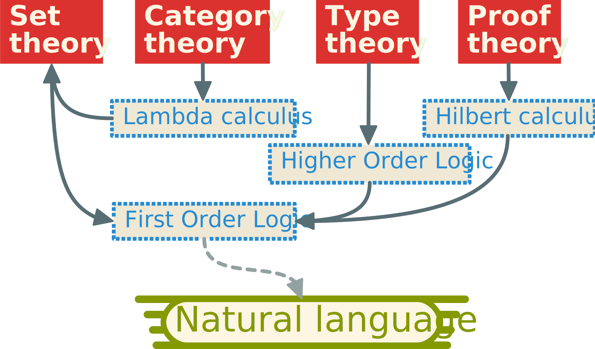{#fig:theory}

Circularity is one of the issues we explore in this section about the limits of formalization languages. Indeed, defining a term requires using a formula in the host language to express the abstracted properties of the generalization [@korzybski_science_1933]. The problem is that most terms will have *circular* definitions.

::: example
Using definitions from the @americanheritagedictionary_circularity_2011, we can find that the term "word" is defined using the word "meaning" that is in turn defined using the term "word". Such circularity can happen to use an arbitrarily long chain of definition that will form a cycle in the dependencies.
:::

<!--This problem is very important as it is often overlooked in foundations of mathematics. -->
For example, we illustrate dependencies between some existing theories and their formalism in @fig:theory. Since a formalization cannot fully be self defined, another host language is generally used, sometimes without being acknowledged.
<!--This causes cycles in the dependencies of languages and theories in mathematics.-->

The only practical way to make some of this circularity disappear is to base on a
<!--a foundation of mathematics using -->
natural language as host language for defining the most basic terms. This allows to acknowledge the problem in an instinctive way while being aware of it while building the theory.

## Functional theory

We aim to reduce the set of axioms allowing to describe a model. The following theory is a proposition for a possible model that takes into account the previously described constraints. It is inspired by category theory [@awodey_category_2010], and typed lambda calculus [@barendregt_lambda_1984].

### Category theory

This theory is based, as its name implies, on *categories*. A category is a mathematical structure that consists of two components:

* A set of **objects** that can be any arbitrary mathematical entities.
* A set of **morphisms** that are functional monomes. They are often represented as *arrows*.

Many definitions of categories exist [@barr_category_1990] but they are all in essence similar to this explanation. The best way to see the category theory is as a general theory of functions. Even if we can use any mathematical entity for the types of the components, the structure heavily implies a functional connotation.

### Axioms

In this part, we propose a model based on functions. The unique advantage of it lays in its explicit structure that allows it to be fully defined. It also holds a coherent algebra that is well suited for our usage. This approach can be described as a special case of category theory. However, it differs in its priorities and formulation. For example, since our goal is to build a standalone foundation, it is impossible to fully specify the domain or co-domain of the functions and they are therefore weakly specified [@godel_consistency_1940].

Our theory is axiomatic, meaning it is based on fundamental logical proposition called axioms. Those form the base of the logical system and therefore are accepted without any need for proof. In a nutshell, axioms are true prior hypotheses.

The following axioms are the explicit base of the formalism. It is mandatory to properly state those axioms as all the theory is built on top of it.

::: {.axiom #axi:identity name="Identity"}
Let's the identity function be <+eq> that associates every function to itself. ^[$\eq  = x \asso x$] This function is therefore transparent as by definition $=(x)$ is the same as $x$. It can be described by using it as **affectation** or aliases to make some expressions shorter or to define any function.
:::

In the rest of the document, classical equality and the identity function will refer to the same notion.

That axiom implies that the formalism is based on *functions*. Any function can be used in any way as long as it has a single argument and returns only one value at a time (named image, which is also a function).

It is important to know that **everything** in our formalism *is* a function. Even notions such as literals, variables or set from classical mathematics are functions. This property is inspired by lambda calculus and some derived functional programming languages.

::: {.axiom #axi:association name="Association"}
^[Using @def:currying and @def:application, we can note $(\asso) = x \asso (f(x) \asso f)$]
Let's the term <+asso> be the function that associates two expressions to another function that associates those expressions. This special function is derived from the notation of *morphisms* of the category theory.
:::

The formal definition uses Currying to decompose the function into two. It associates a parameter to a function that takes an expression and returns a function.

Next we need to lay off the base definitions of the formalism.

### Formalism definition

This functional algebra at the base of our foundation is inspired by *operator algebra* [@takesaki_theory_2013] and *relational algebra* [@jonsson_maximal_1984]. The problem with the operator algebra is that it supposes vectors and real numbers to work properly. Also, relational algebra, like category theory, presupposes set theory.

Here we define the basic notions of our functional algebra that dictates the rules of the formalism we are defining.

::: {.definition #def:currying name="Currying"}
^[$\llp f \rrp = (x \asso \llp f(x)\rrp)$]
Currying is the operation named after the mathematician Haskell Brooks Curry [-@curry_studies_1958] that allows multiple argument functions in a simpler monoidal formalism. A monome is a function that has only one argument and has only one value, as the @axi:association.

The operation of *Currying* is a function <+curry> that associates to each function $f$ another function that recursively partially applies $f$ with one argument at a time.

^[$\llbp f\rrbp = \llbp x, y \asso f(x)(y) \rrbp^+$]
If we take a function $h$ such that when having $x$ as a parameter, gives the function $g$ that takes an argument $y$, *unCurrying* is the function <+uncurry> so that $f(x,y)$ behaves the same way as $h(x)(y)$. We note $h = \llbp f \rrbp$.
:::

::: {.definition #def:application name="Application"}
^[$y = f(x)$] We note the application of $f$ with an argument $x$ as $f(x)$. The application allows to recover the image $y$ of $x$ which is the value that $f$ associates with $x$.
:::

Along with Currying, function application can be used *partially* to make constant some arguments.

::: {.definition #def:partialapplication name="Partial Application"}
We call *partial application* the application using an insufficient number of arguments to any function $f$. This results in a function that has fewer arguments with the first ones being locked by the partial application. It is interesting to note that Currying is simply a recursion of partial applications.
:::

From now on we will note $f(x, y, z, …)$ any function that has multiple arguments but will suppose that they are implicitly Curryied. If a function only takes two arguments, we can also use the infix notation e.g. $x f y$ for its application.

::: example
Applying this to basic arithmetic for illustration, it is possible to create a function that will triple its argument by making a partial application of the multiplication function $×(3)$ ^[$×(3)=x \asso 3×x$] so we can write the operation to triple the number $2$ as $×(3)(2)$ or $×(2,3)$ or with the infix notation $2×3$.
:::

::: {.definition #def:null name="Null"}
The *null function* is the function between nothing and nothing. We note this function <+none> . ^[$\none = \none \asso \none$]
:::

The notation <+none> was chosen to represent the association arrow <+asso> but with a dot instead of the tail of the arrow. This is meant to represent the fact that it inhibits associations.

### Literal and Variables

As everything is a function in our formalism, we use the null function to define notions of variables and literals.

::: {.definition #def:literal name="Literal"}
A literal is a function that associates null to its value. This consists of any function $l$ written as $\none \asso l$.^[$l = \none \asso l$] This means that the function has only itself as an immutable value. We call *constants* functions that have no arguments and have as value either another constant or a literal.
:::

::: example
A good example of that would be the yet to be defined natural numbers. We can define the literal $3$ as $3 = \none \asso 3$. This is a function that has no argument and is always valued to $3$.
:::

::: {.definition #def:variable name="Variable"}
A variable is a function that associates itself to <+none> . This consists of any function $x$ written as $x \asso \none$.^[$x = x \asso \none$] This means that the function requires an argument and has undefined value. Variables can be seen as a demand of value or expression and mean nothing without being defined properly.
:::

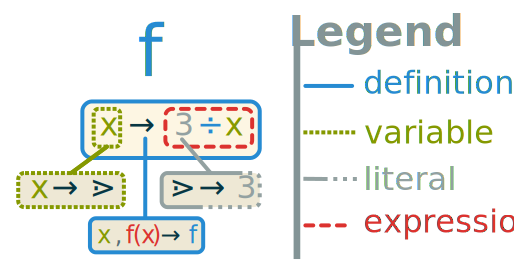{#fig:function}

::: example
The function $f$ defined in @fig:function associates its argument to an expression. Since the argument $x$ is also a variable, the value is therefore dependent on the value required by $x$. In that example, the number $3$ is a literal and $3 \div x$ is therefore an expression using the function $\div$.
:::

An interesting property of this notation is that <+none> is both a variable and a constant. Indeed, by definition, <+none> is the function that associates $\none \asso \none$ and fulfills both definitions.

When defining Currying, we annotated it using the notation $\llp f \rrp = f \asso (x \asso \llp f(x) \rrp)$. The obvious issue is the absence of stopping condition in that recursive expression. While the end of the recursion doesn't technically happen, in practice from the way variables and literals are defined, the recursion chain either ends up becoming a variable or a constant because it is undefined when Currying a nullary function.

### Functional algebra

Inspired by relational algebra and by category theory, we present a functional algebra that fits our needs. The first operator of this algebra allows to combine several functions into one. This is very useful to merge the definition of two functions in order to specify more complex functions.

::: {.definition #def:combination name="Combination"}
^[$\comb = (f, \none \asso f) \comb (\none, f \asso f)$]
The *combination function* <+comb> associates any two functions to a new function that is the union of the definition of **either** functions. If both functions are defined for any given argument, then the combination is undefined ( <+none> ).
:::

^[Combination is useful to define boolean constantly in first order logic (@sec:fol).]
It is interesting to note that the formal definition of the combination is recursive. This means that it will be evaluated if any of the expression matches, decomposing the functions until one of them isn't defined or until nothing matches and therefore the result is <+none> .

::: example
For two functions $f_1$ and $f_2$ that are defined respectively by:

* $f_1= (1\asso 2) \comb (3 \asso 4)$
* $f_2= (2\asso 3) \comb (3 \asso 5)$

the combination $f_3 = f_1 \bowtie f_2$ will behave as follows:

* $f_3(1)=2$
* $f_3(2)=3$
* $f_3(3) = \none$
:::

::: {.definition #def:superposition name="Superposition"}
^[$\super = (\comb) \comb (f,f \asso f)$]
The *superposition function* <+super> associates any two functions to a new function. This function is what the definition of the two functions taken as arguments have in common. The resulting function associates $x \asso y$ when **both** functions are superposing. We can say that the superposition is akin to a joint where the resulting function is defined when both functions have the same behavior.
:::

<!--TODO: Margin ref for usage (ch5 ?)-->

::: example
Reusing the functions of the previous example, we can note that $f_3 \super f_1 = 1 \asso 2$ because it is the only association that both functions have in common. We can also say that $f_1 \super f_2 = \none$ because these functions do not share any associations.
:::

Superposition has a "negative" counterpart called a *subposition*. It allows to do the inverse operation of the super position. More intuitively, if the superposition is akin to the set "intersection", the subposition is the "difference" counterpart.

::: {.definition #def:subposition name="Subposition"}
^[$\sub = f_1, f_2 \asso f_1 \comb (f_1 \super f_2)$]
The *subposition* is the function <+sub> that associates any two functions $f_1$ and $f_2$ to a new function $f_1 \sub f_2$. The subposition will allow to "substract" associations from existing functions. The result removes the superposition from the first function definition.
:::

<!--TODO: Margin ref for usage (ch5 ?)-->

The subposition is akin to a subtraction of function where we remove everything defined by the second function to the definition of the first.

::: example
From the previous example we can write $f_3 \sub f_2 = (1 \asso 2)$. Since $f_2$ has the $2 \asso 3$ associations in common with $f_3$ it is removed from the result.

This operation is more useful with the superposition as it can behave like so: $(f_1 \super f_2) \sub f_2 = f_1$. This allows to undo the superposition.
:::

We can also note a few properties of these functions in @tbl:fun1.

Formula                                         Description
-------                                         -----------
$f \super f = f$                          A function superposed to itself is the same.
$f \super \none = \none$                  Any function superposed by null is null.
$f_1 \super f_2 = f_2 \super f_1$   Superposition order doesn't affect the result.
$f \sub f = \none$                     A function subposed by itself is always null.
$f \sub \none = f$                     Subposing null to any function doesn't change it.

: Example properties of superposition and subposition {#tbl:fun1}

These functions are intuitively the functional equivalent of the union, intersection and difference from set theory. In our formalism we will define the set operations from these.

<!--TODO: add places where any operators are used (Samir)-->

The following operators are the classical operations on functions.

::: {.definition #def:composition name="Composition"}
The *composition function* is the function that associates any two functions $f_1$ and $f_2$ to a new function such that: $f_1 \comp f_2 = x \asso f_1(f_2(x))$.
:::

<!--TODO: Margin ref for usage (ch5 ?)-->

::: {.definition #def:inverse name="Inverse"}
The *inverse function* is the function that associates any function to its inverse such that if $y = f(x)$ then $x = \bullet(f)(y)$.

We can also use an infix version of it with the composition of functions:
$f_1 \bullet f_2 = f_1 \comp \bullet(f_2)$.
:::

<!--TODO: Margin ref for usage (ch5 ?)-->

These properties are akin to multiplication and division in arithmetic.

Formula                                               Description
-------                                               -----------
$f \comp \gtrdot = \gtrdot$                           This means that $\gtrdot$ is the absorbing element of the composition.
$f \comp \eq  = f$                                     Also, $=$ is the neutral element of the composition.
$\bullet(\gtrdot) = \gtrdot \land \bullet\eq  = \eq $   This means that $\none$ and $=$ are commutative functions.
$f_1 \comp f_2 \neq f_2 \comp f_1$                    However, $\comp$ is not commutative.

: Example of function composition and inverse with their properties. {#tbl:fun2}

From now on, we will use numbers and classical arithmetic as we had defined them. However, we consider defining them from a foundation point of view, later using set theory and Peano's axioms.

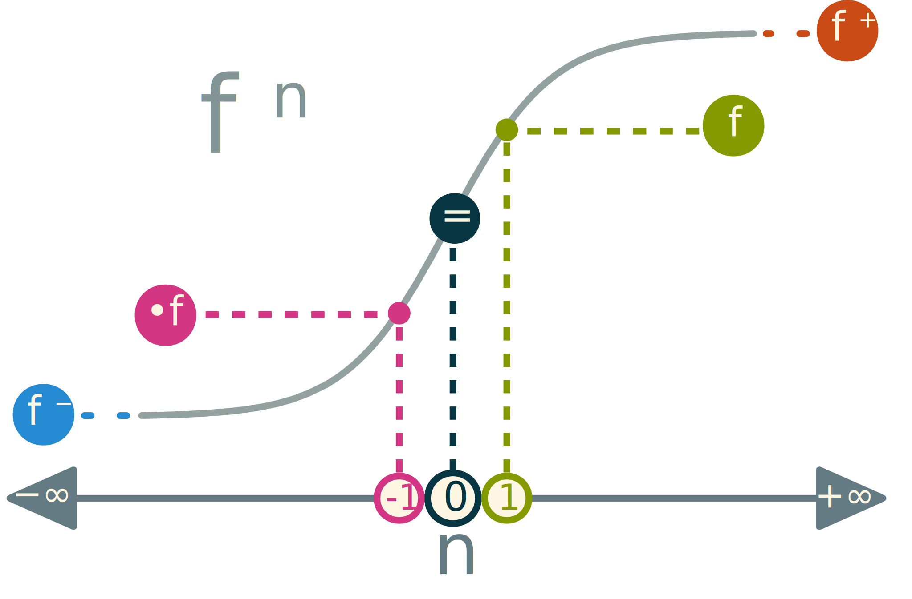{#fig:power}

In classical mathematics, the inverse of a function $f$ is often written as $f^{-1}$. Therefore we can define the transitivity of the $n$^th^ degree as the power of a function such that $f^n = f^{n-1} \comp f$. @Fig:power shows how the power of a function is behaving at key values.

By generalizing the formula, we can define the *transitive cover* of a function $f$ and its inverse respectively as $f^+ = f^{+\infty}$ and $f^- = f^{-\infty}$. This cover is the application of the function to its result infinitely. This is useful especially for graphs as the transitive cover of the adjacency function of a graph gives the connectivity function (see @sec:graph).

We also call *arity* the number of arguments (or the Currying order) of a function noted $|f|$.

### Properties

A modern approach of mathematics is called *reverse mathematics* as instead of building theorems from axioms, we search the minimal set of axioms required by a theorem. Inspired by this, we aim to minimize the formal basis of our system as well as identifying the circularity issues, we provide a dependency graph in @fig:dependancies. We start with the @axi:association at the bottom and the @axi:identity at the top. Everything depends on those two axioms but drawing all the arrows makes the figure way less legible.

Then we define the basic application function <+appl> that has as complement the Currying <+curry> and unCurrying <+uncurry> functions.
Similarly, the combination <+comb> has the superposition <+super> and the subpostion <+sub> functions as complements. The bottom bound of the algebra is the null function <+none> and the top is the identity function <+eq>. Composition <+comp> is the main operator of the algebra and allows it to have an inverse element as the inverse function <+inv> . The composition function needs the application function in order to be constructed.

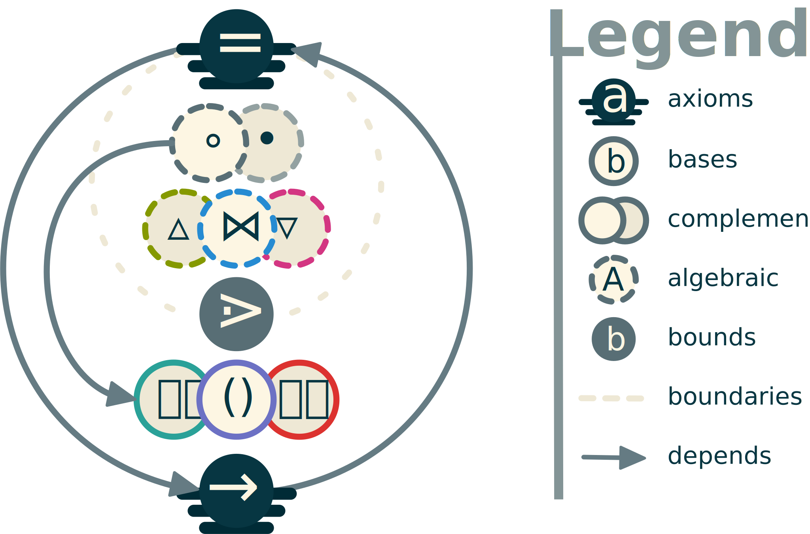{#fig:dependancies}

The algebra formed by the previously defined operations on functions is a semiring $(\bb{F}, \comb, \comp)$ with $\bb{F}$ being the set of all functions.

Indeed, <+comb> is a commutative monoid having <+none> as its identity element and <+comp> is a monoid with <+eq> as its identity element.

Also the composition of the combination is the same as the combination of the composition. Therefore, <+comp> distributes over <+comb> .

At last, using partial application composing with null gives null: $\comp(\none) = ((\none) \asso \none) = \none$.

This foundation is now ready to define other fields of mathematics. We start with logic as it is a very basic formalism in mathematics.

## Logic and reasoning

### First Order Logic {#sec:fol}

In this section, we present <+fol> . <+fol> is based on boolean logic with the two literals *true* (noted <+tru> ) and *false* (noted <+fls> ).

A function noted $q$ that has as only values either <+tru> or <+fls> is called a **predicate**.^[$\dom(\inv q) = \{\fls, \tru\}$]

We define the classical logic *entailment*, the predicate that holds true when a predicate (the conclusion) is true if and only if the first predicate (the premise) is true.

$$\imply = (\fls, x \asso \tru) \bowtie (\tru, x \asso x)$$

Then we define the classical boolean operators $\lnot$ *not*, $\land$ *and* and $\lor$ *or* as:

* $\lnot = (\fls \asso \tru) \comb (\tru \asso \fls)$, the negation associates true to false and false to true.
* $\land = x \asso ((\tru \asso x) \comb (\fls \asso \fls))$, the conjunction is true when all its arguments are simultaneously true.
* $\lor = x \asso ((\tru \asso \tru) \comb (\fls \asso x))$, the disjunction is true if all its arguments are not false.

The last two operators are curried function and can take any number of arguments as necessary and recursively apply their definition.

Another basic predicate is the **equation**. It is the identity function <+eq> but as a binary predicate that is true whenever the two arguments are the same.

Functions that take an expression as parameters are called *modifiers*. <+fol> introduces a useful kind of modifier used to moralize expressions: *quantifiers*. The quantifiers take an expression and a variable as arguments. Classical quantifiers are also predicates: they restrict the values that the variable can take.

In the realm of <+fol>, quantifiers are restricted to individual variable (booleans) as follows:

* The *universal quantifier* <+univ> meaning _"for all"_.^[$\univ = \sol(\land)$]
* The *existential quantifier* <+exist> meaning _"it exists"_.^[$\exist = \sol(\lor)$]

### Higher Order Logic

<+hol> is a class of logic formalism that supersedes <+fol>. It is, however, less well-behaved than <+fol> and is not as popular as a consequence. Indeed, <+hol> allows quantifiers to be applied to sets and even set of sets (see @sec:set). This makes the expressivity of this kind of logic higher but also makes it harder to use and compute.

### Modal logic

^[@Sec:modal_example will illustrate on an example.]
Even bigger than <+hol> is modal logic. In that logic, quantifiers can be applied to *anything*. The most interesting feature of modal logic is quantifying expressions themselves. This allows for *modality* of statements such as their likelihood, context or to even ask for information.

Using that kind of logic, we can also add some less used quantifiers such as:

* The *uniqueness quantifier* <+uniq> meaning _"it exists a unique"_.^[$\uniq = \sol(=(1) \comp +)$]
* The *exclusive quantifier* <+exclu> meaning _"it doesn't exist"_.^[$\exclu = \sol(\lnot \comp \land)$]

It is also possible to change the nature of quantifiers by using a variable instead of restriction to retrieve a set of values [@hehner_practical_2012]:

* The *solution quantifier* <+sol> meaning _"those"_.^[$\sol = f, x, q \asso \lBrace f(x) \such q \rBrace$]

It is interesting to note that most quantified expression can be expressed using the set builder notation discussed in the following section.

## Set Theory {#sec:set}

Since we need to represent knowledge, we will handle more complex data than simple booleans. One such way to describe more complex knowledge is by using set theory. It is used as the classical foundation of mathematics. ^[ @cantor_beitrage_1895] Most other proposed foundations of mathematics invoke the concept of sets even before their first formula to describe the kind of notions they are introducing. The issue is then to define the sets themselves. At the beginning of his founding work on set theory, Cantor wrote:

> "_A set is a gathering together into a whole of definite, distinct objects of our perception or of our thought--which are called elements of the set._"

For Cantor, a set is a collection of concepts and percepts. In our case both notions are grouped in what we call *objects*, *entities* that are all ultimately *functions* in our formalism.

### Base Definitions

This part is based on the work of @cantor_beitrage_1895 and the set theory. The goal is to define the notions of set theory using our formalism.

::: {.definition #def:set name="Set"}
A collection of *distinct* objects considered as an object in its own right. We define a set one of two ways (always using braces):

* In extension by listing all the elements in the set: $\{0,1,2,3,4\}$
* In intention by specifying the rule that all elements follow: $\{n \such q(n)\}$
:::

Using our functional foundation, we can define any set as a predicate $\cal{S} = e \asso \tru$ with $e$ being a member of $\cal{S}$. This allows us to define the member function noted $e \in \cal{S}$ to indicate that $e$ is an element of $\cal{S}$.^[$\in = e, \cal{S} \asso \cal{S}(e)$]

Another, useful definition using sets is the *domain* of a function $f$ as the set of all arguments for which the function is defined. We call *co-domain* the domain of the inverse of a function. We can note them $f \such \dom(f) \to \dom(\inv f)$. In the case of our functional version of sets, they are their own domain.

::: {.definition #def:specification name="Specification"}
The *function of specification* (noted <+such>) is a function that restricts the validity of an expression given a predicate.^[$\such = f, q \asso f \sub (\dom(q = \fls) \to \dom(\inv f))$] It can intuitively be read as _"such that"_.
:::

The specification operator is extensively used in classical mathematics but informally, it is often seen as an extension of natural language and can be quite ambiguous. In the present document any usage of <+such> in any mathematical formula will follow the previously discussed definition.

### Set Operations

Along with defining the domains of functions using sets, we can use function on sets. This is very important in order to define <+zfc> and is extensively used in the rest of the document.

In this section, basic set operations are presented. The first one is the subset.

:::{.definition #def:subset name="Subset"}
A subset is a part of a set that is integrally contained within it. We note $\cal{S} \subset \cal{T} \imply ((e \in \cal{S} \imply e\in \cal{T}) \land \cal{S} \neq \cal{T})$, as a set $\cal{S}$ is a proper subset of a more general set $\cal{T}$.
:::

:::{.definition #def:union name="Union"}
The union of two or more sets $\cal{S}$ and $\cal{T}$ is the set that contains all elements in *either* set. We can note it:

$$\cal{S} \cup \cal{T} = \{ e \such e \in \cal{S} \lor a \in \cal{T}\}$$
:::

:::{.definition #def:intersection name="Intersection"}
The intersection of two or more sets $\cal{S}$ and $\cal{T}$ is the set that contains only the elements member of *both* set. We can note it:

$$\cal{S} \cap \cal{T} = \{ e \such e \in \cal{S} \land e \in \cal{T}\}$$
:::

:::{.definition #def:difference name="Difference"}
The difference of one set $\cal{S}$ to another set $\cal{T}$ is the set that contains only the elements contained in the first but not the last. We can note it:

$$\cal{S} \setminus \cal{T} = \{ e \such e \in \cal{S} \land e \notin \cal{T}\}$$
:::

An interesting way to visualize relationships with sets is by using Venn diagrams [@venn_diagrammatic_1880]. In @fig:venn we present the classical union, intersection and difference operations. It also introduces a new way to represent more complicated notions such as the Cartesian product by using a representation for powerset and higher dimensionality inclusion that a 2D Venn diagram cannot represent.

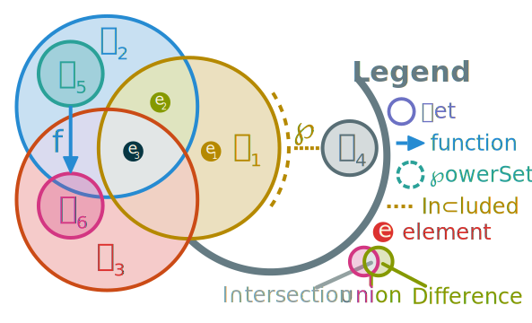{#fig:venn}

::: example
@Fig:venn is the graphical representation of the statements in @tbl:venn.

:::

Formula                                               Description
-------                                               -----------
$e_1 \in \cal{S}_1$                                   $e_1$ is an element of the set $\cal{S}_1$.
$e_2 \in \cal{S}_1 \cap \cal{S}_2$                    $e_2$ is an element of the intersection of $\cal{S}_1$ and $\cal{S}_2$.
$e_3 \in \cal{S}_1 \cap \cal{S}_2 \cap \cal{S}_3$     $e_3$ is an element of the intersection of $\cal{S}_1$, $\cal{S}_2$ and $\cal{S}_3$.
$\cal{S}_5 \subset \cal{S}_2$                         $\cal{S}_5$ is a subset of $\cal{S}_2$.
$\cal{S}_6 \subset \cal{S}_2 \cup \cal{S}_3$          $\cal{S}_6$ is a subset of the union of $\cal{S}_2$ and $\cal{S}_3$.
$f = \cal{S}_5 \to \cal{S}_6$                     $f$ is a function which domain is $\cal{S}_5$ and co-domain is $\cal{S}_6$.
$\cal{S}_4 \subset \powerset(\cal{S}_1)$              $\cal{S}_4$ is a combination of elements of $\cal{S}_1$.

: Caption {#tbl:venn}

These Venn diagrams, originally have a lack of expressivity regarding complex operations on sets. Indeed, from their dimensionality it is complicated to express numerous sets having intersection and disjunctions. For example, it is difficult to represent the following notion.

:::{.definition #def:cartesian name="Cartesian product"}

The Cartesian product of two sets $\cal{S}$ and $\cal{T}$ is the set that contains all possible combinations of an element of both sets. These combinations are a kind of ordered set called *tuples*. We note this product:

$$\cal{S} \times \cal{T} = \{\langle e_{\cal{S}}, e_{\cal{T}}\rangle \such e_{\cal{S}} \in \cal{S} \land e_{\cal{T}} \in \cal{T}\}$$

:::

From this we can also define the set power recursively by $\cal{S}^1 = \cal{S}$ and $\cal{S}^n = \cal{S} \times \cal{S}^{n-1}$.

The Cartesian product can be seen as the set equivalent of Currying. The angles $\langle\rangle$ notation is used for tuples, those are another view on Currying by replacing several arguments using a single one as an ordered list. A tuple of two elements is called a *pair*, of three elements a *triple*, etc. We can access elements in tuples using their index in the following way $e_2 = \langle e_1 , e_2 , e_3 \rangle_2$. By decomposing the tuples as sets we can write:

$$\cal{S} \times \cal{T} = e_{\cal{S}}, e_{\cal{T}} \asso \cal{S}(e_{\cal{S}}) \land \cal{T}(e_{\cal{T}})$$

:::{.definition #def:mapping name="Mapping"}
The mapping notation $\lBrace \rBrace$ is a function such that $\lBrace f(x) \such x \in \cal{S} \rBrace$ will give the result of applying all elements in set $\cal{S}$ as arguments of the function using the unCurrying operation recursively. If the function isn't specified, the mapping will select a member of the set non deterministically. The function isn't defined on empty sets or on sets with fewer members than arguments of the provided function.
:::

::: example
The classical sum operation on numbers can be noted:

$$\sum_{i=1}^3 2i = \lBrace +(2*i) \such i \in [1, 3] \rBrace = +(2*1)(+(2*2)(2*3))$$
:::

### The ZFC Theory

The most common axiomatic set theory is <+zfc> [@kunen_set_1980]. In that definition of sets there are a few notions that come from its axioms. By being able to distinguish elements in the set from one another we assert that elements have an identity and we can derive equality from there:

::: {.axiom #axi:extensionality name="Extensionality"}
$\univ\cal{S} \univ\cal{T} \such \univ e((e\in\cal{S})=(e\in\cal{T})) \imply \cal{S}=\cal{T}$
:::

This means that two sets are equal if and only if they have all their members in common.

Another axiom of <+zfc> that is crucial in avoiding Russel's paradox ($\cal{S} \in \cal{S}$) is the following:

::: {.axiom #axi:fondation name="Foundation"}
$\univ \cal{S} \such (\cal{S} \neq \emptyset \imply \exist \cal{T}\in \cal{S},(\cal{T}\cap \cal{S}=\emptyset))$
:::

This axiom uses the empty set $\emptyset$ (also noted $\{\}$) as the set with no elements. Since two sets are equal if and only if they have precisely the same elements, the empty set is unique.

The definition by intention uses the set builder notation to define a set. It is composed of an expression and a predicate $q$ that will make any element $e$ in a set $\cal{T}$ satisfying its part of the resulting set $\cal{S}$, or as formulated in <+zfc>:

::: {.axiom #axi:specification name="Specification"}
$\univ q \univ \cal{T} \exist \cal{S} \such \left(\univ e \in \cal{S} \such (e \in \cal{T} \land q(e)) \right)$
:::

The last axiom of <+zfc> we use is to define the power set $\powerset(\cal{S})$ as the set containing all subsets of a set $\cal{S}$:

::: {.axiom #axi:powerset name="Power set"}
$\powerset(\cal{S}) = \{\cal{T} \such \cal{T} \subseteq \cal{S}\}$
:::

With the symbol $\cal{S} \subseteq \cal{T}  \imply (\cal{S} \subset \cal{T} \lor \cal{S} = \cal{T})$. These symbols have an interesting property as they are often used as a partial order over sets.

## Graphs {#sec:graph}

With set theory, it is possible to introduce all of standard mathematics. A field of interest for this thesis is the study of the structure of data. This interest arises from the need to encode semantic information in a knowledge base using a very simple language (see @ch:self). Most of these structures use graphs and isomorphic derivatives.

::: {.definition #def:graph name="Graph"}
A graph is a mathematical structure $g$ which is defined by its *connectivity function* <+con> that links two sets into a structure: the edges $E$ and the vertices $V$.
:::

### Adjacency, Incidence and Connectivity

::: {.definition #def:connectivity name="Connectivity"}
The connectivity function is a combination of the classical adjacency and incidence functions of the graph. It is defined using a circular definition in the following way:

* *Adjacency*: $\con_{\adja} = v \asso \{ e: v \in \con_{\inci}(e) \}$^[Also: $\con_{\adja} = \inv \con_{\inci}$]
* *Incidence*: $\con_{\inci} = e \asso \{ v: e \in \con_{\adja}(v) \}$

Defining either function defines the graph. For convenience, the connectivity function combines the adjacency and incidence:

$$\con = \con_{\adja} \comb \con_{\inci}$$
:::

Usually, graphs are noted $g=(V,E)$ with the set of vertices $V$ (also called nodes) and edges $E$ (arcs) that links two vertices together. Each edge is classically a pair of vertices ordered or not depending on whether the graph is directed or not.^[$E \subseteq V^2$]
It is possible to go from the set based definition to the functional relation using the following equation: $\dom(\con_{\inci}) = E$

::: example
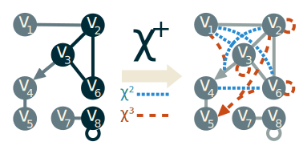{#fig:transitive}

A graph is often represented with lines or arrows linking points together like illustrated in @fig:transitive. In that figure, the vertices $v_1$ and $v_2$ are connected through an undirected edge. Similarly $v_3$ connects to $v_4$ but not the opposite since they are bonded with a directed edge. The vertex $v_8$ is also connected to itself.
:::

<!--TODO: put new notation explicitly-->

### Digraphs

The digraphs or *directional graphs* are a specific case of graphs where *all* edges have a direction. This means that we can have two vertices $v_1$ and $v_2$ linked by an edge and while it is possible to go from $v_1$ to $v_2$, the inverse is impossible. For such case the edges are ordered pairs and the incidence function can be decomposed into:

$$\con_{\inci} = \con_{\ingo} \comb \con_{\outgo}$$

We note $\con_{\ingo}$ the **incoming relation** and $\con_{\outgo}$ the **outgoing relation**.

In digraphs, classical edges can exist if allowed and will simply be bidirectional edges.

### Path, cycles and transitivity

Most of the intrinsic information of a graph is contained within its structure. Exploring its properties requires to study the “shape” of a graph and to find relationships between vertices. That is why graph properties are easier to explain using the transitive cover $\con^+$ of any graph $g = (V,E)$.

This transitive cover will create another graph in which two vertices are connected through an edge if and only if it exists a path between them in the original graph $g$. We illustrate this process in @fig:transitive. Note how there is no edge in $\con^2(g)$ between $v_5$ and $v_6$ and the one in $\con^3(g)$ is directed toward $v_5$ because there is no path back to $v_6$ since the edge between $v_3$ and $v_4$ is directed.

<!--TODO: more explanation-->

::: {.definition #def:path name="Path"}
We say that vertices $v_1$ and $v_2$ are *connected* if it exists a path from one to the other. Said otherwise, there is a path from $v_1$ to $v_2$ if and only if $\langle v_1, v_2 \rangle \in \dom(\con^+(g))$.
:::

The notion of connection can be extended to entire graphs. An undirected graph $g$ is said to be *connected* if and only if $\univ e \in V^2 ( e \in \dom(\con^+(g)))$.

Similarly we define *cycles* as the existence of a path from a given vertex to itself. For example, in @fig:transitive, the cycles of the original graph are colored in blue. Some graphs can be strictly acyclical, enforcing the absence of cycles.

### Trees

A **tree** is a special case of a graph. A tree is an acyclical connected graph. If a special vertex called a *root* is chosen, we call the tree a *rooted tree*. It can then be a directed graph with all edges pointing away from the root. When progressing away from the root, we call the current vertex *parent* of all exterior *children* vertices. Vertex with no children are called *leaves* of the tree and the rest are called *branches*.

An interesting application of trees to <+fol> is called *and/or trees* where each vertex has two sets of children: one for conjunction and the other for disjunction. Each vertex is a logic formula and the leaves are atomic logic propositions. This is often used for logic problem reduction. In @fig:andor we illustrate how and/or trees are often depicted.

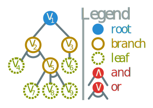{#fig:andor}

### Quotient

Another notion often used for reducing big graphs is the quotiening as illustrated in @fig:quotient.

::: {.definition #def:quotient name="Graph Quotient"}
A quotient over a graph is the act of reducing a subgraph into a node while preserving the external connections. All internal structure becomes ignored and the subgraph now acts like a regular node. We note it $\div_f(g)= (\{f(v) \such  v \in V \}, \{ f(e) \such e \in E \})$ with $f$ being a function that maps any vertex either toward itself or toward its quotiened vertex.
:::

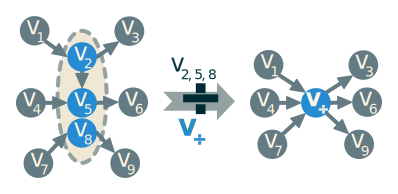{#fig:quotient}

A quotient can be thought of as the operation of merging several vertices into one while keeping their connections with other vertices.

::: example
@Fig:quotient explains how to do the quotient of a graph by merging the vertices $v_2$, $v_5$ and $v_8$ into $v_{\div}$. The edge between $v_2$ and $v_5$ is lost since it is inside the quotienned part of the graph. All other edges are now connected to the new vertex $v_{\div}$.
:::

### Hypergraphs {#sec:hypergraph}

A generalization of graphs are **hypergraphs** where the edges are allowed to connect to more than two vertices [@ray-chaudhuri_hypergraph_1972]. They are often represented using Venn-like representations but can also be represented with edges "gluing" several vertex like in @fig:hypergraph.

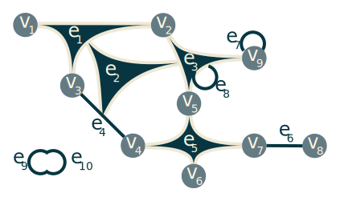{#fig:hypergraph}

::: example
In @fig:hypergraph, vertices are the discs and edges are either lines or gluing surfaces. In hypergraph, classical edges can exist like $e_4$, $e_6$ or $e_7$. Taking for example $e_1$, we can see that it connects 3 vertices: $v_1$, $v_2$ and $v_3$. It is also possible to have an edge connecting edges like $e_8$ that connects $e_3$ to itself. Edges can also "glue" more than two edges like $e_2$ connects $e_1$, $e_3$ and $e_4$. The most exotic structures are edge-loops as seen with $e_9$ and $e_{10}$ which allow graphs that are only made of edges without any vertices.
:::

An hypergraph is said to be *$n$-uniform* if the edges are restricted to connect to only $n$ vertices together. In that regard, classical graphs are 2-uniform hypergraphs.

Hypergraphs have a special case where $E \subset V$. This means that edges are allowed to connect to other edges. In @fig:hypergraph, this is illustrated by the edge $e_2$ connecting to three other edges. That type of edge-graphs are akin to port graphs [@silberschatz_port_1981]. An interesting discussion about the compatibility of hypergraphs with <+zfc> is presented by @vepstas_hypergraph_2008. He said that a generalization of hypergraph allowing for edge-to-edge connections violate the @axi:fondation of <+zfc> by allowing edge loops. Indeed, like in @fig:hypergraph, an edge $e_9 = \{e_{10}\}$ can connect to another edge $e_{10} = \{ e_9 \}$ causing an infinite descent inside the $\in$ relation in direct contradiction with <+zfc> .

This shows the limitations of <+fol> and <+zfc> based models, particularly in the field of knowledge representation. Some structures require higher dimensions as proposed by <+hol> , modal logic and hypergraphs.
However, it is important to note that these models are more general than those based on <+fol> and <+zfc> . Indeed, these models contain what is possible to represent in a classical way but remove restrictions specific to these models.

## Sheaf

In order to understand sheaves, we need to present a few auxiliary notions. Most of these definitions are adapted from [@vepstas_sheaves_2008]. The first of which is a seed.

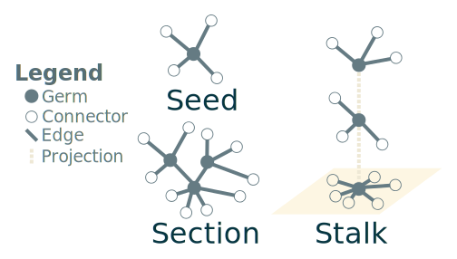{#fig:seed}

::: {.definition #def:seed name="Seed"}
A seed corresponds to a vertex along with the set of adjacent edges. Formally we note a seed $\seed = (v, \con_g(v))$ that means that a seed built from the vertex $v$ in the graph $g$ contains a set of adjacent edges $\con_g(v)$. We call the vertex $v$ the *germ* of the seed. All edges in a seed do not connect to the other vertices but keep the information and are able to match the correct vertices through typing (often a type of a single individual). We call the edges in a seed *connectors*.
:::

Seeds are extracts of graphs that contain all information about a vertex. Illustrated in the @fig:seed, seeds have a central germ (represented with discs) and connectors leading to a typed vertex (outlined circles). Those external vertices are not directly contained in the seed but the information about what vertex can fit in them is kept. It is useful to represent connectors like jigsaw puzzle pieces: they can match only a restricted number of other pieces that match their shape.

From there, it is useful to build a kind of partial graph from seeds called sections.

::: {.definition #def:section name="Section"}
A section is a set of seeds that have their common edges connected. This means that if two seeds have an edge in common connecting both germs, then the seeds are connected in the section and the edges are merged. We note $g_\seed = (V, \lBrace \cup \such E_{section} \rBrace)$ the graph formed by the section.
:::

In @fig:seed, a section is represented. It is a connected section composed of seeds along with the additional seeds of any vertices they have in common. They are very similar to subgraph but with an additional border of typed connectors. This tool was originally mostly meant for big data and categorization over large graphs. As the graph quotient is often used in that domain, it was transposed to sections. Quotients allow us to define stalks.

::: {.definition #def:stalk name="Stalk"}
Given a projection function $f \such V \to V'$ over the germs of a section $\seed$, the stalk above the vertex $v' \in V'$ is the quotient of all seeds that have their germ follow $f(v) = v'$.
:::

The quotienning is used in stalks for their projection. Indeed, as shown in @fig:seed, the stalks are simply a collection of seeds with their germs quotiened into their common projection. The projection can be any process of transformation getting a set of seeds in one side and gives object in any base space called the image. Sheaves are a generalization of this concept to sections.

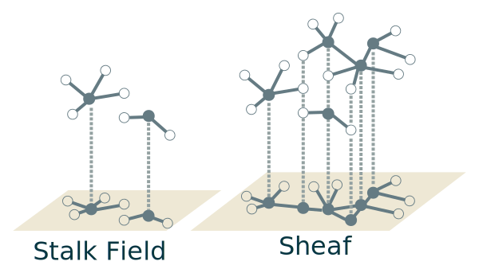{#fig:sheaf}

::: {.definition #def:sheaf name="Sheaf"}
A sheaf is a collection of sections, together with a projection. We note it $\cal{F} = \langle g_{\seed}, glue \rangle$ with the function $glue$ being the gluing axioms that the projection should respect depending on the application. The projected sheaf graph is noted as the fusion of all quotiened sections:

$$glue_{\cal{F}} = \{ \div_{glue_{\seed}} \such \{glue_{\seed} \in g_{\seed}\}$$
:::

By putting several sections into one projection, we can build stack fields. These fields are simply a subcategory of sheaves. Illustrated in @fig:sheaf, a sheaf is a set of sections with a projection relation that usually merges similarly typed connectors.

## Conclusion

In this chapter, we presented the tools we will use for the rest of the document along with its underlying formalism. First we presented a functional theory that allows for a concise expression of the formula for our usage. We also described classical mathematical tools like <+fol> , set theory and graphs. In parallel, we introduced non-classical tools of higher order such as <+hol> , modal logic, hypergraphs and sheaves.  Those notions are mostly data structures and allow to express any model needed for our usage.

The first of these models is about a partial self described language for knowledge representation.
