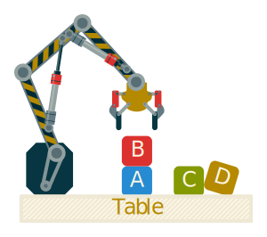
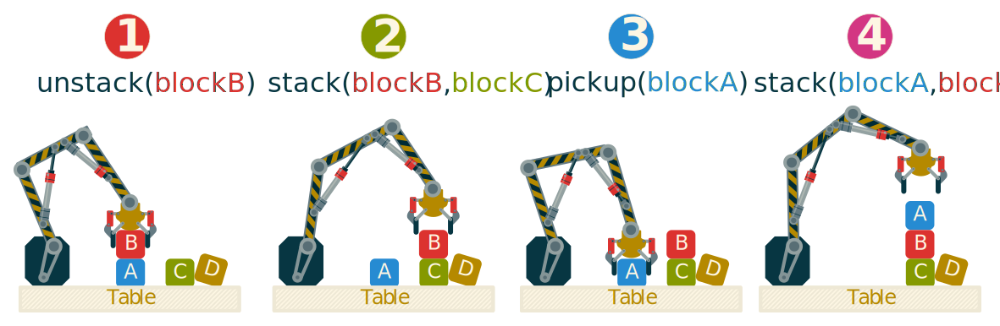
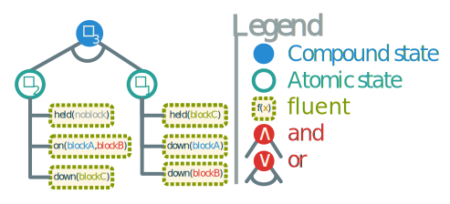
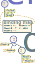
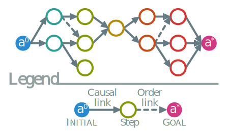
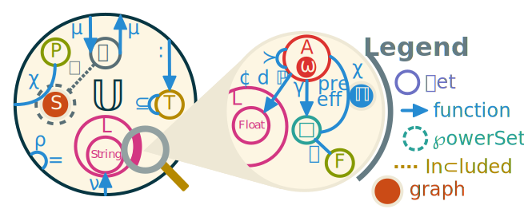
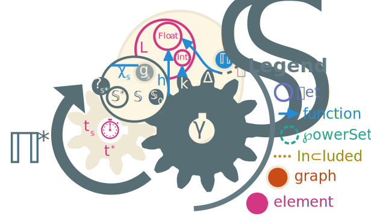

# General Planning Formalism {#ch:planning}

When designing intelligent systems, an important feature is the ability to make decisions and act accordingly. To act, one should plan ahead. This is why the field of automated planning is being actively researched in order to find efficient algorithms to find the best course of action in any given situation. The previous chapter presented a new knowledge representation model. The way to represent the knowledge of planning domains is an important factor to take into account in order to conceive most planning algorithms.

All planning formalisms are based on mainly two notions that define the planning domain: *actions* and *states*. A state is a set of *fluents* that describe aspects of the world modeled by the domain. Each action has a logic formula over states that allows its correct execution. This requirement is called *precondition*. The mirror image of this notion is called possible *effects* which are logic formulas that are enforced on the current state after the action is executed. The domain is completed with a problem, most of the time specified in a separate file. The problem basically contains two states: the *initial* and *goal* states.

In this chapter, we will start with a popular planning problem as an example of what planning is about. Then, we will formalize general notions of planning using the functional formalism of @ch:fondation. This leads to our contribution: by factorizing how planners search for a result, it becomes possible to formalize all planning paradigms into one unified approach. To finish we will show how this formalism can be applied to every single planning paradigm.

## Illustration {#sec:plan_example}

To illustrate how automated planners work, we introduce a typical planning problem called **block world**.

::: example
In this example, a robotic grabbing arm tries to stack blocks on a table in a specific order. The arm is only capable of handling one block at a time. We suppose that the table is large enough so that all the blocks can be put on it without any stacks. @Fig:blockworld illustrates the setup of this domain.

{#fig:blockworld}

The possible actions are `pickup`, `putdown`, `stack` and `unstack`. There are at least three fluents needed:

* one to state if a given block is `down` on the table,
* one to specify which block is `held` at any moment and
* one to describe which block is stacked `on` which block.

We also need a special block value to state when `noblock` is held or on top of another block. This block is a constant.
:::

The knowledge we just described is called *planning domain*.

In that example, the initial state is described as stacks and a set of blocks directly on the table. The goal state is usually the specification of one or many stacks that must be present on the table. This part of the description is called *planning problem*.

In order to solve it we must find a valid sequence of actions called a *plan*. If this plan can be executed in the initial state and result in the goal state, it is called a *solution* of the planning problem. To be executed, each action must be done in a state satisfying its preconditions and will alter that state according to its effects. A plan can be executed if all its actions can be executed in the sequence of the plan.

::: example
For example, in the block world domain we can have an initial state with the $blockB$ on top of $blockA$ and the $blockC$ being on the table. In @fig:plan, we give a plan solution to the problem consisting of having the stack $\langle blockA, blockB, blockC \rangle$ from that initial state.

{#fig:plan}
:::

All automated planners aim to find such a solution to their planning problem. The main issue is that planning problem quickly becomes very expensive to solve. This is why planners are often evaluated on time and solution quality. The quality of a plan is often measured by how hard it is to execute, whether by its execution time or by the resources needed to accomplish it. This metric is often called the *cost* of a plan and is often simply the sum of the costs of its actions.

Automated planning is very diverse. A lot of paradigms shift the definition of the domain, actions and even plan to widely varying extents. This is the reason why making a general planning formalism was deemed so hard or even impossible:

> "_It would be unreasonable to assume there is one single compact and correct syntax for specifying all useful planning problems._" \hfill @sanner_relational_2010

Indeed, the block world example domain we give is mostly theoretical since there is infinitely more subtlety into this problem such as mechatronic engineering, balancing issues and partial ability to observe the environment and predict its evolution as well as failure in the execution. In our example, we didn't mention the misplaced $blockD$ that could very well interfere with any execution in unpredictable ways. This is why so many planning paradigms exist and why they are all so diverse: they try to address an infinitely complex problem, one sub-problem at a time. In doing so we lose the general view of the problem and by simply stating that this is the only way to resolve it we close ourselves to other approaches that can become successful. Like once said:

> "_The easiest way to solve a problem is to deny it exists._" \hfill @asimov_gods_1973

However, in the next section we aim to define such a general planning formalism. The main goal is to provide the automated planning community with a general unifying framework.

<!-- FIXME: Samir finds it excessive -->

## Formalism

In this section, we will present how automated planning works by using the formalism we first described in @ch:fondation. This leads to a general formalism of automated planning. The goal is to explain what is planning and how it works. First we must express the knowledge domain formalism, then we describe how problems are represented and lastly how a general planning algorithm can be envisioned.

### Planning domain

In order to conceive a general formalism for planning domains, we base its definition on the formalism of SELF. This means that all parts of the domain must be a member of the universe of discourse <+uv>.

#### Fluents

First, we need to define the smallest unit of knowledge in planning, the fluents.

::: {.definition name="Fluent"} :::
A planning fluent is a predicate $f \in \flu$.

Fluents are signed. Negative fluents are noted $\neg f$ and behave as a logical complement. We do not use the closed world hypothesis: fluents are only satisfied when another compatible fluent is provided.
:::::::::::::::::::::::::::::::::::

The name "fluent" comes from their fluctuating value. Indeed the truth value of a fluent is meant to vary with time and specifically by acting on it. In this formalism we represent fluents using either parameterized entities or using statements for binary fluents.

::: example
In our example, back in @sec:plan_example, we have three predicates: `down`, `held` and `on`. They can form many fluents like $held(no-block)$, $on(blockA, blockB)$ or $\neg down(blockA)$.
When expressing a fluent we suppose its truth value is <+tru> and denote falsehood using the negation $\neg$.
:::

#### States

When expressing states, we need a formalism to express sets of fluents as formulas.

::: {.definition name="State"} :::
A state is a logical formula of fluents. Since all logical formulas can be reduced to a simple form using only $\land$, $\lor$, and $\neg$, we can represent states as *and/or trees*. This means that the leaves are fluents and the other nodes are states. We note states using small squares <+state> as it is often the symbol used in the representation of automates and grafcets.
:::

::: example
In the domain block world, we can express a couple of states as :

* $\state_1 = held(noblock) \land on(blockA, blockB) \land down(blockC)$
* $\state_2 = held(blockC) \land down(blockA) \land down(blockB)$

In such a case, both states $\state_1$ and $\state_2$ have their truth value being the conjunction of all their fluents. We can express a disjunction in the following way: $\state_3 = \state_1 \lor \state_2$. In that case, $\state_3$ is the root of the and/or tree and all its direct children are or vertices. The states $\state_1$ and $\state_2$ have their children as *and vertices*. All the leaves are fluents. This tree is presented in the @fig:state_tree.

{#fig:state_tree}
:::

#### Verification and binding constraints

When planning, there are two operations that are usually done on states: verify if a precondition fits a given state and then apply the effects of an action.

Classical planning has a clear distinction between preconditions and effects. Preconditions are predicates that need to be satisfied before the action can be executed. In classical formalism, effects are separated into positive and negative effects [@ghallab_automated_2004]. Most of the time, planners will only support simple positive and grounded effects in order to make planning much easier.

In our model we consider preconditions and effects as states. The idea is to make the planning formalism as uniform as possible in order to factor most operations into generic ones.

The verification is the operation $\state_{\pre} \models \state$ that has either no value when the verification fails or a binding map for variables and fluents with their respective values.

The algorithm is a regular and/or tree exploration and evaluation applied on the state $\cstate = \state_{\pre} \land \state$. During the evaluation, if an inconsistency is found then the algorithm returns nothing. Otherwise, at each node of the tree, the algorithm will populate the binding map and verify if the truth value of the node holds under those constraints. All quantified variables are also registered in the binding map to enforce coherence in the root state. If the node is a state, the algorithm recursively applies until it reaches fluents. Once $\cstate$ is valuated as true, the binding map is returned. @Fig:verify illustrates this process.

::: example
Using previously defined example states $\state_{1,2,3}$, and adding the following:

* $\state_4(x) = \{held(noblock), down(x)\}$ and
* $\state_5(y) = \{held(y), \neg down(y)\}$,

We can express a few examples of fluent verification:

* $held(noblock) \models held(x) = \{x=noblock\}$
* $\neg held(x) \models held(x) = \emptyset$
:::

::: {id="fig:verafy"}
{#fig:verify width=30%}\hfill
{#fig:apply width=30%}

Examples of operations on states.
:::

### Effect Application

Once the verification is done, the binding map is kept until the planner needs to apply the action to the state. In our formalism, effects *are* states instead of describing what fluents are added or deleted. The application will therefore be much different than with classical planning. Indeed the goal of the application will be to enforce the validity of the effect state while maintaining the coherence of the next state.

The application of an effect state is noted $\state_{\eff}(\state) = \state'$ and is very similar to the verification. The algorithm will traverse the state $\state$ and use the binding map to force the values inside it. The binding map is previously completed using $\state_{\eff}$ to enforce the application of its new value in the current state. This leads to changing the state $\state$ progressively into $\state'$ and the application algorithm will return this state. This process is illustrated in @fig:apply.

#### Actions

Actions are the main mechanism behind automated planning, they describe what can be done and how it can be done.

::: {.definition #def:action name="Action"} :::
An action is a parameterized tuple $a(args)=\langle \pre, \eff, \constr, \cost, \dur, \proba, \plans \rangle$ where:

* <+pre> and <+eff> are states that are respectively the **preconditions and the effects** of the action.
* <+constr> is the state representing the **constraints**.
* <+cost> is the intrinsic **cost** of the action.
* <+dur> is the intrinsic **duration** of the action.
* <+proba> is the prior **probability** of the action succeeding.
* <+plans> is a set of **methods** that decompose the action into smaller simpler ones.
::::::::::::::::::::::::::::::::::::::::::::::::::

Operators take many names in different planning paradigms: actions, steps, tasks, etc. In our case we call operators, all fully lifted actions and actions are all the possible instances (including operators).

In order to be more generalist, we allow in the constraints description, any time constraints, equality or inequality, as well as probabilistic distributions. These constraints can also express derived predicates. It is even possible to place arbitrary constraints on order and selection of actions.

Actions are often represented as state operators that can be applied in a given state to alter it. The application of actions is done by using the action as a relation on the set of states $a : \states \to \states$ defined as follows:

$$a(\state) =
\begin{cases}
  \emptyset,& \text{if } \pre \models \state =\emptyset\\
  \eff(\state),& \text{using the binding map otherwise}
\end{cases}$$

::: example
A useful action we can define from previously defined states is the following:

$$pickup(x) = \langle \state_4(x), \state_5(x), (x: Block), 1.0¢, 3.5s, 75\%, \emptyset \rangle$$

That action can pick up a block $x$ in $3.5$ seconds using a cost of $1.0$ with a prior success probability of $75\%$.
:::

#### Domain

The planning domain specifies the allowed operators that can be used to plan and all the fluents they use as preconditions and effects.

::: {.definition name="Domain"} :::
A planning domain <+dom> is a set of **operators** which are fully lifted *actions*, along with all the relations and entities needed to describe their preconditions and effects.
:::::::::::::::::::::::::::::::::::

::: example
In the previous examples the domain was named block world. It consists in four actions: $pickup, putdown, stack$ and $unstack$. Usually the domain is self contained, meaning that all fluents, types, constants and operators are contained in it.
:::

### Planning Problem & Solution

The aim of an automated planner is to find a plan to satisfy the goal. This plan can be of multiple forms, and there can even be multiple plans that meet the demand of the problem.

#### Solution to Planning Problems

::: {.definition name="Partial Plan / Method"} :::
A partially ordered plan is an *acyclic* directed graph $\plan = (A_{\plan}, E)$, with:

* $A_{\plan}$ the set of **steps** of the plan as vertices. A step is an action belonging in the plan. $A_{\plan}$ must contain an initial step $a_{\plan}^0$ and goal step $a_{\plan}^*$ as convenience for certain planning paradigms.
* $E$ the set of **causal links** of the plan as edges.
We note $l = a_s \xrightarrow{\state} a_t$ the link between its source $a_s$ and its target $a_t$ caused by the set of fluents $\state$. If $\state = \emptyset$ then the link is used as an ordering constraint.
:::::::::::::::::::::::::::::::::

With this definition, any kind of plan can be expressed. This includes temporal, fully or partially ordered plans or even hierarchical plans (using the methods of the actions <+plans>). It can even express diverse planning results. An exhaustive list of instance is presented in @sec:planning_paradigms.

<!-- FIXME: check referemce -->

The notation can be reminiscent of functional affectation and it is on purpose. Indeed, those links can be seen as relations that only affect their source to their target and the plan is a graph with its adjacence function being the combination of all links.

In our framework, *ordering constraints* are defined as the transitive cover of causal links over the set of steps. We note ordering constraints: $a_a \succ a_s$, with $a_a$ being *anterior* to its *successor* $a_s$. Ordering constraints cannot form cycles, meaning that the steps must be different and that the successor cannot also be anterior to its anterior steps:
$a_a \neq a_s \land a_s \not \succ a_a$.
If we need to enforce order, we simply add a link without specifying a cause. The use of graphs and implicit order constraints helps to simplify the model while maintaining its properties. Totally ordered plans are made by specifying links between all successive actions of the sequence.

::: example
In the @sec:plan_example, we described a classical fully ordered plan, illustrated in @fig:plan. A partially ordered plan has a tree-like structure except that it also meets in a "sink" vertex (goal step). We explicit this structure in @fig:poplan. This figure is an example of how partially ordered plans are structured. The main feature of such a graph is its acyclicity.

{#fig:poplan}
:::

<!--TODO: Why figure vague ? Why not block world ?-->

#### Planning Problem Definition

With this formalism, the problem is very simplified but still general.

::: {.definition name="Planning Problem"} :::
The planning problem is defined as the **root operator** <+rootop> which methods are potential solutions of the problem. Its preconditions and effects are respectively used as initial state and goal description.
::::::::::::::::::::::::::::::::::::

As for the preconditions and effects, we decided to factorize processes by making the problem homogeneous. Indeed, since the problem itself is an action and that each action also can have methods comprised of actions, it is possible to treat problems and actions the same way (especially useful for hierarchical planning). Most of the specific notions of this framework are optional. The user is free to support any features of the framework according to their use case.

Since we base our planning formalism on the one of <+self>, we can express the structure of our formalism using the same extended Venn diagram as in @fig:typerel. The @fig:color explains how planning uses the previously defined relations to make its structure homogeneous and contained within the universe <+uv>. We can also see the relation $\landor$ between the set of all states <+states> and the set of all fluents <+flu> that form the previously shown and-or trees. Multiple relations are used for actions in <+actions>. Those are all explained in @def:action. We included the root operator <+rootop> in the set of all actions. It is interesting to note how the set of plans <+plans> is by definition a set of graphs since it uses a connectivity function <+con> between actions and states.

{#fig:color}

## Planning search

A general planning algorithm can be described as a guided exploration of a search space. The detailed structure of the search space as well as search iterators are dependent on the planning paradigm used and therefore are parameters of the algorithm. There are also quite a few aspects that need consideration like solution and temporal constraints.

### Search space

::: {.definition #def:planner name="Planner"}
A planning algorithm, often called planner, is an exploration of a search space <+searches> partially ordered by an iterator <+iter> guided by a heuristic <+heu>. From any problem <+pb> every planner can derive two pieces of information immediately:

* the starting point $\start \in \searches$ and
* the solution predicate <+find> that gives the validity of any potential solution in the search space.

Formally the problem can be viewed as a path-finding problem in the directed graph $g_{\searches}$ formed by the vertex set $\searches$ and the adjacency function <+iter>. The set of solutions is therefore expressed as:

$$\solu =
\left \{ \solu :
  \langle \start, \solu \rangle \in \con^+_{\searches}(\start)
  \land \find
\right \}$$
:::

We note a provided heuristic $\heu(\search)$. It gives off the shortest predicted distance to any point of the solution space. The exploration is guided by it by minimizing its value.

In order to accommodate some specific planning paradigm, it is interesting to have a common way to encode search constraints such as the expected number of solutions, or even the allocated time to complete the search.

### Solution constraints

As finding a plan is computationally expensive, it is sometimes better to try to find either a more generally applicable plan or a set of alternatives. This is especially important in the case of execution monitoring or human interactions as proposing several relevant solutions to pick from is a very interesting feature. Also, in planning, time is of the essence and it is useful to inform the planner of the time it has to find a solution.

We note <+scons> the **set of constraints on the solution**. These constraints are represented as states: a set of predicates that evaluates to true once the solution is meeting the expectations.

These constraints can vary widely between planning paradigm. As such, it is interesting to standardize how each planning paradigm will encode extra problem specification and requirements. In order to explain why solution constraints are relevant to planning, we will give it all on a simple example.

::: example
Bob is a machinist and plans to make a part using a mill. This part is needed for a bigger project and must be ready by a specific deadline.

^[]

While taking a tea break, Bob spills over his drink over the mill's electronics making it unusable. Bob originally planned to make the part using computer control. This is a problem because Bob needs an alternative plan now that his original plan failed.
:::

In the following sections we will explain what Bob can do to meet his deadline and how it is relevant for planning.

#### Diversity

A planning paradigm in particular requires explicit constraints on the solution. This paradigm is called *diverse planning*. The goal is to find several plans that are all solutions but all different enough as to be different approaches. It can be taught as a form of hierarchical planning where the composition isn't specified but we expect nonetheless different methods.

In order to quantify the expected diversity of a set of solutions, we introduce to <+scons> the plan distance metric <+dist> [@lee_generating_1999] that allows to compare how much two plans are different.

::: example
Bob could have come up with two different plans to make that part such as using the mill manually or using a subcontractor to make the part.

The main idea behind diverse planning is to come prepared and to present very different plans. For example, Bob couldn't just have used a plan that would have consisted of switching the orientation of the work on the mill or anything too similar to the original plan.
:::

#### Cardinality

In diverse planning, another criteria that is user specified is the cardinality of the set of solutions. We note <+nsol> the number of expected different solutions. This simply makes the process return when either it found <+nsol> solutions or when it determined that $\nsol > |\solu|$.

In classical planning, $\nsol = 1$ since only the best plan is expected. This parameter is added to the set of constraints <+scons>.

::: example
In our example, Bob clearly came prepared with a unique plan. The replanning he is now doing could have been avoided with more plans prepared in advance.

In practice, finding a good number of plans is quite arbitrary and context dependent and so often left at the user's discretion.
:::

#### Probability

For probabilistic planning, all elements of the probability distributions used are typically included in the domain. The prior probability distribution noted <+proba> is therefore encoded into <+scons>.

Probabilistic planning uses this probability distribution to compute a *policy* that helps reach a goal. A policy is a heuristic guide that returns the action most likely to succeed in any given situation. So a policy is basically a function ^[Using the mapping notation <+mapping> from @ch:fondation.] $\bb{pol} = \state \to \lBrace \max \comp \proba_{\state} : \actions \rBrace$ that will always give the action with the maximum success probability knowing the current state.

::: example
Bob can use a policy to solve that issue. In his case it is probably more of a "protocol" or a document instructing of what to do in most situations. That way, Bob doesn't have to improvise and will follow what was decided before.
:::

#### Temporality

Another aspect of planning lies in its timing. Indeed sometimes acting needs to be done before a deadline and planning are useful only during a finite timeframe. This is done even in optimal planning as researchers evaluating algorithms often need to set a timeout in order to be able to complete a study in a reasonable amount of time. Indeed, often in efficiency graphs, planning instances are stopped after a defined amount of time.

This time component is quite important as it often determines the planning paradigm used. It is expressed as two parameters:

* <+searcht> the allotted time for the algorithm to find at least a fitting solution.
* <+opti> additional time for plan optimization.

This means that if the planner cannot find a fitting solution in time it will either return a timeout error or a partial or abstract solution that needs to be refined. Anytime planners will also use these parameters to optimize the solution some more. If the amount of time is either unknown or unrestricted the parameters can be omitted and their value will be set to infinity.

::: example
In our running example, Bob has a specified deadline to abide with. This kind of constraints are often implicit and not given to the planner. Classical planners will simply make a best effort to find the best solution and are only evaluated up to a certain time to compare results between approaches.
:::

## General Planning Algorithm

A general planner is an algorithm capable of resolving all types of planning domains and problems. This means that it becomes possible to compare the characteristics of completely different planning approaches. It also makes it possible to use several planning paradigms at once (e.g. durative actions and probabilistic planning combined). The formalization of such a planner allows for a more general explanation and description of planning problems and solutions.

### Formalization

We note a general planner $\plans^*(\solu, \start, \find, \heu, \scons, \dom)$ an algorithm that can find solutions to any planning formalism using the appropriate instance.

The most important point to understand is that a general planner is a shortest path algorithm. These kinds of algorithms are very common in AI and are often used as an example of classical algorithms. One of the first classical shortest path algorithms is called $A*$ [@hart_formal_1968]. It is a simple heuristic powered shortest path algorithm. It is important to note that any shortest path algorithm can be used to make a general planner. For example, a variant of the $A*$ algorithm can be used for diverse planning. This algorithm is called $K*$ after the term <+nsol> used to denote the number of expected solutions [@aljazzar_heuristic_2011, alg. 1].

In automated planning, this last algorithm is used as the base of some diverse planners [@stentz_focussed_1995; @riabov_new_2014]. Using our formalism, the parameters are as follows: $K^*(g_{\searches}, \start, \find, \heu)$. In this case, the solution predicate contains the solution constraints <+scons>.

Of course this is merely an instance of a general planning algorithm. We haven't evaluated the performance of any instance. All we propose in this chapter is the formalism.

{#fig:gplanner}

@Fig:gplanner is an illustration of how such a general planner is structured. The darker inner circle represents the search space <+searches> as defined in @def:planner. The gears represent different aspects of the solution constraints <+scons>.

Now that a general planner has been formed it is quite relevant to provide instances of it on every planning paradigms to show that it can fit them all.

## Classical Planning Paradigms {#sec:planning_paradigms}

One of the most comprehensive work on summarizing the automated planning domain was done by @ghallab_automated_2004. This book explains the different planning paradigm of its time and gives formal description of some of them. This work has been updated later [@ghallab_automated_2016] to reflect the changes occurring in the planning community.

In the following sections we will show instances of the general planner for each planning formalism. We will omit the last three parameters <+heu>, <+scons>, <+dom>. We do so in order to use the partial application of @ch:fondation and obtain a specific planner ready to be fully instantiated by the user (the domain is built in a way so that it doesn't depend on the paradigm).

### State-transition planning

The most classical representation of automated planning is using the state transition approach: actions are operators on the set of states and a plan is a finite-state automaton.
We can also see any planning problem as either a graph exploration problem or even a constraint satisfaction problem. In any way that problem is isomorph to its original formulation and most efficient algorithms use a derivative of $A*$ exploration techniques on the state space.

The parameters for state space planning are trivial:

$$\plans^*_{\states} = \plans^* \left( (\states, \actions), \pre(\rootop), \eff(\rootop) \right)$$

This formulation takes advantage of several tools previously described. It uses the partial application of a function to omit the last parameters. It also defines the search graph using the set of all states <+states> as the vertices set and the set of all available actions <+actions> as the set of edges while considering actions as relations that can be applied to states to make the search progress toward an eventual solution. We also use the binary nature of states to use the effects of the root operator as the solution predicate.

Usually, we would set both <+searcht> and <+opti> to an infinite amount as it is often the case for such planners. These parameters are left to the user of the planner.

State based planning usually supposes total knowledge of the state space and action behavior.
No concurrence or time constraints are expressed and the state and action space must be finite as well as the resulting state graph. This process is also deterministic and doesn't allow uncertainty. The result of such planning is a totally ordered sequence of actions called a plan. The total order needs to be enforced even if it is unnecessary.

All those features are important in practice and lead to other planning paradigms that are more complex than classical state-based planning.

### Plan space planning

<+psp> is a form of planning that uses plan space as its search space. It starts with an empty plan and tries to iteratively refine that plan into a solution.

The transformation into a general planner is more complicated than for state-based planning as the progress is made through refinements. We note the set of possible refinements of a given plan $r= \plan \to \lBrace \odot : \otimes(\plan) \rBrace$ with $\otimes$ being the flaws and $\odot$ the resolvers. Each refinement is a new plan in which we fixed a *flaw* using one of the possible *resolvers* (see @def:flaws and @def:resolvers).

$$\plans^*_{\plans} = \plans^* \left( r, a^0 \rightarrow a^*, \otimes(\search) = \emptyset  \right)$$

with $a^0$ and $a^*$ being the initial and goal steps of the plan corresponding to $\start$ such that $\eff(a^0) = \pre(\rootop)$ and $\pre(a^*) = \eff(\rootop)$. The iterator is all the possible resolutions of all flaws on any plan in the search space and the solution predicate is true when the plan has no more flaws.

Details about flaws, resolvers and the overall <+pocl> algorithm will be presented in @sec:psp.

This approach can usually give a partial plan if we set <+searcht> too low for the algorithm to complete. This plan is not a solution but can eventually be used as an approximation for certain use cases (like intent recognition, see @ch:rico).

### Case based planning

Another plan oriented planning is called <+cbp>. This kind of planning relies on a library $\cal{C}$ of already complete plans and tries to find the most appropriate one to repair. To repair a plan we use a derivative of the refinement function noted $r_*$ that will make either a classical refinement or repair a part of the plan.

$$\plans_{\cal{C}} = \plans^* \left( r_* , \lBrace \min : \plan \in \cal{C} \land \plan(\pre(\rootop)) \models \eff(\rootop) \rBrace, \search(\pre(\rootop)) \neq \emptyset \right)$$

The planner selects a plan that realize the goal state of the problem from its initial state. This plan is then repaired and validated iteratively. The problem with this approach is that it may be unable to find a valid plan or might need to populate and maintain a good plan library. For such case an auxiliary planner is used (preferably a diverse planner; that gives several solutions).

### Probabilistic planning

Probabilistic planning tries to deal with uncertainty by working on a policy instead of a plan. The initial problem holds probability laws that govern the execution of any actions. It is sometimes accompanied with a reward function instead of a deterministic goal. We use the set of states as search space with the policy as the iterator.

$$\plans_{\proba} = \plans^* \left( \bb{pol}, \pre(\rootop), \search \models \eff(\rootop) \right )$$

At each iteration a state is chosen from the frontier. The frontier is updated with the application of the most likely to succeed action given by the policy. The search stops when the frontier satisfies the goal.

### Hierarchical planning

<+htn> are a totally different kind of planning paradigm. Instead of a goal description, <+htn> uses a root task that needs to be decomposed. The task decomposition is an operation that replaces a task (action) by one of its methods <+plans>. We note $r_+$ the set of classical refinements in a plan along with any action decomposition (see @ch:heart).

$$\plans_{\rootop} = \plans^* \left ( r_+, \plans({\rootop}), \otimes(\search) = \emptyset \land \univ a \in \actions_{\plan \in \search} \plans(a) = \emptyset \right )$$

The instance of the general planner for <+htn> planning is similar to the <+psp> one: it fixes flaws in plans. The idea is to add a *decomposition flaw* to the classical flaws of <+psp>. This technique is more detailed in @ch:heart.

## Discussion on General Planning

In this chapter, we presented a way to formalize all planning paradigms under a unifying notation. This is quite interesting in the fact that it is now easier to explain planners that use one or more paradigms at once: the so-called "hybrid planners." That last notion is far from new as demonstrated by @gerevini_combining_2008 and in the field of <+htn-ti> which reuses <+psp> like techniques.

In the following two chapters, we will show how using <+self> with this formalism allows for a general planning framework and how it can be used to make hybrid planners.
