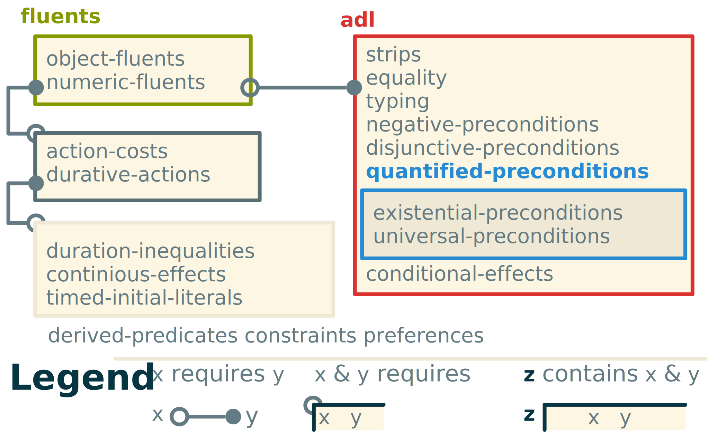

# COLOR Framework {#ch:color}

Using the formalism for a general planner, it becomes possible to define a general *action language*. Action languages are languages used to encode planning domains and problems. Among the first to emerge, we can find the popular <+strips>. It is derived from its eponymous planner Stanford Research Institute Problem Solver [@fikes_strips_1971].

After <+strips>, one of the first languages to be introduced to express planning domains is called <+adl> [@pednault_adl_1989]. That formalism adds negation and conjunctions into literals to <+strips>. It also drops the closed world hypothesis for an open world one: anything not stated in conditions (initials or action effects) is unknown.

The current standard was strongly inspired by @penberthy_ucpop_1992 and his <+ucpop> planner. Like <+strips>, <+ucpop> had a planning domain language that was probably the most expressive of its time. It differs from <+adl> by merging the add and delete lists in effects and to change both preconditions and effects of actions into logic formula instead of simple states.

## PDDL

The most popular standard action language in automated planning is the <+pddl>. It was created for the first major automated planning competition hosted by <+aips> in 1998 [@ghallab_pddl_1998]. This language came along with syntax and solution checker written in Lisp. The goal was to standardize the notation of planning domains and problems so that libraries of standard problems can be used for benchmarks. The main goal of the language was to be able to express most of the planning problems of the time.

With time, the planning competitions became known under the name of <+ipc>. With each installment, the language evolved to address issues encountered the previous years. The current version of <+pddl> is **3.1** [@kovacs_bnf_2011]. Its syntax goes similarly as described in @lst:pddl_syntax.

```{#lst:pddl_syntax .none caption="Simplified explanation of the syntax of PDDL." escapechar=$}
(define (domain <domain-name>)
  (:requirements :<requirement-name>)
  (:types <type-name>)
  (:constants <constant-name> - <constant-type>)
  (:predicates (<predicate-name> ?<var> - <var-type>))
  (:functions (<function-name> ?<var> - <var-type>) - <function-type>)

  (:action <action-name>
      :parameters (?<var> - <var-type>)
      :precondition (and (= (<function-name> ?<var>) <value>) (<predicate-name> ?<var>))
      :effect
      (and (not (<predicate-name> ?<var>))
     (assign (<function-name> ?<var>) ?<var>)))
```

<+pddl> uses the functional notation style of Lisp. It usually defines two files: one for the domain and one for the problem instance. The domain describes constants, fluents and all possible actions. The problem lays the initial and goal states description.

::: example
Consider the classic block world domain expressed in @lst:block_pddl. It uses a predicate to express whether a block is on the table because several blocks can be on the table at once. However it uses a 0-ary function to describe the one block allowed to be held at a time. The description of the stack of blocks is done with a unary function to give the block that is on top of another one. To be able to express the absence of blocks it uses a constant named `no-block`. All the actions described are pretty straightforward: `stack` and `unstack` make sure it is possible to add or remove a block before doing it and `pick-up` and `put-down` manages the handling operations.

```{#lst:block_pddl .none caption="Classical PDDL 3.0 definition of the domain Block world" escapechar=$}
(define (domain BLOCKS-object-fluents)
  (:requirements :typing :equality :object-fluents)
  (:types block)
  (:constants no-block - block)
  (:predicates (on-table ?x - block))
  (:functions (in-hand) - block
  (on-block ?x - block) - block) ;;what is in top of block ?x

  (:action pick-up
      :parameters (?x - block)
      :precondition (and (= (on-block ?x) no-block) (on-table ?x) (= (in-hand) no-block))
      :effect
      (and (not (on-table ?x))
     (assign (in-hand) ?x)))

  (:action put-down
      :parameters (?x - block)
      :precondition (= (in-hand) ?x)
      :effect
      (and (assign (in-hand) no-block)
     (on-table ?x)))

  (:action stack
      :parameters (?x - block ?y - block)
      :precondition (and (= (in-hand) ?x) (= (on-block ?y) no-block))
      :effect
      (and (assign (in-hand) no-block)
       (assign (on-block ?y) ?x)))

  (:action unstack
      :parameters (?x - block ?y - block)
      :precondition (and (= (on-block ?y) ?x) (= (on-block ?x) no-block) (= (in-hand) no-block))
      :effect
      (and (assign (in-hand) ?x)
    (assign (on-block ?y) no-block))))
```
:::


However, <+pddl> is far from a universal standard. Some efforts have been made to standardize the domain of automated planning in the form of optional requirements. The latest of the <+pddl> standard is the version 3.1 [@kovacs_bnf_2011]. It has 18 atomic requirements as represented in @fig:pddl_req. Most requirements are parts of <+pddl> that either increase the complexity of planning significantly or that require extra implementation effort to meet. For example, the `quantified-precondition` adds quantifiers into the logical formula of preconditions forcing a check on all fluents of the state to check the validity

{#fig:pddl_req}

Even with that flexibility, <+pddl> is unable to cover all of automated planning paradigms. This caused most subdomains of automated planning to be left in a state similar to before <+pddl>: a collection of languages and derivatives that aren't interoperable. The reason for this is the fact that <+pddl> isn't expressive enough to encode more than a limited variation in action and fluent description.

Another problem is that <+pddl> isn't made to be used by planners to help with their planning process. Most planners will totally separate the compilation of <+pddl> before doing any planning, so much so that most planners of the latest <+ipc> used a framework that translates <+pddl> into a useful form before planning, adding computation time to the planning process.

The domain is so diverse that attempts to unify it haven't succeeded so far. The main reason behind this is that some paradigms are vastly different from the classical planning description. Sometimes just adding a seemingly small feature like probabilities or plan reuse can make for a totally different planning problem. In the next section we describe planning paradigms and how they differ from classical planning along with their associated languages.

## Temporality oriented

When planning, time can become a sensitive constraint. Some critical tasks may require to be completed within a certain time. Actions with duration are already a feature of <+pddl> 3.1. However, <+pddl> might not provide support for external events (i.e. events occurring independently from the agent). To do this one must use another language.

### PDDL+

PDDL+ is an extension of <+pddl> 2.1 that handles processes and events [@fox_pddl_2002]. It can be viewed as similar to <+pddl> 3.1 continuous effects but it differs on the expressivity. A process can have an effect on fluents at any time. The effect can happen either from the agent's own doing or being purely environmental. It might be possible in certain cases to model this using the durative actions, continuous effects and timed initial literals of <+pddl> 2.2 [@edelkamp_pddl2_2004] or later versions.

In @lst:pddl_plus, we reproduce an example from @fox_pddl_2002. It shows the syntax of durative actions in PDDL+. 
The language uses *timed preconditions* to specify how an action behaves with time and what is needed for its success. It can also specify condition on the duration of the action. The timed preconditions are also available in <+pddl> 3.1, but the `increase` and `decrease` rate of fluents is an exclusive feature of PDDL+.

```{#lst:pddl_plus .none caption="Example of PDDL+ durative action from Fox's paper." escapechar=$}
(:durative-action downlink
    :parameters (?r - recorder ?g - groundStation)
    :duration (> ?duration 0)
    :condition (and (at start (inView ?g))
                    (over all (inView ?g))
                    (over all (> (data ?r) 0)))
    :effect (and (increase (downlinked)
                      (* #t (transmissionRate ?g)))
                 (decrease (data ?r)
                      (* #t (transmissionRate ?g)))))
```
The main issue with durative actions is that time becomes a continuous resource that may change the values of fluents. The search for a plan in that context has a higher complexity than regular planning.

### ANML

@smith_anml_2008

### MPMTL

@to_mixed_2016

## Probabilistic

Sometimes, acting can become unpredictable. An action can fail for many reasons, from logical errors down to physical constraints. This calls for a way to plan using probabilities with the ability to recover from any predicted failures. <+pddl> doesn't support using probabilities. That is why all <+ipc>'s tracks dealing with it always used another language than <+pddl>.

### PPDDL

PPDDL was used during the 4^th^ and 5^th^ <+ipc> for its probabilistic track [@younes_ppddl_2004]. It allows for probabilistic effects as demonstrated in @lst:ppddl. The planner takes into account the probability when choosing an action. The plan must be the most likely to succeed. But even with the best plan, failure can occur. This is why probabilistic planning often gives policies instead of a plan. A policy dictates the best choice in any given state, failure or not. While this allows for much more resilient execution, computation of policies is exponentially harder than classical planning. Indeed the planner needs to take into account every outcome of every action in the plan and react accordingly.

```{#lst:ppddl .none caption="Example of PPDDL use of probabilistic effects from Younes's paper." escapechar=$}
(define (domain bomb-and-toilet)
    (:requirements :conditional-effects :probabilistic-effects)
    (:predicates (bomb-in-package ?pkg) (toilet-clogged)
                  (bomb-defused))
    (:action dunk-package
             :parameters (?pkg)
             :effect (and (when (bomb-in-package ?pkg)
                                (bomb-defused))
                          (probabilistic 0.05 (toilet-clogged)))))
```

### RDDL

Another language used by the 7^th^ <+ipc>'s uncertainty track is RDDL [@sanner_relational_2010]. This language has been chosen because of its ability to express problems that are hard to encode in <+pddl> or PPDDL. Indeed, RDDL is capable of expressing probabilistic networks in planning domains. This along with complex probability laws allows for easy implementation of most probabilistic planning problems. Its syntax differs greatly from <+pddl>, and seems closer to Scala or C++.
An example of a <+bnf> is provided in @lst:rddl from @sanner_relational_2010. In this listing, we can see that actions in RDDL don't need preconditions or effects. In that case the reward is the closest information to the classical goal and the action is simply a parameter that will influence the probability distribution of the events that conditioned the reward.

``` {#lst:rddl .none caption="Example of RDDL syntax by Sanner." escapechar=$}
////////////////////////////////////////////////////////////////////////
// A simple propositional 2-slice DBN (variables are not parameterized).
//
// Author: Scott Sanner (ssanner [at] gmail.com)
////////////////////////////////////////////////////////////////////////
domain prop_dbn {

 requirements = { reward-deterministic };

 pvariables {
  p : { state-fluent,  bool, default = false };
  q : { state-fluent,  bool, default = false };
  r : { state-fluent,  bool, default = false };
  a : { action-fluent, bool, default = false };
 };

 cpfs {
  // Some standard Bernoulli conditional probability tables
  p´ = if (p ^ r) then Bernoulli(.9) else Bernoulli(.3);

  q´ = if (q ^ r) then Bernoulli(.9)
      else if (a) then Bernoulli(.3) else Bernoulli(.8);

  // KronDelta is like a DiracDelta, but for discrete data (boolean or int)
  r´ = if (~q) then KronDelta(r) else KronDelta(r <=> q);          
 };

 // A boolean functions as a 0/1 integer when a numerical value is needed
 reward = p + q - r; // a boolean functions as a 0/1 integer when a numerical value is needed
}

instance inst_dbn {

 domain = prop_dbn;
 init-state {
  p = true;  // could also just say 'p' by itself
  q = false; // default so unnecessary, could also say '~q' by itself
  r;         // same as r = true
 };

 max-nondef-actions = 1;
 horizon  = 20;
 discount = 0.9;
}
```

## Multi-agent

Planning can also be a collective effort. In some cases, a system must account for other agents trying to either cooperate or compete in achieving similar goals. The problem that arises is coordination. How to make a plan meant to be executed with several agents concurrently ? Several multi-agent action languages have been proposed to answer that question.

### MAPL

MAPL is another extension of <+pddl> 2.1 that was introduced to handle synchronization of actions [@brenner_multiagent_2003]. This is done using modal operators over fluents. In that regard, MAPL is closer to the PDDL+ extension proposed earlier. It encodes durative actions that will later be integrated into the <+pddl> 3.0 standard. MAPL also introduces a synchronization mechanism using speech as a communication vector. This seems very specific as explicit communication isn't a requirement of collaborative work. @Lst:mapl is an example of the syntax of MAPL domains. <+pddl> 3.0 seems to share a similar syntax.

``` {#lst:mapl .none caption="Example of MAPL syntax by Brenner." escapechar=$}
(:state-variables
  (pos ?a - agent) - location
  (connection ?p1 ?p2 - place) - road
  (clear ?r - road) - boolean)
(:durative-action Move
  :parameters (?a - agent ?dst - place)
  :duration (:= ?duration (interval 2 4))
  :condition
    (at start (clear (connection (pos ?a) ?dst)))
  :effect (and
    (at start (:= (pos ?a) (connection (pos ?a) ?dst)))
    (at end (:= (pos ?a) ?dst))))
```

### MA-PDDL

Another aspect of multi-agent planning is the ability to affect tasks and to manage interactions between agents efficiently. For this MA-PDDL seems more adapted than MAPL. It is an extension of <+pddl> 3.1, that makes easier to plan for a team of heteroneous agents [@kovacs_multiagent_2012]. In the example in @lst:ma-pddl, we can see how action can be affected to agents. While it makes the representation easier, it is possible to obtain similar effect by passing an agent object as parameter of an action in <+pddl> 3.1. More complex expressions are possible in MA-PDDL, like referencing the action of other agents in the preconditions of actions or the ability to affect different goals to different agents. Later on, MA-PDDL was extended with probabilistic capabilities inspired by PPDDL [@kovacs_converting_2013].

``` {#lst:ma-pddl .none caption="Example of MA-PDDL syntax by Kovacs." escapechar=$}
(define (domain ma-lift-table)
(:requirements :equality :negative-preconditions
               :existential-preconditions :typing :multi-agent)
(:types agent) (:constants table)
(:predicates (lifted (?x - object) (at ?a - agent ?o - object))
(:action lift :agent ?a - agent :parameters ()
:precondition (and (not (lifted table)) (at ?a table)
              (exists (?b - agent)
               (and (not (= ?a ?b)) (at ?b table) (lift ?b))))
:effect (lifted table)))
```

## Hierarchical

Another approach to planning is using <+htnS> to resolve some planning problems. Instead of searching to satisfy a goal, <+htnS> try to find a decomposition to a root task that fits the initial state requirements and that generates an executable plan.

### UMCP

One of the first planners to support <+htn> domains was UCMP by @erol_umcp_1994. It uses Lisp like most of the early planning systems. Apparently <+pddl> was in part inspired by UCMP's syntax. Like for <+pddl>, the domain file describes action (called operators here) and their preconditions and effects (called post conditions). The syntax is exposed in @lst:ucmp. The interesting part of that language is the way decomposition is handled. Each task is expressed as a set of methods. Each method has an expansion expression that specifies how the plan should be constructed. It also has a pseudo-precondition with modal operators on the temporality of the validity of the literals.

``` {#lst:ucmp .lisp caption="Example of the syntax used by UCMP." escapechar=$}
(constants a b c table) ; declare constant symbols
(predicates on clear) ; declare predicate symbols
(compound-tasks move) ; declare compound task symbols
(primitive-tasks unstack dostack restack) ; declare primitive task symbols
(variables x y z) ; declare variable symbols

(operator unstack(x y)
          :pre ((clear x)(on x y))
          :post ((~on x y)(on x table)(clear y)))
(operator dostack (x y)
          :pre ((clear x)(on x table)(clear y))
          :post ((~on x table)(on x y)(~clear y)))
(operator restack (x y z)
          :pre ((clear x)(on x y)(clear z))
          :post ((~on x y)(~clear z)(clear y)(on x z)))

(declare-method move(x y z)
                :expansion ((n restack x y z))
                :formula (and (not (veq y table))
                              (not (veq x table))
                              (not (veq z table))
                              (before (clear x) n)
                              (before (clear z) n)
                              (before (on x y) n)))

(declare-method move(x y z)
                :expansion ((n dostack x z))
                :formula (and (veq y table)
                              (before (clear x) n)
                              (before (on x y) n)))
```

### SHOP2

The next <+htn> planner is SHOP2 by @nau_shop2_2003. It remains to this day, the reference implementation of an <+htn> planner. The SHOP2 formalism is quite similar to UCMP's: each method has a signature, a precondition formula and eventually a decomposition description. This decomposition is a set of methods like in UCMP. The methods can also be partially ordered allowing more expressive plans. An example of the syntax of a method is given in @lst:shop2.

```{#lst:shop2 .lisp caption="Example of method in the SHOP2 language." escapechar=$}
(:method
  ; head
    (transport-person ?p ?c2)
  ; precondition
    (and
      (at ?p ?c1)
      (aircraft ?a)
      (at ?a ?c3)
      (different ?c1 ?c3))
  ; subtasks
    (:ordered
      (move-aircraft ?a ?c1)
      (board ?p ?a ?c1)
      (move-aircraft ?a ?c2)
      (debark ?p ?a ?c2)))
```

### HDDL

A more recent example of <+htn> formalism comes from the PANDA framework by @bercher_hybrid_2014. This framework is considered the current standard of HTN planning and allows for great flexibility in domain description. It is proposed to be the language for the new hierarchical planning track at the <+ipc>. PANDA takes previous formalisms and generalizes them into a new language exposed in @lst:hddl. That language was called HDDL.

```{#lst:hddl .none caption="Example of HDDL syntax as used in the PANDA framework." escapechar=$}
(define (domain transport)
  (:requirements :typing :action-costs)
  (:types
        location target locatable - object
        vehicle package - locatable
        capacity-number - object
  )
  (:predicates
     (road ?l1 ?l2 - location)
     (at ?x - locatable ?v - location)
     (in ?x - package ?v - vehicle)
     (capacity ?v - vehicle ?s1 - capacity-number)
     (capacity-predecessor ?s1 ?s2 - capacity-number)
  )

  (:task deliver :parameters (?p - package ?l - location))
  (:task unload :parameters (?v - vehicle ?l - location ?p - package))

  (:method m-deliver
    :parameters (?p - package ?l1 ?l2 - location ?v - vehicle)
    :task (deliver ?p ?l2)
     :ordered-subtasks (and
      (get-to ?v ?l1)
      (load ?v ?l1 ?p)
      (get-to ?v ?l2)
      (unload ?v ?l2 ?p))
  )
  (:method m-unload
    :parameters (?v - vehicle ?l - location ?p - package ?s1 ?s2 - capacity-number)
    :task (unload ?v ?l ?p)
    :subtasks (drop ?v ?l ?p ?s1 ?s2)
  )

  (:action drop
    :parameters (?v - vehicle ?l - location ?p - package ?s1 ?s2 - capacity-number)
    :precondition (and
        (at ?v ?l)
        (in ?p ?v)
        (capacity-predecessor ?s1 ?s2)
        (capacity ?v ?s1)
      )
    :effect (and
        (not (in ?p ?v))
        (at ?p ?l)
        (capacity ?v ?s2)
        (not (capacity ?v ?s1))
      )
  )
)
```

### HPDDL

A very recent language proposition was done by @ramoul_mixedinitiative_2018. He proposes HPDDL with a simple syntax similar to the one of UCMP. In @lst:hpddl we give an example of HPDDL method. Its expressive power seems similar to that of UCMP and SHOP. It works in Java using the PDDL4J framework [@pellier_pddl4j_2018].

``` {#lst:hpddl .none caption="Example of HPDDL syntax as described by Ramoul." escapechar=$}
(:method do_navigate
  :parameters(?x - rover ?from ?to - waypoint)
  :expansion((tag t1 (navigate ?x ?from ?mid))
             (tag t2 (visit ?mid))
             (tag t3 (do_navigate ?x ?mid ?to))
             (tag t4 (unvisited ?mid)))
  :constraints((before (and (not (can_traverse ?x ?from ?to)) (not (visited ?mid))
                            (can_traverse ?x ?from ?mid)) t1)))
```

## Ontological

Another idea is to merge automated planning and other artificial intelligence fields with knowledge representation and more specifically ontologies. Indeed, since the "semantic web" is already widespread for service description, why not make planning compatible with it to ease service composition ?

<!--**TODO: cite Eva**-->

### WebPDDL

This question finds its first answer in 2002 with WebPDDL. This language, shown in @lst:webpddl, is meant to be compatible with <+rdf> by using <+uri> identifiers for domains [@mcdermott_representing_2002]. The syntax is inspired by <+pddl>, but axioms are added as constraints on the knowledge domain. Actions also have a return value and can have variables that aren't dependent on their parameters. This allows for greater expressivity than regular <+pddl>, but can be partially emulated using <+pddl> 3.1 constraints and object fluents.

```{#lst:webpddl .none caption="Example of WebPDDL syntax by Mc Dermott." escapechar=$}
(define (domain www-agents)
  (:extends (uri "http://www.yale.edu/domains/knowing")
            (uri "http://www.yale.edu/domains/regression-planning")
            (uri "http://www.yale.edu/domains/commerce"))
  (:requirements :existential-preconditions :conditional-effects)
  (:types Message - Obj Message-id - String)
  (:functions  (price-quote ?m - Money)
               (query-in-stock ?pid - Product-id)
               (reply-in-stock ?b - Boolean) - Message)
  (:predicates (web-agent ?x - Agent)
               (reply-pending a - Agent id - Message-id msg - Message)
               (message-exchange ?interlocutor - Agent
                                 ?sent ?received - Message
                                 ?eff - Prop)
               (expected-reply a - Agent sent expect-back - Message))
  (:axiom
      :vars (?agt - Agent ?msg-id - Message-id ?sent ?reply - Message)
      :implies (normal-step-value (receive ?agt ?msg-id) ?reply)
      :context (and (web-agent ?agt)
                    (reply-pending ?agt ?msg-id ?sent)
                    (expected-reply ?agt ?sent ?reply)))
  (:action send
      :parameters (?agt - Agent ?sent - Message)
      :value (?sid - Message-id)
      :precondition (web-agent ?agt)
      :effect (reply-pending ?agt ?sid ?sent))
  (:action receive
    :parameters (?agt - Agent ?sid - Message-id)
    :vars (?sent - Message ?eff - Prop)
    :precondition (and (web-agent ?agt) (reply-pending ?agt ?sid ?sent))
    :value (?received - Message)
    :effect (when (message-exchange ?agt ?sent ?received ?eff) ?eff)))
```

### OPT

This previous work was updated by @mcdermott_opt_2005. The new version is called OPT and allows for some further expressivity. It can express hierarchical domains with links between actions and even advanced data structure. The syntax is mostly an update of WebPDDL. In @lst:opt, we can see that the <+uri> was replaced by simpler names, the action notation was simplified to make the parameter and return value more natural. Axioms were replaced by facts with a different notation.

```{#lst:opt .lisp caption="Example of the updated OPT syntax as described by Mc Dermott." escapechar=$}
(define (domain www-agents)
  (:extends knowing regression-planning commerce)
  (:requirements :existential-preconditions :conditional-effects)
  (:types Message - Obj Message-id - String )
  (:type-fun (Key t) (Feature-type (keytype t)))
  (:type-fun (Key-pair t) (Tup (Key t) t))
  (:functions (price-quote ?m - Money)
              (query-in-stock ?pid - Product-id)
              (reply-in-stock ?b - Boolean) - Message)
  (:predicates (web-agent ?x - Agent)
               (reply-pending a - Agent id - Message-id msg - Message)
               (message-exchange ?interlocutor - Agent
                                 ?sent ?received - Message
                                 ?eff - Prop)
               (expected-reply a - Agent sent expect-back - Message))
  (:facts
    (freevars (?agt - Agent ?msg-id - Message-id
               ?sent ?reply - Message)
      (<- (and (web-agent ?agt)$<!-- -->$
               (reply-pending ?agt ?msg-id ?sent)
               (expected-reply ?agt ?sent ?reply))
               (normal-value (receive ?agt ?msg-id) ?reply))))
  (:action (send ?agt - Agent ?sent - Message) - (?sid - Message-id)
    :precondition (web-agent ?agt)
    :effect (reply-pending ?agt ?sid ?sent))
  (:action (receive ?agt - Agent ?sid - Message-id) - (?received - Message)
    :vars (?sent - Message ?eff - Prop)
    :precondition (and (web-agent ?agt)
                       (reply-pending ?agt ?sid ?sent))
    :effect (when (message-exchange ?agt ?sent ?received ?eff) ?eff)))
```

## Hybrids

### SIADEX

HTN + Temporal

@castillo_efficiently_2006

## Color and general planning representation

From the general formalism of planning proposed earlier, it is possible to create an instantiation of the <+self> language for expressing planning domains. This extension was the primary goal of creating <+self> and uses almost all features of the language.

### Framework

In order to describe this planning framework into <+self>, we simply put all fields of the actions into properties. Entities are used as fluents, and the entire knowledge domain as constraints.

```{#lst:planning .java caption="Definition of default planning notions in <+self>" escapechar=$}
"lang.w" = ? ; //include default language file.
Fluent = Entity;
State = (Group(Fluent), Statement);
BooleanOperator = (&,|);
(pre,eff, constr)::Property(Action,State);$\label{line:preeff}$
(costs,lasts,probability) ::Property(Action,Float);$\label{line:attributes}$
Plan = Group(Statement);$\label{line:plan}$
-> ::Property(Action,Action); //Causal links$\label{line:causallinks}$
methods ::Property(Action,Plan);
```

The file presented in @lst:planning, gives the definition of the syntax of fluents and actions in <+self>. The first line includes the default syntax file using the first statement syntax. The fluents are simply typed as entities. This allows them to be either parameterized entities or statements. States are either a set of fluents or a logical statement between states or fluents. When a state is represented as a set, it represents the conjunction of all fluents in the set.

Then at @line:preeff, we define the preconditions, effects and constraint formalism. They are represented as simple properties between actions and states. This allows for the simple expression of commonly expressed formalism like the ones found in <+pddl>. @Line:attributes expresses the other attributes of actions like its cost, duration and prior probability of success.

Plans are needed to be represented in the files, especially for a case based and hierarchical paradigms. They are expressed using statements for causal link representation. The property `->` is used in these statements and the causes are either given explicitly as parameters of the property or they can be inferred by the planner. We add a last property to express methods relative to their actions.

### Example domain

Using the classical example domain used earlier, we can write the following file in @lst:block_world.

```{#lst:block_world .java caption="Blockworld written in <+self> to work with Color" escapechar=$}
"planning.w" = ? ; //include base terminology $\label{line:include}$

(! on !, held(!), down(_)) :: Fluent;$\label{line:arity}$

pickUp(x) pre (~ on x, down(x), held(~));$\label{line:pickup}$
pickUp(x) eff (~(down(x)), held(~));

putDown(x) pre (held(x));
putDown(x) eff (held(~), down(x));

stack(x, y) pre (held(x), ~ on y);
stack(x, y) eff (held(~), x on y);

unstack(x, y) pre (held(~), x on y);
unstack(x, y) eff (held(x), ~ on y);
```

At line @line:include, we need to include the file defined in @lst:planning. After that, @line:arity defines the allowed arrity of each relation/function used by fluents. This restricts the cardinality eventually between parameters (one to many, many to one, etc.).

@Line:pickup encodes the action $pickup$ defined earlier. It is interesting to note that instead of using a constant to denote the absence of the block, we can use an anonymous exclusive quantifier to make sure no block is held. This is quite useful to make concise domains that stay expressive and intuitive.

### Differences with <+pddl>

<+self>+Color is more concise than <+pddl>. It will infer most types and declarations. Variables are also inferred if they are used more than once in a statement while also used as parameters.

While <+pddl> uses a fixed set of extensions to specify the capabilities of the domain, <+self> uses inclusion of other files to allow for greater flexibility. In <+pddl>, everything must be declared while in <+self>, type inference allows for usage without definition. It is interesting to note that the use of variable names `x` and `y` are arbitrary and can be changed for each statement and the domain will still be functionally the same. The line 3 in @lst:block_pddl is a specific feature of <+self> that is absent in <+pddl>. It is possible to specify constraints on the cardinality of properties. This limits the number of different combinations of values that can be true at once. This is typically done in <+pddl> using several predicates or constraints.

Most of the differences can be summarized saying that '<+self> do it once, <+pddl> needs it twice'. This doesn't only mean that <+self> is more compact but also that the expressivity allows for a drastic reduction of the search space if taken into account. @thiebaux_defense_2005 advocate for the recognition of the fact that expressivity isn't just a convenience but is crucial for some problems and that treating it like an obstacle by trying to compile it away only makes the problem worse. If a planner is agnostic to the domain and problem, it cannot take advantages of clues that lies in the name and parameters of an action [@babli_use_2015].

Whatever the time and work that an expert spends on a planning domain it will always be incomplete and fixed. <+self> allows for dynamic extension and even addresses the use of reified actions as parameters. Such a framework can be useful in multi-agent systems where agents can communicate composite actions to instruct another agent. It can also be useful for macro-action learning that allows to improve hierarchical domains from repeating observations. It can also be used in online planning to repair a plan that failed. And at last this framework can be used for explanation or inference by making easy to map two similar domains together.
<!--(lots of @citation).-->

Also another difference between <+self> and <+pddl> is the underlying planning framework. We presented the one of <+self> (@lst:planning) but <+pddl> seems to suppose a more classical state based formalism. For example, the fluents are of two kinds depending on if they are used as preconditions or effects. In the first case, the fluent is a formula that is evaluated like a predicate to know if the action can be executed in any given state. Effects are formulas enforcing the values of existing fluent in the state. <+self> just supposes that the new knowledge is enforcing and that the fluents are of the same kind since verification about the coherence of the actions is made prior to its application in planning.

## Conclusion

In this chapter we have explained how a general planning framework can be designed to interpret any planning paradigm. We explained how classical action languages encode their domain representation and specific features. After illustrating each language with an example, we have proposed our framework based on <+self> and compared it to the standard currently in use.In this chapter we have explained how a general planning framework can be designed to interpret any planning paradigm. We explained how classical action languages encode their domain representation and specific features. After illustrating each language with an example, we have proposed our framework based on <+self> and compared it to the standard currently in use.In this chapter we have explained how a general planning framework can be designed to interpret any planning paradigm. We explained how classical action languages encode their domain representation and specific features. After illustrating each language with an example, we have proposed our framework based on <+self> and compared it to the standard currently in use.In this chapter we have explained how a general planning framework can be designed to interpret any planning paradigm. We explained how classical action languages encode their domain representation and specific features. After illustrating each language with an example, we have proposed our framework based on <+self> and compared it to the standard currently in use.
