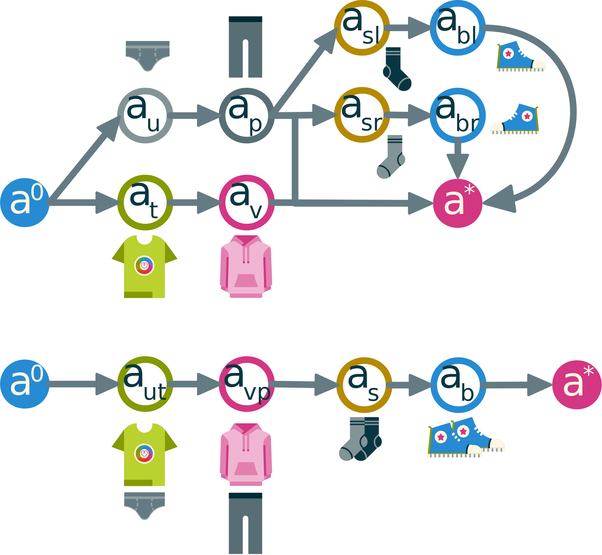

# Toward Intent Recognition {#ch:rico}

Since the original goal of this thesis was on intent recognition of dependent persons, we need to explain some more about that specific domain. The problem is to infer the goals of an external agent through only observations without intervention. In the end, the idea is to infer that goal confidently enough to start assisting the other agent without explicit instructions.

## Domain problems

This field was widely studied. Indeed, at the end of the last century, several works started using *abduction* to infer intents from observational data. Of course this comes as a challenge since there is a lot of uncertainty involved. We have no reliable information on the possible goals of the other agent and we don't have the same knowledge of the world. Also, observations can sometimes be incomplete or misleading, the agent can abandon goals or pursue several goals at once while also doing them sub-optimally or even fail at them. To finish, sometimes agents can actively try to hide their intents to the viewer.

### Observations and inferences

As explained above, we can only get close to reality and any progress in
relevance and detail is exponentially expensive in terms of computing
and memory resources. That is why any system will maintain a high degree
of abstraction that will cause errors inherent in this approximation.

This noise phenomenon can impact the activity and situation recognition
system and therefore seriously impact the intention recognition and
decision-making system with an amplification of the error as it is
processed. It is also important to remember that this phenomenon of data
noise is also present in inhibition and that the lack of perception of
an event is as disabling as the perception of the wrong event.

It is possible to protect recognition systems in an appropriate way, but
this often implies a restriction on the levels of possibilities offered
by the system such as specialized recognition or recognition at a lower
level of relevance.

### Cognitive inconsistencies

In the field of personal assistance, activity recognition is a crucial
element. However, it happens that these events are very difficult to
recognize. The data noise mentioned above can easily be confused with an
omission on the part of the observed agent. This dilemma is also present
during periods of inactivity, the system can start creating events from
scratch to fill what it may perceive as inhibition noise.

These problems are accompanied by others related to the behavior of the
observed agent. For example, they may perform unnecessary steps, restart
ongoing activities or suddenly abandon them. It is added that other
aspects of observations can make automated inferences such as ambiguous
actions or the agent performing an action that resembles another
complicated.

However, some noise problems can be easily detected by simple cognitive
processes such as impossible sequences (e. g. closing a closed door).
Contextual analyses provide a partial solution to some of these
problems.

### Sequentiality

Since our recognition is based on a highly temporal planning aspect, we
must take into account the classic problems of sequentiality.

A first problem is to determine the end of one plan and the beginning of
another. Indeed, it is possible that some transitions between two planes
may appear to be a plane in itself and therefore may cause false
positives. Another problem is that of intertwined planes. A person can
do two things at once, such as answering the phone while cooking. An
action in an intertwined plan can then be identified as a
discontinuation of activity or a logical inconsistency. A final problem
is that of overloaded actions. Not only can an agent perform two tasks
simultaneously, but also perform an action that contributes to two
activities. These overloaded actions make the process of intention
recognition complex because they are close to data noise.

## Existing approaches

The problem of intention recognition has been strongly addressed from
many angles. It is therefore not surprising that there are many
paradigms in the field. The first studies on the subject highlight the
fact that intention recognition problems are problems of abductive logic
or graph coverage. Since then, many models have competed in imagination
and innovation to improve the field. These include constraint
system-based models that provide a solution based on pre-established
rules and compiled plan libraries, those that use state or action
networks that then launch algorithms on this data, and reverse planning
systems.

### Constraint

One of the approaches to intention recognition is the one that builds a
system around a strong logical constraint. There is often a time
constraint system that is complemented by various extensions to cover as
many sequential problems as possible.

#### Deductive Approach

In order to solve a problem of intention recognition, abductive logic
can be used. Contrary to deductive logic, the goal is to determine the
objective from the observed actions. Among the first models introduced
is @goldman_new_1999's model, which uses the principle of action to
construct a logical representation of the problem. This paradigm
consists in creating logical rules as if the action in question was
actually carried out, but in hypothesizing the predicates that
concretize the action and thus being able to browse the research space
thus created in order to find all the possible plans to contain the
observed actions and concretizing defined intentions. This model is
strongly based on first-order logic and SWI Prolog logic programming
languages. Although revolutionary for the time, this system pale in
comparison to recent systems, particularly in terms of prediction
accuracy.

#### Algebraic Approach

Some paradigms use algebra to determine possible plans from observed
actions. In particular, we find the model of @bouchard_smart_2006 which extends the subsumption
relationship from domain theory to the description of action and
sequence of action in order to introduce it as an order relationship in
the context of the construction of a lattice composed of possible plans
considering the observed actions. This model simply takes into account
the observed actions and selects any plan from the library of plans that
contains at least one observed action. Then this paradigm will construct
all the possible plans that correspond to the Cartesian product of the
observed actions with the actions contained in the selected plans (while
respecting their order). This system makes it possible to obtain a
subsumption relationship that corresponds to the fact that the plans are
more or less general. Unfortunately, this relationship alone does not
provide any information on which plan is most likely.

That is why @roy_possibilistic_2011 created a probabilistic extension of this model.
This uses frequency data from a system learning period to calculate the
influence probabilities of each plane in the recognition space. This
makes it possible to calculate probabilistic intervals for each plan,
action as well as for a plan to know a given action. In order to
determine the probability of each plane knowing the upper bound of the
lattice (plane containing all observed actions) the sum of the
conditional probabilities of the plane for each observed action divided
by the number of observed actions is made. This gives a probability
interval for each plane allowing the ordinates. This model has the
advantage of considering many possible plans but has the disadvantage of
seeing a computational explosion as soon as the number of observed
actions increases and the context is not taken into account.

#### Grammatical Approach

Another approach is that of grammar. Indeed, we can consider actions as
words and sequences as sentences and thus define a system that allows us
to recognize shots from incomplete sequences. @vidal_online_2010 has therefore
created a system of intention recognition based on grammar. It uses the
evaluated grammar system to specify measurements from observations.
These measures will make it possible to select specific plans and thus
return a hierarchical hypothesis tree with the actions already carried
out, the future and the plans from which they are derived. This model is
very similar to first order logic-based systems, and uses a SWI Prolog
type logic language programming system. Given the scope of maritime
surveillance, this model, although taking very well into account the
context and the evolution of the measures, is only poorly adapted to an
application in assistance, particularly in the absence of a system for
discriminating against results plans.

#### Linear programming approach

Another class of approaches is that of diverting standard
problem-solving tools to solve the problem of intention recognition. It
is therefore possible, by modifying traditional algorithms or by
transforming a problem, to ensure that the solution of the tool
corresponds to the one sought.

@inoue_ilpbased_2011 develops the idea of a model that uses linear
programming to solve the recognition problem. Indeed, observations are
introduced in the form of causes in relation to hypotheses, in a
first-order logic predicate system. Each atom is then weighed and
introduced into a process of problem transformation by feedback and the
introduction of order and causality constraints in order to force the
linear program toward optimal solutions by taking into account
observations. Although ingenious, this solution does not discriminate
between possible plans and is very difficult to apply to real-time
recognition situations, mainly because of the problem transformation
procedure required each time the problem is updated.

#### Markovian Logic Approach

Another constraint paradigm is the one presented by @raghavana_plan
using a Markovian extension of first-order logic. The model consists of
a library of plans represented in the form of Horn clauses indicating
which actions imply which intentions. The aim is therefore to reverse
the implications in order to transform the deduction mechanism into an
abduction mechanism. Exclusionary constraints and a system of weights
acquired through learning must then be introduced to determine the most
likely intention. Once again, despite the presence of a system of result
discrimination, there is no consideration of context and abductive
transformation remains too cumbersome a process for real-time
recognition.

### Networks

#### And/Or trees approach

As in its early days, intention recognition can still be modeled in the
form of graphs. Very often in intention recognition, trees are used to
exploit the advantages of acyclicity in resolution and path algorithms.
In the prolific literature of Geib et al. we find the model at the basis
of PHATT [@geib_problems_2002] which consists of an AND/OR tree representing a
HTN that contains the intentions as well as
their plans or methods. A prior relationship is added to this model and
it is through this model that constraints are placed on the execution of
actions. Once an action is observed, all the successors of the action
are unlocked as potential next observed action. We can therefore infer
by hierarchical path the candidate intentions for the observed sequence.

Since this model does not allow discrimination of results, @geib_partial_2005 then adds probabilities to the explanations of the
observations. The degree of coverage of each possible goal is used to
calculate the probability of each goal. That is, the goal with the plan
containing the most observed action and the least unobserved action will
be the most likely. This is very ingenious, as the coverage rate is one
of the most reliable indicators. However, the model only takes into
account temporality and therefore has no contextual support. The
representation in the form of a tree also makes it very difficult to be
flexible in terms of the plans, which are then fixed a priori.

#### HTN Approach

The HTN model is often used in the field, such as the hierarchical tree
form used by @avrahami-zilberbrand_fast_2005. The tree consists of nodes that
represent various levels of action and intent. A hierarchical
relationship links these elements together to define each intention and
its methods. To this tree is added an anteriority relationship that
constrains the execution order. This paradigm uses time markers that
guarantee order to use an actualization algorithm that also updates a
hypothesis tree containing possible intentions for each observation.

A probabilistic extension of the @avrahami-zilberbrand_hybrid_2006 applies a
hierarchical hidden Markov model to the action tree. Using three types
of probability that of plan tracking, execution interleaving and
interruption, we can calculate the probability of execution of each plan
according to the observed sequence. The logic and contextual model
filtered on the possible plans upstream leaving us with few calculations
to order these plans.

This contextual model uses a decision tree
based on a system of world properties. Each property has a finite (and
if possible very limited) number of possible values. This allows you to
create a tree containing for each node a property and an arc for each
value. This is combined with other nodes or leaves that are actions.
While running through the tree during execution, the branches that do
not correspond to the current value of each property are pruned. Once a
leaf is reached, it is stored as a possible action. This considerably
reduces the research space but requires a balanced tree that is not too
large or restrictive.

#### Hidden Markovian Approach

When we approach stochastic models, we very often find Markovian or
Bayesian models. These models use different probabilistic tools ranging
from simple probabilistic inference to the fusion of stochastic
networks. It can be noted that probabilities are often defined by
standard distributions or are isomorphic to weighted systems.

A stochastic model based on THRs is the one presented by @blaylock_fast_2006. This creates hierarchical stacks to categorize abstraction
levels from basic actions to high level intentions. By chaining a hidden
Markov model to these stacks, the model is able to affect a probability
of intention according to the observed action.

#### Bayesian Approach

Another stochastic paradigm is the one of @han_contextdependent_2013. It uses Bayesian
networks to define relationships between causes, intentions and actions
in a given field. Each category is treated separately in order to reduce
the search space. The observed actions are then selected from the action
network and extracted. The system then uses the intention network to
build a temporary Bayesian network using the NoisyOR method. The network
created is combined in the same way with the network of causes and makes
it possible to have the intention as well as the most probable cause
according to the observations.

#### Markovian network approach

The model of @kelley_contextbased_2012 (based on [@hovland_skill_1996]) is a model using hidden
Markov networks. This stochastic network is built here by learning data
from robotic perception systems. The goal is to determine intent using
past observations. This model uses the theory of mind by invoking that
humans infer the intentions of their peers by using a projection of
their own.

Another contextual approach is the one developed for robotics by @hofmann_intent_2007. The stochastic system is completed by weighting based on
an analysis of vernacular corpuses. We can therefore use the context of
an observation to determine the most credible actions using the
relational system built with corpus analysis. This is based on the
observation of the objects in the scene and their condition. This makes
common sense actions much more likely and almost impossible actions
leading to semantic contradictions.

#### Bayesian Theory of Mind

This principle is also used as the basis of the paradigm of @baker_modeling_2014 which forms a Bayesian theory of the mind. Using a limited
representation of the human mind, this model defines formulas for
updating beliefs and probabilities a posteriori of world states and
actions. This is constructed with sigmoid distributions on the simplex
of inferred beliefs. Then the probabilities of desire are calculated in
order to recover the most probable intention. This has been validated as
being close to the assessment of human candidates on simple intention
recognition scenarios.

## Inverted planning

Another way to do intent recognition do not rely on having a plan library at all by using inverted planning. In fact, intent recognition is the opposite problem as planning. In planning we compute the plan from the goal and in intent recognition we seek the goal from the plan. This means that planning is a *deduction* problem while intent recognition is an *abduction* problem. It is therefore possible to transform an intent recognition problem into a planning one.

More intuitively, this transformation relies on the *theory of mind*. This notion of psychology states that one of the easiest ways to predict the mind of another agent is by projecting our own way of thinking onto the target. The familiar way to understand this is to ask the question, "what would **I** do if I were them ?". This is obviously imperfect since we don't have the complete knowledge of the other mind but is often good enough at basic predictions.

This theory is based on the Belief, Desire and Intention (BDI) model. In our case the belief part is akin to the knowledge database, the desires are the set of possible goals (weighted by costs) and the intent is the plan that achieve a selected goal.

A good analysis of this way of thinking in the context of intent recognition can be found in @baker_goal_2007's work on the subject.

To get further, the work of @ramirez_plan_2009 is the founding paper on the principle of transforming the intent recognition problem into a planning one. That work was later improved by @chen_planning_2013 in order to support multiple and concurrent goals at once.

In order to do that Ramirez rediscovers an old tool called constraints encoding into planning @baioletti_encoding_1998. This allows to force the selection of operators in a given a certain order or adding arbitrary constraints on the solution.

The encoding on itself is quite straight forward : Adding artificial fluents to derive an action's behavior considering its selection. In the case of Ramirez's work, the fluents ensure that the observed actions are selected at the start. The resulting plan is then compared to another plan computed while avoiding the observed action. The difference in cost is proportional to the likelihood of the goal to be pursued.

This problem transformation was more recently improved significantly by @sohrabi_plan_2016. Indeed, their work allows for using observed fluents instead of actions. This modification allows for a more accurate and flexible prediction with less advanced observations. It also takes into account the missing and noisy observation to affect negatively the likelihood of a goal. Along with the use of diverse planning, this technique allows for seamless multi-goal recognition.

In order to see this technique used in practice we refer to the works of @talamadupula_planning_2011.

### Probabilities and approximations

Now that the intuition is covered, we need to prove that the result of the planning process is indeed correlated to the probability of the agent pursuing that plan knowing the observations. But first we need to formalize how probabilities work.

An *event* is a fixed fluent, a logical proposition that can occur. The likelihood of an event happening ranges from $0$ (impossible) to $1$ (certain). This is represented by a relation named **probability** of any event $e$ noted $\proba(e) \in [0,1]_{\bb{R}}$. This means that probabilities are real numbers restricted between $0$ and $1$.

::: {.definition name="Conditional probabilities"}
Conditional probabilities are probabilities of an event assuming that another related event happened. This allows to evaluate the ways in which events are affecting one another. The probability of the event $A$ occurring knowing that $B$ occurred is written:

$$\proba(A|B) = \frac{\proba(A \cap B)}{\proba(B)}$$

with, $\proba(A \cap B)$ being the probability that both events occur. In the case of two *independent* events $\proba(A|B) = \proba(A)$.
:::

We note the set of goals that can be pursued $G$ and the temporal sequence of observations $\obs$. Using conditional probabilities, we seek to have a measure of $\proba(g|\obs)$ for any goal $g \in G$.

In that section we explain how inverted planning does that computation.

For any set of observations $\obs$ the probability of the set is the product of the probability of any observation $o \in \obs$. We can then note $\proba(\obs)=\prod_{o\in \obs} \proba(o)$.

We assume that the observed agent is pursuing one of the known goals. The event of an agent pursuing a specific goal is noted $g$. This means that $\proba(G) = \sum_{g\in G}\proba(G) = 1$ because the event is considered certain.

Using *conditional probabilities* we can also note  $\proba(G|\plan) = 1$ for a valid plan $\plan$ that achieves any goals $g \in G$.

::: {.theorem name="Bayes"}
Bayes's theorem allows to find the probability of an event based on prior knowledge of other factors related to said event. It is another basic way to compute conditional probabilities as follows:

$$\proba(A|B) = \frac{\proba(B|A)\proba(A)}{\proba(B)}$$
:::

In the Bayesian logic, one should start with a *prior* probability of an event and actualize it with any new information to make it more precise. In our case, we suppose that $\proba(G)$ is given or computed by an external tool.

From the direct application of Bayes's theorem and the previous assumptions, we have :

$$\proba(\plan|\obs) = \frac{\proba(\obs|\plan) \proba(\plan)}{\proba(\obs)} = \frac{\proba(\obs|\plan) \proba(\plan|G) \proba(G)}{\proba(\obs)}$$ {#eq:plan-obs}

Using the event $\plan$ transitively we can simplify to:

$$ \proba(G|\obs) = \frac{\proba(\obs|G)\proba(G)}{\proba(\obs)}$$ {#eq:goal-obs}

::: {.theorem name="Total Probability"}
If we have a countable set of disjoint events $E$ we can compute the probability of all events happening as the sum of the probabilities of each event:

$$\proba(E) = \sum_{e \in E} \proba(e)$$
:::

Since we consider that we have all likely plans for a given goal we can neglect the very improbable ones and assert that the events of any given plans being acted are independent from one another. Also, the total probability of all plans is certain. From the total probability formula:

$$\proba(\obs|G) = \sum_{\plan \in \plans_G} \proba(\obs|\plan) \proba(\plan|G)$$ {#eq:obs-goal}

In @eq:goal-obs, we have $\proba(G)$ and $\proba(\obs)$ known from prior knowledge. Along with @eq:obs-goal, we can say that:

$$\proba(G|\obs)= \alpha \proba(\obs|G) \proba(G)$$

With $\alpha$ being a normalizing constant. Also, using the previous formula we can assert that:

$$\proba(g|\obs) \propto \sum_{\plan \in \plans_g} \proba(\plan|\obs)$$

This means that if the cost of the plan is related to its likeliness of being pursued knowing the observation sequence, we can evaluate the probability of any goal being pursued. This allows for Sohrabi's problem transformation to work.

That transformation is simply affecting the cost of a plan by dissuading any missed or added fluents while rewarding correct predicted fluents relative to the observations. This process is illustrated in @fig:proba.

{#fig:proba}

## Intent recognition Using Abstract Plans

The initial objective of this thesis was to make intent predictions use abstract plans and repairs. Since plan repair is very susceptible to the heuristic, it is not a reliable tool for general and uncertain planning and will perform worse on all cases not handled well by a given heuristic.

This is not the case of abstract HTN planning since the plan generated is valid while incomplete. The idea here is to quantify the quality of an abstract plan to weigh its plausibility and the likelihood of missing fluents using Sohrabi's method.

The unforeseen problem is that, while in theory this seems like a very efficient approach, in practice it can lack a lot of performance since turning a sequence of observed fluents into a backward chaining heuristic is tricky at best.

In this section, some idea of how that could be done is explored along with perspectives for further works regarding the subject.

### Linearization

In order to use the approach of Sohrabi, we need total ordered plans. This is quite an issue since our planner generates partial order plans. Each of these plans have one or several *linearizations*: totally ordered plans that correspond to all possible orders of the plan.

The idea here is to merge parallel actions into one using graph quotient. This is the same mechanism behind sheaves. To do this we use the fact that there are no threats in valid plans and therefore parallel actions have compatible preconditions and effects. This allows to merge several actions into one that is equivalent in terms of fluents and cost. To merge two actions into one we do the following: $\pre(a_m) = \pre(a_1) \circ \pre(a_2)$ and $\eff(a_m)= \eff(a_1) \circ \eff(a_2)$. We use the application of states over other states and ignore the order.

### Abstraction

Since abstract plans use composite actions that have explicit preconditions and effects, they can be treated as a normal action. Indeed, while it is possible that an abstract action has fewer requirements and effects than what is done in its methods, it can't have more since the methods must *at least* fulfill the parent action's "contract."

Adding to that, while merging actions in the linearization step, it may be appropriate to merge actions into a composite action that holds all the merged actions in its only method.

### Example

In this section we present an example as well as a description of the execution of our planning algorithm and how the results are used for intent recognition.

{#fig:clothes}

::: example
@Fig:clothes illustrates an example of such a linearization. The linearization happens by merging actions that can be done simultaneously. Of course, this is not a valid totally ordered plan since classical planning supposes that the agent can only perform an action at once.

In our example, a person wants to get dressed. In a partial order plan there is no need to order between top clothing and bottom clothing. It is also necessary to specify if the right or left socks and shoes should be put on first.
:::

In a first time, we explain how the planning algorithm can affect the result of the intent recognition.

#### Partial Order Approach

Using a previously described POP algorithm (@ch:heart) we can create a planning domain with the following actions from the example in @fig:clothes: $a_u$, $a_t$, $a_p$, $a_v$, $a_{s(l|r)}$ and $a_{b(l|r)}$. Each action instinctively requires you to wear clothes that are underneath their related garment and put it on. For example, the action $a_{br}$ requires the right socket to be put on (effect of $a_{sr}$) and will result in putting the right shoe on.

The goal is to put on all the clothes from a state of none are already put on. The planner will select each action to fulfill the goal and add causal links to prevent threats between actions and to fulfill their preconditions. The resulting plan is the upper one in @fig:clothes.

Now the intent recognition part quick in and linearize the plan. To do so, the algorithm identifies actions that can be done simultaneously and merge them into a single action.
The purpose of this merging is to make the plan totally ordered while keeping fluents in chronological order. Here we can see that the linear plan describes actions of putting clothes by layers instead of by the garment. Details are lost but the chronological order and cost is kept (by adding costs of all actions being merged).

This allows for existing intent recognition methods to be applied on the resulting plan without losing on the advantages of partial order plans. This technique results in the plan on the bottom of @fig:clothes. This plan is totally ordered and can be used by the classical inverted planning approaches as described previously.

#### Abstract Plan Approach

This example also illustrates the advantages of using abstract plans for intent recognition. If the domain is properly designed for it, we can use an abstract plan that has composite actions made by layers of clothing.

In that approach, we reuse the previous domain but extend it with the following actions: $a_{ut}$, $a_{vp}$, $a_s$, $a_b$. These actions will behave in the same way as the merged actions of the linearization. Each action corresponds to a layer of clothing and can be decomposed into the atomic actions relative to that layer. For example, the action $a_{ut}$ is the action related to putting on the first layer of clothing. It can be decomposed into the action of putting underwear $a_u$ and the action of putting on a t-shirt $a_t$.

Using our HEART planner, it is possible to request only an abstract plan to contain this level of action. The planning process will therefore result into the plan on the bottom of @fig:clothes that is also the linearized plan found earlier.

Since the abstract plans are easier to compute, the intent recognition becomes faster for the same result in that case. The main factor in the efficiency of this method is the design of the domain.

## Conclusion

In this chapter, we present existing intent recognition techniques and expose how inverted planning can be fitted to our planning approach.

<!--FIXME Repeat that further research is needed and that practical testing wasn't done for lack of time.-->