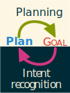

# Acknowledgements {-}

# Preface {-}

In this section we present a quick guide to the presentation of the information in this document. This will give its global structure and each of the type of formating and its meaning.

## Text format {-}

The text can be emphasized **more** or *less* to make a key word more noticeable.

## Citations {-}

In text citations will be in this format: Author *et al.* 
([year](https://citationstyles.org/)) to make the author part of the text and (Author *et al.* [year](https://citationstyles.org/)) when simply referencing the work.

## Quotes {-}

Sometimes, important quotes needs emphasis. They are presented as:

> _"Don't quote me on that !"_^[Gréa ([2019](antoine.grea.me))]

# Introduction

## Thesis Context

The work in this thesis was started in 2014, funded at the time by an \arc  (Academic Research Community) research allocation courtesy of the \ara region in France. This organism is acting toward an improvement of the quality of life and of aging. Hence, the original subject was oriented toward assisting dependent persons using intelligent robots. However, such assistance is often rejected by these people who are also very demanding on the social skills of caregivers.
That's why the work lays on the aspect of intent recognition and collaboration in assistive robotics.

This work was done under the \ucbl university in the \liris (Laboratory of computeR science in Image and Information Systems). I was supervised by Samir Aknine and Laëtitia Matignon from the \sma team (Multi-Agent System). Part of the work was funded by the university \lumiere and by the \polytech engineering school.

## Motivations

The social skills of modern robot are rather poor. Often, it is that lack that inhibits human-robot communication and cooperation. Humans being a social species, they require the use of implicit social cues in order to interact comfortably with an interlocutor. The primary goal of this thesis is to address this issue and create the formal foundations of a system able to help dependent people.

In order to enhance assistance to dependent people, we need to account for any deficiency they might have. An entire field of medicine and computer sciences is already dedicated to helping with the physical deficiencies. In our case we chose to address cognitive deficiencies. The main one is anterograde amnesia and dementia caused by Alzheimer's disease. In such cases, the patient is unable to express their needs. That is a problem even with human caregivers as the information about their intent needs to be inferred from their past actions.

## Issues

This is the main issue addressed in the Artificial Intelligence (AI) field of intent recognition. The problem is very simple: from observational data, we need to infer the goals and intent of an external agent. There are several ways to handle this issue. Most approaches use trivial machine learning techniques like Bayesian Networks (BN) or Markovian Decision Processes (MDP). The issue with these common approaches is that they require an extensive amount of training data and need to be trained on each patient. This makes the practicality of such system quite limited. To address this issue, some works proposed hybrid approaches using hand-made plan libraries or enforcing logical constraints on the probabilistic method.

A work from Ramirez @citation, added an interesting method to solve that kind of problems. Indeed, they noticed an interesting parallel of that problem with the field of automated planning. This analogy was made by using the Theory of mind @citation, that states that any agent will infer the intent of other agents using a projection of their own expectation on the observed behavior of the external agent.{.margin}

This made the use of planner possible to infer intent without the need for extensive and well-crafted plan libraries. Now only the domain of the possible actions and their effects and prerequisites is needed to infer the logical intent of an agent.

The main issue of planning for that particular use is that of computation time and search space sizes. This prevents most planner to make any decision before the intent is already realized and therefore being useless for assistance. This time constraint lead to the search of a real-time planner algorithm that is also very expressive and flexible to accommodate for dynamical changes.

## Contributions

In order to achieve such a planner, the first step was to formalize what is exactly needed to express a domain. Hierarchical and lenient forms of plan ordering gave the most expressivity and flexibility but at the cost of time performance. This is why, a new formalism of knowledge representation was needed in order to increase the speed of the search space exploration while restricting it using semantic inference rules. 

While searching for a knowledge representation system, some prototypes were done using standard ontology tools but all proved to be way too slow and inexpressive for that application. This made the creation of a lighter but more flexible knowledge representation system, a requirement of the project.

Then the planning formalism was to be converted into our general knowledge representation tool. Since automated planning have a very diverse ecosystem of approaches and paradigms, it was also devoid of a universal standard formalism. A new formalism is proposed and compared to the one used in some part of the planning community.

Then finally, a couple of planner were conceived to attempt answering the speed and flexibility requirement of human intent recognition. The first one is a prototype that aims to evaluate the advantages of repairing plans using several heuristics. The second is a more complete prototype derived from the first (without plan repair), that also implement a Breadth-First Search (BFS) approach to hierarchical decomposition of composite actions. This allows the algorithm to provide intermediary plan that, while incomplete, are an abstraction of the result plan. This allows for anytime probability computation using existing techniques of invert planning.

## Plan

