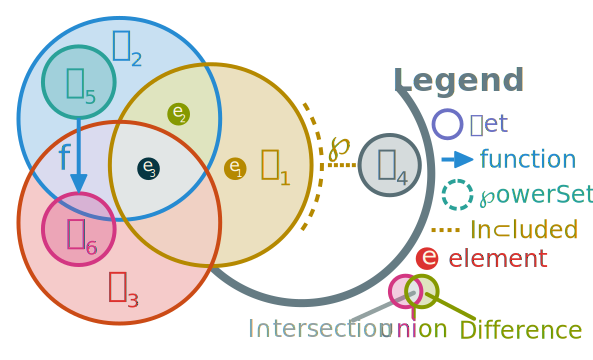
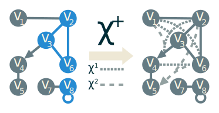
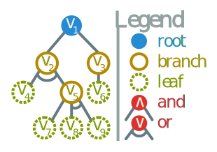
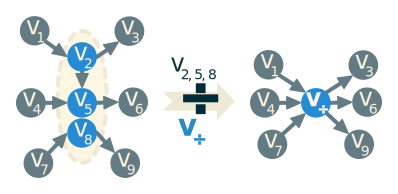
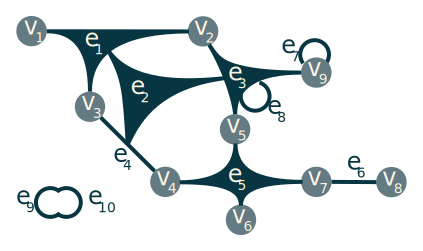
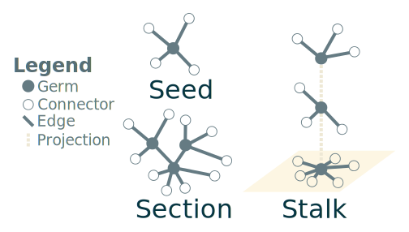
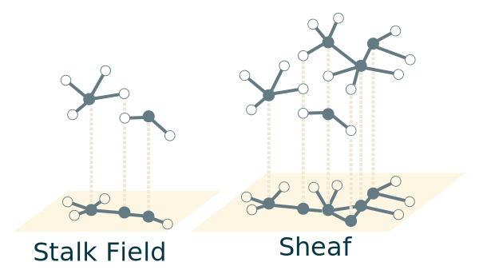
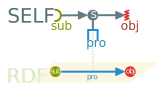
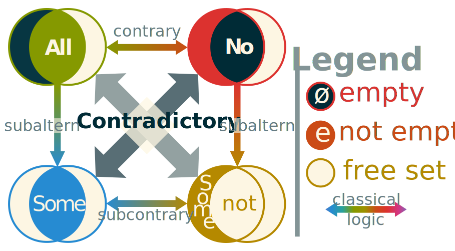

# Knowledge Representation


**SAMIR**: 

* Cite slow start 1.2
* System : implentation -> Model : theory
* Examples
* theorems or not
* s : D -> D notation in table
* Double arrow too for ±
* to port : porter une notion in smth
* 1.2.2 : criterion
* Example of parsing
* 1.2.6.1 : light defeasible logic
* lacks properties and proofs: what are the advantages ?
* **TODO**: Chap 1 $\timeout$

Knowledge representation is at the intersection of maths, logic, language and computer sciences. Its research starts at the end of the 19^th^ century, with Cantor inventing set theory [@cantor_property_1874]. Then after a crisis in the beginning of the 20^th^ century with Russel's paradox and Gödel's incompletude theorem, revised versions of the set theory become one of the foundations of mathematics. The most accepted version is the Zermelo-Fraenkel axiomatic set theory with the axiom of Choice (ZFC) [@fraenkel_foundations_1973; @ciesielski_set_1997]. This effort leads to a formalization of mathematics itself, at least to a certain degree.

Knowledge description systems rely on syntax to interoperate systems and users to one another. The base of such languages comes from the formalization of automated grammars by @chomsky_three_1956. It mostly consists of a set of hierarchical rules aiming to deconstruct an input string into a sequence of terminal symbols. This deconstruction is called parsing and is a common operation in computer science. More tools for the characterization of computer language emerged soon after thanks to @backus_syntax_1959 while working on a programming language at IBM. This is how the Backus-Naur Form (BNF) metalanguage was created on top of Chomsky's formalization.

A similar process happened in the 1970's, when logic based knowledge representation gained popularity among computer scientists [@baader_description_2003]. Systems at the time explored notions such as rules and networks to try and organize knowledge into a rigorous structure. At the same time other systems were built based on First Order Logic (FOL). Then, around the 1990's, the research began to merge in search of common semantics in what led to the development of Description Logics (DL). This domain is expressing knowledge as a hierarchy of classes containing individuals.

From there and with the advent of the world wide web, engineers were on the lookout for standardization and interoperability of computer systems. One such standardization took the name of "semantic web" and aimed to create a widespread network of connected services sharing knowledge between one another in a common language. At the beginning of the 21^st^ century, several languages were created, all based on the World Wide Web Consortium (W3C) specifications called Resource Description Framework (RDF) [@klyne_resource_2004]. This language is based on the notion of statements as triples. Each can express a unit of knowledge. All the underlying theoretical work of DL continued with it and created more expressive derivatives. One such derivative is the family of languages called Web Ontology Language (OWL) [@horrocks_shiq_2003]. Ontologies and knowledge graphs are more recent names for the representation and definition of categories (DL classes), properties and relation between concepts, data and entities.

All these tools are the base for all modern knowledge representations. In the rest of this chapter, we discuss the fundamentals of each of the aspects of knowledge description, then we propose a knowledge description framework that is able to adapt to its usage.

## Fundamentals

First, we present the list of notations in this document. While trying to stick to traditional notations, we also aim for an unambiguous symbols across several domains while remaining concise and precise.

### Foundation of maths and logic systems

In order to understand knowledge representation, some mathematical and logical tools need to be presented. 

#### First Order Logic

**Symbol**                                            **Description**
----------                                            ---------------
$=, \neq$                                             Equal and not equal.
$e : ?(e)$                                            The colon is a separator to be read as "such that". Also used for typing.
$\top, \bot$                                          Top and bottom symbols used as true and false respectively.
$?(e)$                                                Predicate over $e$.
$\lnot, \land, \lor, \veeonwedge$                     Negation (not), conjunction (and), disjunction (logical or) and either.
$\vdash$                                              Entails, used for logical implication and consequence.
$\forall, \exists, \exists!, \nexists, \textsection$  Universal, existential, uniqueness, exclusive and solution quantifiers.
$[?(e)]$                                              Iverson's brackets: $[\bot]=0$ and $[\top]=1$.

: List of classical symbols for logic. {#tbl:logic}

The first mathematical notion we define is logic. More precisely First Order Logic (FOL) in the context of DL. All notations are presented in @tbl:logic. FOL is based on boolean logic with the two values $\top$ *true* and $\bot$ *false* along with the classical boolean operators $\lnot$ *not*, $\land$ *and* and $\lor$ *or*. These are defined in the following way :

* $\lnot \top = \bot$, not true is the same as false.
* $a \land b \vdash (a = b = \top)$, $a$ and $b$ is true when they are both simultaneously true.
* $\lnot(a \lor b) \vdash (a = b = \bot)$, $a$ or $b$ is true if both variables are not false.

With $\vdash$ being the logical implication also called entailement and $=$ being the identity relation. When combining logical operators with boolean variables, we form *expressions* also called formulas. These expressions can be evaluated given an interpretation of the variable to return a boolean value. Any function that returns a boolean is called a *predicate* (noted $?(e)$). Relations that takes an expression as parameter are called *modifiers*. FOL introduce a useful kind of modifer used to generalize expressions: *quantifiers*. Quantifiers can specify restriction on a variable. These restrictions forces the expression to be true in specific cases depending on the quantifier used.

The classical quantifiers includes the following:

* The *universal quantifier* $\forall$ meaning _"for all"_.
* The *existential quantifier* $\exists$ meaning _"it exists"_.
* The *uniqueness quantifier* $\exists!$ meaning _"it exists a unique"_.
* The *exclusive quantifier* $\nexists$ meaning _"it doesn't exist"_.
* The *solution quantifier* $\textsection$ meaning _"those"_ [@hehner_practical_2012].

The last three quantifiers are optional in FOL but will be conducive later on. It is interesting to note that most quantified expression can be expressed using the set builder notation discussed in the following section.

#### Set Theory

**Symbol**                                  **Description**
----------                                  ---------------
$\emptyset$                                 Empty set, also noted $\{\}$.
$e \in \cal{S}$                             Element $e$ is a member of set $\cal{S}$.
$\subset, \cup, \cap, \setminus, \times$    Set inclusion, union, intersection, difference and cartesian product.
$|\cal{S}|$                                 Cardinal (number of elements) of set $\cal{S}$.
$\{e : ?(e)\}$                              Set builder notation, set of all $e$ such that $?(e)$ is true.
$\wp(\cal{S})$                              Powerset: set of all subsets of $\cal{S}$.

: List of classical symbols and syntax for sets. {#tbl:set}

Since we need to represent knowledge, we will handle more complex data than simple booleans. At the beginning of his funding work on set theory, Cantor wrote:

> "_A set is a gathering together into a whole of definite, distinct objects of our perception or of our thought--which are called elements of the set._" \hfill George @cantor_beitrage_1895

For Cantor, a set is a collection of concepts and percepts. We define a set using the notations in @tbl:set.

::: {.definition #def:set name="Set"}
A collection of *distinct* objects considered as an object in its own right. We define a set one of two ways (always using braces):

* In extension by listing all the elements in the set: $\{0,1,2,3,4\}$
* In intension by specifying the rule that all elements follow: $\{n : n \in \bb{N} \land (n \le 4) \}$
:::

The member relation is noted $e \in \cal{S}$ to indicate that $e$ is an element of $\cal{S}$.
We note $\cal{S} \subset \cal{T} \vdash ((e \in \cal{S} \vdash e\in \cal{T}) \land \cal{S} \neq \cal{T})$, that a set $\cal{S}$ is a proper subset of a more general set $\cal{T}$.

We also define the union, intersection and difference as following:

* $\cal{S} \cup \cal{T} = \{e : e \in \cal{S} \lor e \in \cal{T} \}$
* $\cal{S} \cap \cal{T} = \{e : e \in \cal{S} \land e \in \cal{T} \}$
* $\cal{S} \setminus \cal{T} = \{e : e \in \cal{S} \land e \notin \cal{T} \}$

An interesting way to visualize relationsips with sets is by using Venn diagrams. In @fig:venn we present the classical set operations.

{#fig:venn}

These diagrams have a lack of expressivity regarding complex operations on sets. Indeed, from their plannar form it is complicated to express numerous sets having intersection and disjunctions. One exemple is the cartesian product that is defined as $\cal{S} \times \cal{T} = \{\langle e_{\cal{S}}, e_{\cal{T}} \rangle : e_{\cal{S}} \in \cal{S} \land e_{\cal{T}}\in \cal{T}\}$.

We can also define the set power recursively by $\cal{S}^1 = \cal{S}$ and $\cal{S}^n = \cal{S} \times \cal{S}^{n-1}$.

The most common axiomatic set theory is ZFC. In that definition of sets there are a few notions that comes from its axioms. By being able to distinguish elements in the set from one another we assert that elements have an identity and we can derive equality from there:

::: {.axiom #axi:extensionality name="Extensionality"}
$\forall\cal{S} \forall\cal{T} : \forall e((e\in\cal{S})=(e\in\cal{T})) \vdash \cal{S}=\cal{T}$
:::

Another axiom of ZFC that is crucial in avoiding Russel's paradox ($\cal{S} \in \cal{S}$) is the following:

::: {.axiom #axi:fondation name="Foundation"}
$\forall \cal{S} : (\cal{S} \neq \emptyset \vdash \exists \cal{T}\in \cal{S},(\cal{T}\cap \cal{S}=\emptyset))$
:::

This axiom uses the empty set $\emptyset$ (also noted $\{\}$) as the set with no elements. Since two sets are equals if and only if they have precisely the same elements, the empty set is unique.

The definition by intention uses *set builder notation* to define a set. It is composed of an expression and a predicate $?$ that will make any element $e$ in a set $\cal{T}$ satisfying it part of the resulting set $\cal{S}$, or as formulated in ZFC:

::: {.axiom #axi:specification name="Specification"}
$\forall ? \forall \cal{T} \exists \cal{S} : \left(\forall e \in \cal{S} : (e \in \cal{T} \land ?(e)) \right)$
:::

The last axiom of ZFC we use is to define the power set $\wp(\cal{S})$ as the set containing all subsets of a set $\cal{S}$:

::: {.axiom #axi:powerset name="Power set"}
$\wp(\cal{S}) = \{\cal{T} : \cal{T} \subseteq \cal{S}\}$
:::

With the symbol $\cal{S} \subseteq \cal{T} \vdash (\cal{S} \subset \cal{T} \lor \cal{S} = \cal{T})$. These symbols have an interesting property as they are often used as a partial order over sets.

#### Relational algebra

**Symbol**                        **Description**
----------                        ---------------
$f \circ g$                       Function composition also noted $g(f(x))$
$\sigma, \pi$                     Selection and projection of a relation.
$\langle e_1, e_2, e_n \rangle$   $n$-uple also called a relation.
$\cal{S} \to \cal{S}$             Association relation. Used for graph edges and domain definition.
$e \mapsto f(e)$                  Substitution relation.

: List of classical symbols and syntax for relational algebra. {#tbl:rel}

From set theory, it is possible to add relations between sets.

::: {.definition #def:rel name="Relation"}
A relation is effectively a subset of the cartesian product between several sets: $r = \sigma \wp \left( \bigtimes_{i=1}^n \cal{S}_i \right)$ with $\sigma$ being the selection relation and $n$ being the *arity* of the relation $r$.

It can also be noted as a set of tuples each noted $\langle e_1, e_2, e_n \rangle$.
:::

We need to define some special relations often used for set manipulation:

* The **substitution** that replace a variable in an expression $\bb{e}$ such that: $(e \mapsto f(e))(\bb{e}(e)) = \bb{e}(f(e))$. The substitution is often used for function definition.
* The **selection** that selects elements given a predicate $?$ such that: $\sigma_?(\cal{S}) = \{e : ?(e) \land e\in \cal{S}\}$. The choice selection $\sigma_!(\cal{S})$ is a non deterministic choice of one element in $\cal{S}$.
* The **projection** that merges elements of a set given a filter $f$ such that: $\pi_f(\cal{S}) = \{ f(e) : e \in \cal{S}\}$. The default projection uses the identity relation $=$ instead of $f$.

Functions are a special case of relations that takes as value the selected element of the last set. We note them $f: \left( \bigtimes_{i=1}^{n-1} \cal{S}_i \right) \to \cal{S}_n$. The set $\bigtimes_{i=1}^{n-1} \cal{S}_i$ is called the *domain* of the function $\cal{D}(f)$ and the set $\cal{S}_n$ is caled the *codomain* $\cal{D}^{-1}(f)$. The number $n-1$ is called the degree of the function.

We can combine functions using the *function composition operator* $g \circ f = x \mapsto g(f(x))$. The functional power of $f$ noted $f^n$ is defined recursively as :

* $f^0 = x \mapsto x$, $f^1 = x \mapsto f(x)$ and $f^{-1} = f(x) \mapsto x$
* $f^n = f \circ f^{n+[n<0]-[n>0]}$ with $[?(n)]$ being an Iverson bracket ($[\top]=1$ and $[\bot]=0$).

#### Graphs

**Symbol**                    **Description**
----------                    ---------------
$g=(V,E)$                     Graph $g$ with set of vertices $V$ and edges $E$.
$\phi^{\pm|n|*}(e|v)$         Incidence (edge) and adjacence (vertex) function for graphs:
$\phi$                        • A tuple or set representing the edge or all adjacent edges of a vertex.
$\phi^-$                      • Source vertex (subject) or set of all incoming edges of a vertex. 
$\phi^+$                      • Target vertex (object) or set of all outgoing edges of a vertex.
$\phi^0$                      • Label of edges and vertex : property of a statement or cause of a causal link.
$\chi(g)^+$                   Transitive closure of graph $g$.
$\div$                        Graph quotient.

: List of classical symbols and syntax for graphs. {#tbl:graph}

Next in line, we need to define a few notions of graph theory.

::: {.definition #def:graph name="Graph"}
A graph is a mathematical structure $g=(V,E)$ consisting of vertices $V$ (also called nodes) and edges $E$ (arcs) that links two vertices together. Each edge is basically a pair of vertices ordered or not depending on if the graph is directed or not. We can write $E= \sigma\wp(V^2)$
:::

{#fig:transitive}

A graph is often represented with lines or arrows linking points together like illustrated in @fig:transitive. In that figure, the vertices $v_1$ and $v_2$ are connected through an undirected edge. Similarly $v_3$ connects to $v_4$ but not the opposite since they are bonded with a directed edge. The vertex $v_8$ is also connected to itself.

From that definition, some other relations are needed to express most properties of graphs. In the following, the signed symbol only applies to directed graphs.
 
We provide graphs with an adjacence function $\phi$ over any vertex $v \in V$ such that:

* $\phi(v) = \{ e : e\in E \land v \in e \}$
* $\phi^+(v) = \{ \langle v \rightarrow v' \rangle \in E : v' \in V \}$ and $\phi^-(v) = \{ \langle v' \rightarrow v \rangle \in E : v' \in V \}$

This relation gives the set of incoming or outgoing edges from any vertex. In non directed graphs, the relation gives edges adjacent to the vertex. For example: in @fig:transitive, $\phi(v_1) = \{ \langle v_1, v_2 \rangle \}$. In that example, using directed graph notation we can note $\phi^+(v_3) = \{ \langle v_3 \rightarrow v_4 \rangle \}$.

Using types, it is possible to reuse the same symbol to define an incidence function over any edges $e = \langle v, v' \rangle$ such that:

* $\phi(e) =  \langle v, v' \rangle$
* $\phi^-(e) = v$ and $\phi^+(e) = v'$

Most of the intrinsic information of a graph is contained within its structure. Exploring its properties require to study the "shape" of a graph and to find relationships between vertices. That is why graph properties are easier to explain using the *transitive cover* $\chi^+$ of any graph $g = (V,e)$ defined as follows:

* $\chi(g) = (V,e') : e' = e \cup \{ \langle v_1, v_3 \rangle : \{ \langle v_1, v_2 \rangle, \langle v_2, v_3 \rangle \} \subset e \}$
* $\chi^+ = \chi^\infty$

This transitive cover will create another graph in which two vertices are connected through an edge if and only if it exists a path between them in the original graph $g$. We illustrate this process in @fig:transitive. Note how there is no edge in $\chi(g)$ between $v_5$ and $v_6$ and the one in $\chi^2(g)$ is directed towards $v_5$ because there is no path back to $v_6$ since the edge between $v_3$ and $v_4$ is directed.

::: {.definition #def:path name="Path"}
We say that vertices $v_1$ and $v_2$ are *connected* if it exists a path from one to the other. Said otherwise, there is a path from $v_1$ to $v_2$ if and only if $\langle v_1, v_2 \rangle \in E_{\chi^+(g)}$.
:::

The notion of connection can be extended to entire graphs. An undirected graph $g$ is said to be *connected* if and only if $\forall e \in V^2 ( e \in E_{\chi^+(g)})$.

Similarly we define *cycles* as the existence of a path from a given vertex to itself. For example, in @fig:transitive, the cycles of the original graph are colored in blue. Some graphs can be strictly acyclical, enforcing the absence of cycles.

A **tree** is a special case of a graph. A tree is an acyclical connected graph. If a special vertex called a *root* is chosen we call the tree a *rooted tree*. It can then be a directed graph with all edge pointing away from the root. When progressing away from the root, we call the current vertex *parent* of all exterior *children* vertices. Vertex with no children are called *leaves* of the tree and the rest are called *branches*. 

An interesting application of trees to FOL is called *and/or trees* where each vertex has two sets of children: one for conjunction and the other for disjunction. Each vertex is a logic formula and the leaves are atomic logic propositions. This is often used for logic problem reduction. In @fig:andor we illustrate how and/or trees are often depicted.

{#fig:andor}

Another notion often used for reducing big graphs is the quotiening as illustrated in @fig:quotient.

::: {.definition #def:quotient name="Graph Quotient"}
A quotient over a graph is the act of reducing a subgraph into a node while preserving the external connections. All internal structure becomes ignored and the subgraph now acts like a regular node. We note it $\div_f(g)= (\pi_f(V), \{ \pi_f(e) : e \in E\})$ with $f$ being a function that maps any vertex either toward itself or toward its quotiened vertex.
:::

We can also combine several graphs into one using fusion: $g_1 + g_2 = (V_1 \cup V_2, E_1 \cup E_2)$.

{#fig:quotient}

#### Hypergraphs

A generalization of graphs are **hypergraphs** where the edges are allowed to connect to more than two vertices. They are often represented using Venn-like representations but can also be represented with edges "gluing" several vertex like in @fig:hypergraph.

An hypergraph is said to be *$n$-uniform* if the edges are restricted to connect to only $n$ vertices together. In that regard, classical graphs are 2-uniform hypergraphs.

{#fig:hypergraph}

Hypergraphs have a special case where $E \subset V$. This means that edges are allowed to connect to other edges. In @fig:hypergraph, this is illustrated by the edge $e_3$ connecting to three other edges. Information about these kinds of structures for knowledge representation is hard to come by and rely mostly on a form of "folk wisdom" within the mathematics community where knowledge is rarely published and mostly transmitted orally during lessons. One of the closest information available is this forum post [@kovitz_terminology_2018] that associated this type of graph to port graphs [@silberschatz_port_1981]. Additional information was found in the form of a contribution of @vepstas_hypergraph_2008 on an encyclopedia article about hypergraphs. In that contribution, he says that a generalization of hypergraph allowing for edge-to-edge connections violate the @axi:fondation of ZFC by allowing edge-loops. Indeed, like in @fig:hypergraph, an edge $e_9 = \{e_{10}\}$ can connect to another edge $e_{10} = \{ e_9 \}$ causing an infinite descent inside the $\in$ relation in direct contradiction with ZFC.

This shows the limits of standard mathematics especially on the field of knowledge representation. Some structures needs higher dimensions than allowed by the one-dimensional structure of ZFC and FOL.
However, it is important not to be mistaken: such non-standard set theories are more general than ZFC and therefore contains ZFC as a special case. All is a matter of restrictions.

#### Sheaf

**Symbol**                          **Description**
----------                          ---------------
$\textbullet, \varstar, \multimap$  Germ, seed and connector.
$\cal{F}$                           Sheaf (from French *faisceau*).

: List of symbols and syntax for sheaves. {#tbl:sheaf}

In order to understand sheaves, we need to present a few auxiliary notions. Most of these definitions are adapted from [@vepstas_sheaves_2008]. The first of which is a seed.

{#fig:seed}

::: {.definition #def:seed name="Seed"}
A seed corresponds to a vertex along with the set of adjacent edges. Formally we note a seed $\varstar = (\textbullet, \phi_g(\textbullet))$ that means that a seed build from the vertex $\textbullet$ in the graph $g$ contains a set of adjacent edges $\phi_g(\textbullet)$. We call the vertex $\textbullet$ the *germ* of the seed. The edges in a seed does not connect to the other vertices but keep the information and are able to match the correct vertices through typing (often a type of a single individual). We call the edges in a seed *connectors*.
:::

Seeds are extracts of graphs that contains all information about a vertex. Illustrated in the @fig:seed, seeds have a central germ (represented with discs) and connectors leading to a typed vertex (outlined circles). Those external vertices are not directly contained in the seed but the information about what vertex can fit in them is kept. It is useful to represent connectors like jigsaw puzzle pieces: they can match only a restricted number of other pieces that match their shape.

From there, it is useful to build a kind of partial graph from seeds called sections.

::: {.definition #def:section name="Section"}
A section is a set of seeds that have their common edges connected. This means that if two seeds have an edge in common connecting both germs, then the seeds are connected in the section and the edges are merged. We note $g_\varstar = (●, ⌕)$ the graph formed by the section.
:::

In @fig:seed, a section is represented. It is a connected section composed of seeds along with the additional seeds of any vertices they have in common. They are very similar to subgraph but with an additional border of typed connectors. This tool was originally mostly meant for big data and categorization over large graphs. As graph quotient is often used in that domain, it was ported to sections instead of graphs allows us to define stalks.

::: {.definition #def:stalk name="Stalk"}
Given a projection function $f:●\to ●'$ over the germs of a section $\varstar$, the stalk above the vertex $\textbullet' \in ●'$ is the quotient of all seeds that have their germ follow $f(\textbullet) = \textbullet'$.
:::

The quotienning is used in stalks for their projection. Indeed, as shown in @fig:seed, the stalks are simply a collection of seeds with their germs quotiened into their common projection. The projection can be any process of transformation getting a set of seeds in one side and gives object in any base space called the image. Sheaves are a generalization of this concept to sections.

{#fig:sheaf}

::: {.definition #def:sheaf name="Sheaf"}
A sheaf is a collection of sections, together with a projection. We note it $\cal{F} = \langle G_{\varstar}, \pi_g \rangle$ with the function $g$ being the gluing axioms that the projection should respect depending on the application. The projected sheaf graph is noted $g_{\cal{F}} = \sum_{g_{\varstar} \in G_{\varstar}}\div_g(g_{\varstar})$ as the fusion of all quotiened sections.
:::

By merging common vertices into a section, we can build stack fields. These fields are simply a subcategory of sheaves. Illustrated in @fig:sheaf, a sheaf is a set of section with a projection relation.

### Grammar and Parsing

Grammar is an old tool that used to be dedicated to linguists. With the funding works by Chomsky and his Contex-Free Grammars (CFG), these tools became available to mathematicians and shortly after to computer scientists.

A CFG is a formal grammar that aims to generate a formal language given a set of hierarchical rules. Each rule is given a symbol as a name. From any finite input of text in a given alphabet, the grammar should be able to determine if the input is part of the language it generates.

#### BNF

In computer science, popular metalanguage called BNF was created shortly after Chomsky's work on CFG. 
The syntax is of the following form :

```bnf
<rule> ::= <other_rule> | <terminal_symbol> | "literals"
```

A terminal symbol is a rule that does not depend on any other rule. It is possible to use recursion, meaning that a rule will use itself in its definition. This actually allows for infinite languages. Despite its expressive power, BNF is often used in one of its extended forms.

In this context, we present a widely used form of BNF syntax that is meant to be human readable despite not being very formal. We add the repetition operators `*` and `+` that respectively repeat 0 and 1 times or more the preceding expression. We also add the negation operator `~` that matches only if the following expression does not match. We also add parentheses for grouping expression and brackets to group literals.

#### Dynamic Grammar

A regular grammar is static, it is set once and for all and will always produce the same language. In order to be more flexible we need to talk about dynamic grammars and their associated tools.

One of the main tools for both static and dynamic grammar is a parser. It is the program that will interpret the input into whatever usage it is meant for. Most of the time, a parser will transform the input into another similarly structured language. It can be a storage inside objects or memory, or compiled into another format, or even just for syntax coloration. Since a lot of usage requires the same kind of function, a new kind of tool emerged to make the creation of a parser simpler. We call those tools parser or compiler generators [@paulson_semanticsdirected_1982]. They take a grammar description as input and gives the program of a parser of the generated language as an output.

For dynamic grammar, these tools can get more complicated. There are a few ways a grammar can become dynamic. The most straightforward way to make a parser dynamic is to introduce code in the rule handling that will tweak variables affecting the parser itself [@souto_dynamic_1998]. This allows for handling context in CFG without needing to rewrite the grammar.

Another kind of dynamic grammar is grammar that can modify themselves. In order to do this a grammar is valuated with reified objects representing parts of itself [@hutton_monadic_1996]. These parts can be modified dynamically by rules as the input gets parsed [@renggli_practical_2010; @alessandro_ometa_2007]. This approach uses Parsing Expression Grammars (PEG)[@ford_parsing_2004] with Packrat parsing that Packrat parsing backtracks by ensuring that each production rule in the grammar is not tested more than once against each position in the input stream [@ford_packrat_2002]. While PEG is easier to implement and more efficient in practice than their classical counterparts [@loff_computational_2018; @henglein_peg_2017], it offset the computation load in memory making it actually less efficient in general [@becket_dcgs_2008].

Some tools actually just infer entire grammars from inputs and software [@hoschele_mining_2017; @grunwald_minimum_1996]. However, these kinds of approaches require a lot of input data to perform well. They also simply provide the grammar after expensive computations.

#### Description Logics

On of the most standard and flexible way of representing knowledge for databases is by using ontologies. They are based mostly on the formalism of Description Logics (DL). It is based on the notion of classes (or types) as a way to make the knowledge hierarchically structured. A class is a set of individuals that are called instances of the classes. Classes got the same basic properties as sets but can also be constrained with logic formula. Constraints can be on anything about the class or its individuals. Knowledge is also encoded in relations that are predicates over attributes of individuals.

It is common when using DLs to store statements into three boxes [@baader_description_2003]: 

* The TBox for terminology (statements about types)
* The RBox for rules (statements about properties) [@burckert_terminologies_1994]
* The ABox for assertions (statements about individual entities)

These are used mostly to separate knowledge about general facts (intentional knowledge) from specific knowledge of individual instances (extensional knowledge).
The extra RBox is for "knowhow" or knowledge about entity behavior. It restricts usages of roles (properties) in the ABox. The terminology is often hierarchically ordered using a subsumption relation noted $\subseteq$. If we represent classes or type as a set of individuals then this relation is akin to the subset relation of set theory.

There are several versions and extensions of DL. They all vary in expressivity. Improving the expressivity of DL system often comes at the cost of less efficient inference engines that can even become undecidable for some extensions of DL.


### Ontologies and their Languages

Most AI problem needs a way to represent data. The classical way to represent knowledge has been more and more specialized for each AI community. Each their Domain Specific Language (DSL) that neatly fit the specific use it is intended to do. There was a time when the branch of AI wanted to unify knowledge description under the banner of the "semantic web". From numerous works, a repeated limitation of the "semantic web" seems to come from the languages used. In order to guarantee performance of generalist inference engines, these languages have been restricted so much that they became quite complicated to use and quickly cause huge amounts of recurrent data to be stored because of some forbidden representation that will push any generalist inference engine into undecidability.

The most basic of these languages is perhaps RDF Turtle [@beckett_turtle_2011]. It is based on triples with an XML syntax and has a graph as its knowledge structure [@klyne_resource_2004]. A RDF graph is a set of RDF triples $\langle sub, pro, obj \rangle$ which fields are respectively called subject, property and object. It can also be seen as a partially labeled directed graph $(V, E)$ with $V$ being the set of RDF nodes and $E$ being the set of edges. This graph also comes with an incomplete label $\phi^0 : (V \cup E) \to L_{String}^{URI}$ relation. Nodes without an URI are called blank nodes. It is important that, while not named, blank nodes have a distinct internal identifier from one another that allows to differentiate them.

Built on top of RDF, the W3C recommended another standard called OWL. It adds the ability to have hierarchical classes and properties along with more advanced description of their arrity and constraints. OWL is, in a way, more expressive than RDF [@vanharmelen_handbook_2008 p825]. It adds most formalism used in knowledge representation and is widely used and interconnected. OWL comes in three versions: OWL Lite, OWL DL and OWL Full. The lite version is less advanced but its inference is decidable, OWL DL contains all notions of DL and the full version contains all features of OWL but is strongly undecidable.

The expressivity can also come from a lack of restriction. If we allow some freedom of expression in RDF statements, its inference can quickly become undecidable [@motik_properties_2007]. This kind of extremely permissive language is better suited for specific usage for other branches of AI. Even with this expressivity, several works still deem existing ontology system as not expressive enough, mostly due to the lack of classical constructs like lists, parameters and quantifiers that don't fit the triple representation of RDF.

One of the ways which have been explored to overcome these limitations is by adding a 4^th^ field in RDF. This field is meant for context and annotations. This field is used for information about any statement represented as a triple, such as access rights, beliefs and probabilities, or most of the time the source of the data [@tolksdorf_semantic_2004]. One of the other uses of the fourth field of RDF is to reify statements [@hernandez_reifying_2015]. Indeed by identifying each statement, it becomes possible to efficiently for statements about statements.

A completely different approach is done by @hart_opencog_2008 in his framework for Artificial General Intelligence (AGI) called OpenCog. The structure of the knowledge is based on a rhizome, a collection of trees, linked to one another. This structure is called Atomspace. Each vertex in the tree is an atom, leaf-vertexes are nodes, the others are links. Atoms are immutable, indexed objects. They can be given values that can be dynamic and, since they are not part of the rhizome, are an order of magnitude faster to access. Atoms and values alike are typed.

The goal of such a structure is to be able to merge concepts from widely different domains of AI. The major drawback being that the whole system is very slow compared to pretty much any domain specific software.


## Self

**Symbol**                          **Description**
----------                          ---------------
$\cal{D}, P, \bb{Q}, S, T, \bb{U}$  Sets for domains, properties, quantifiers, statements, types and universe.
$\mu^\pm$                           Meta-relation for abstraction ($+$) and reification ($\minus$).
$\nu$                               Name relation.
$\rho$                              Parameter relation.

: List of classical symbols and syntax for self. {#tbl:self}

As we have seen, most existing knowledge description systems have a common drawback: they are static. This means that they are either too inefficient or too specific. To fix this issue, a new knowledge representation system must be presented. The goal is to make a minimal language framework that can adapt to its use to become as specific as needed. If it becomes specific is must start from a generic base. Since that base language must be able to evolve to fit the most cases possible, it must be neutral and simple.

To summarize, that framework must maximize the following criteria:

1. **Neutral**: Must be independent from preferences and be localization.
2. **Permissive**: Must allow as many data representation as possible.
2. **Minimalist**: Must have the minimum number of base axioms and as little native notions as possible.
4. **Adaptive**: Must be able to react to user input and be as flexible as possible.

In order to respect these requirements, we developed a framework for knowledge description. This Structurally Expressive Language Framework (SELF) is our answer to these criteria. SELF is inspired by RDF Turtle and Description Logic.

### Knowledge Structure

SELF extends the RDF graphs by adding another label to the edges of the graph to uniquely identify each statement. This basically turns the system into a quadruple storage even if this forth field is transparent to the user.

::: {.axiom #axi:structure name="Structure"} :::
A SELF graph is a set of statements that transparently include their own identity. The closest representation of the underlying structure of SELF is as follows:
$$
g_{\bb{U}} = (\bb{U}, S) :
  S = \left\{ s = \langle sub,pro,obj \rangle: 
    s \in \cal{D} \vdash s \land \cal{D} \right\}
$$

with:

* $sub, obj \in \bb{U}$ being entities representing the *subject* and *object* of the *statement* $s$,
* $pro \in P$ being the *property* of the statement $s$,
* $\cal{D} \subset S$ is the *domain* of the *world* $g_{\bb{U}}$,
* $S, P \subset \bb{U}$ with $S$ the set of statements and $P$ the set of properties,
:::::::::::::::::::::::::::::::::::::::::::::::

This means that the world $g_{\bb{U}}$ is a graph with the set of entities $\bb{U}$ as vertices and the set of statements $S$ as edges. This model also suppose that every statement $s$ must be true if they belong to the domain $\cal{D}$. This graph is a directed 3-uniform hypergraph.

Since sheaves are a representation of hypergraphs, we can encode the structure of SELF into a sheaf-like form. Each seed is a statement, the germ being the statement vertex. It is always accompanied of an incoming connector (its subject), an outgoing connector (its object) and a non-directed connector (its property). The sections are domains and must be coherent. Each statement, along with its property, makes a stalk as illustrated in @fig:selfgraph.

{#fig:selfgraph}

The difference with a sheaf is that the projection function is able to map the pair statement-property into a labeled edge in its projection space. We map this pair into a classical labeled edge that connects the subject to the object of the statement in a directed fashion. This results in the projected structure being a correct RDF graph.

#### Consequences

The base knowledge structure is more than simply convenience. The fact that statements have their own identity, changes the degrees of freedom of the representation. RDF has a way to represent reified statements that are basically blank nodes with properties that are related to information about the subject, property and object of a designated statement. The problem is that such statements are very differently represented and need 3 regular statements just to define. Using the fourth field, it becomes possible to make statements about *any* statements. It also becomes possible to express modal logic about statements or to express, various traits like the probability or the access rights of a statement.

The knowledge structure holds several restrictions on the way to express knowledge. As a direct consequence, we can add several theorems to the logic system underlying SELF. The @axi:structure is the only axiom of the system.

::: {.theorem #theo:identity name="Identity"} :::
Any entity is uniquely distinct from any other entity.
::::::::::::::::::::::::::::::::::

This theorem comes from the @axi:extensionality of ZFC. Indeed it is stated that a set is a unordered collection of distinct objects. Distinction is possible if and only if intrinsic identity is assumed. This notion of identity entails that a given entity cannot change in a way that would alter its identifier.

::: {.theorem #theo:consistency name="Consistency"} :::
Any statement in a given domain is consistent with any other statements of this domain.
:::::::::::::::::::::::::::::::::::::

Consistency comes from the need for a coherent knowledge database and is often a requirement of such constructs. This theorem also is a consequence of the @axi:structure: $s \in \cal{D} \vdash s \land \cal{D}$.

::: {.theorem #theo:uniformity name="Uniformity"} :::
Any object in SELF is an entity. Any relations in SELF are restricted to $\bb{U}$.
::::::::::::::::::::::::::::::::::::

This also means that all native relations are closed under $\bb{U}$. This allows for a uniform knowledge database.

#### Native properties

@Theo:identity lead to the need for two native properties in the system : *equality* and *name*.

The **equality relation** $= :  \bb{U} \to \bb{U}$, behaves like the classical operator. Since the knowledge database will be expressed through text, we also need to add an explicit way to identify entities. This identification is done through the **name relation** $\nu: \bb{U} \to L_{String}$ that affects a string literal to some entities. This lead us to introduce literals into SELF that is also entities that have a native value.

The @axi:structure puts a type restriction on property. Since it compartments $\bb{U}$ using various named subsets, we must adequately introduce an explicit type system into SELF. That type system requires a **type relation** (named using the colon) $: : \bb{U} \to T$. That relation is complete as all entities have a type. @Theo:uniformity causes the set of entities to be universal. Type theory, along with Description Logic (DL), introduces a **subsumption relation** $\subseteq : T \to T$ as a partial ordering relation to the types. Since types can be seen as sets of instances we simply use the the subset relation from set theory. In our case, the entity type is the greatest element of the lattice formed by the set of types with the subsumption relation $(T, \subseteq)$.

The @theo:uniformity also allows for some very interesting meta-constructs. That is why we also introduce a signed **Meta relation** $\mu^+: \bb{U} \to D$ with $\mu^- = (\mu^+)^{-1}$. This allows to create domain from certain entities and to encapsulate domains into entities. $\mu^-$ is for reification and $\mu^+$ is for abstraction. This Meta relation also allows to express value of entities, like lists or various containers.

To fulfill the principle of adaptability and in order to make the type system more useful, we introduce the **parameter relation** $\rho: \bb{U} \to \bb{U}$. This relation affects a list of parameters, using the meta relation, to some parameterized entities. This also allows for variables in statements.

Since @axi:structure gives the structure of SELF a hypergraph shape, we must port some notions of graph theory into our framework. Introducing the **statement relation** $\phi : S \to \bb{U}$ reusing the same symbol as for the adjacency and incidence relation of graphs. This isn't a coincidence as this relation has the same properties. For example, $\phi^-(s)$ gives the subject of a statement $s$. Respectively, $\phi^+$ and $\phi^0$ give the object and property of any statement. For adjacencies, $\phi^-$ and $\phi^+$ can give the set of statements any entity is respectively the object and subject of. For any property $pro$, the notation $\phi^0(pro)$ gives the set of statements using this property. This allows us to port all the other notions of graphs using this relation as a base.

In @fig:typerel, we present all the native relations along with their domains and most subsets of $\bb{U}$.

{#fig:typerel}

### Syntax

Since we need to respect the requirements of the problem, the RDF syntax cannot be used to express the knowledge. Indeed, RDF states native properties as English nodes with a specific URI that isn't neutral. It also isn't minimalist since it uses an XML syntax so verbose that it is not used for most examples in the documents that defines RDF because it is too confusing and complex [@w3c_rdf_2004a; @w3c_rdf_2004]. The XML syntax is also quite restrictive and cannot evolve dynamically to adapt to the usage.

So we need to define a new language that is minimalist and neutral. At the same time the language must be permissive and dynamic. These two goals are incompatible and will end up needing different solutions. So the solution to the problem is to actually define two languages that fit the criteria : one minimalist and one adaptive. The issue is that we need not make a user learn two languages and the second kind of language must be very specific and that violates the principle of neutrality we try to respect.

The only solution is to make a mechanism to adapt the language as it is used. We start off with a simple framework that uses a grammar.

The description of $\bb{g}_0$ is pretty straightforward: it mostly is just a triple representation separated by whitespaces. The goal is to add a minimal syntax consistent with the @axi:structure. In @lst:grammar, we give a simplified version of $\bb{g}_0$. It is written in a pseudo-BNF fashion, which is extended with the classical repetition operators `*` and `+` along with the negation operator `~`. All tokens have names in uppercase. We also add the following rule modifiers:

* `<~name>` are ignored for the parsing. However, the tokens are consumed and therefore acts like separators for the other rules.
* `<?name>` are inferred rules and tokens. They play a key role for the process of derivation explained in @sec:derivation.

```{#lst:grammar .bnf caption="Simplified pseudo-BNF description for basic SELF." escapechar=$}
<~COMMENT: <INLINE: "//" (~["\n", "\r"])*>
| <BLOCK: "/*" (~["*/"])*> > //Ignored
<~WHITE_SPACE: " "|"\t"|"\n"|"\r"|"\f">
<LITERAL: <INT> | <FLOAT> | <CHAR> | <STRING>> //Java definition$\label[line]{line:literal}$
<ID: <TYPE: <UPPERCASE>(<LETTERS>|<DIGITS>)* > $\label[line]{line:uppercase}$
| <ENTITY:  <LOWERCASE>(<LETTERS>|<DIGITS>)*> 
| <SYMBOL: (~[<LITERALS>, <LETTERS>, <DIGITS>])*>>

<worselfld> ::= <first> <statement>* <EOF>
<first> ::= <subject> <?EQUAL> <?SOLVE> <?EOS> $\label[line]{line:first}$
<statement> ::= <subject> <property> <object> <EOS> $\label[line]{line:statement}$
<subject> ::= <entity>
<property> ::= <ID> | <?meta_property>
<object> ::= <entity>
<entity> ::= <ID> | <LITERAL> | <?meta_entity>
```

In order to respect the principle of neutrality, the language must not suppose of any regional predisposition of the user. There are few exceptions for the sake of convenience and performance. The first exception is that the language is meant to be read from left to right and have an occidental biased `subject verb object` triple description. Another exception is for liberals that use the same grammar as in classical Java. This means that the decimal separator is the dot (`.`). This could be fixed in later version using dynamic definitions (see @sec:peano).

Even if sticking to the ASCII subset of characters is a good idea for efficiency, SELF can work with UTF-8 and exploits the Unicode Character Database (UCD) for its token definitions [@unicodeconsortium_unicode_2018]. This means that SELF comes keywords free and that the definition of each symbol is left to the user. Each notion and symbol is inferred (with the exception of the first statement which is closer to an imposed configuration file).

In $\bb{g}_0$, the first two token definitions are ignored. This means that comments and white-spaces will act as separation and won't be interpreted. Comments are there only for convenience since they do not serve any real purpose in the language. It was arbitrarily decided to use Java-style comments. White-spaces are defined against UCD's definition of the separator category `Z&` [see @unicodeconsortium_unicode_2018a, chap. 4].

@Line:literal uses the basic Java definition for liberals. In order to keep the independence from any natural language, boolean laterals are not natively defined (since they are English words).

Another aspect of that language independence is found starting at @line:uppercase where the definitions of `<UPPERCASE>`, `<LOWERCASE>`, `<LETTERS>` and `<DIGITS>` are defined from the UCD (respectively categories `Lu`, `Ll`, `L&`, `Nd`). This means that any language's upper case can be used in that context. For performance and simplicity reasons we will only use ASCII in our examples and application.

The rule at @line:first is used for the definition of three tokens that are important for the rest of the input. `<EQUAL>` is the symbol for equality and `<SOLVE>` is the symbol for the *solution quantifier* (and also the language pendant of $\mu^-$). The most useful token `<EOS>` is used as a statement delimiter. This rule also permits the inclusion of other files if a string literal is used as a subject. The underlying logic of this first statement will be presented in @sec:quantifier.

At @line:statement, we can see one of the most defining features of $\bb{g}_0$: statements. The input is nothing but a set of statements. Each component of the statements are entities. We defined two specific rules for the subject and object to allow for eventual runtime modifications. The property rule is more restricted in order to guarantee the non-ambiguity of the grammar.

### Dynamic Grammar {#sec:derivation}

The syntax we described is only valid for $\bb{g}_0$. As long as the input is conforming to these rules, the framework keeps the minimal behavior. In order to access more features, one needs to break a rule. We add a second outcome to handling with violations : **derivation**. There are several kinds of possible violations that will interrupt the normal parsing of the input :

* Violations of the `<first>` statement rule : This will cause a fatal error.
* Violations of the `<statement>` rule : This will cause a derivation if an unexpected additional token is found instead of `<EOS>`. If not enough tokens are present, a fatal error is triggered.
* Violations of the secondary rules (`<subject>`, `<entity>`, …) : This will cause a fatal error except if there is also an excess of token in the current statement which will cause derivation to happen.

Derivation will cause the current input to be analyzed by a set of meta-rules.
The main restriction of these rules is given in $\bb{g}_0$: each statement must be expressible using a triple notation. This means that the goal of the meta-rules is to find an interpretation of the input that is reducible to a triple and to augment $\bb{g}_0$ by adding an expression to any `<meta_*>` rules. If the input has fewer than 3 entities for a statement then the parsing fails. When there is extra input in a statement, there is a few ways the infringing input can be reduced back to a triple.

#### Containers

The first meta-rule is to infer a container. A container is delimited by at least a left and right delimiter (they can be the same symbol) and an optional middle delimiter. We infer the delimiters using the @alg:container.

~~~ {.algorithm #alg:container name="Container meta-rule" startLine="1"}
\Function{container}{Token current}
  \State \Call{lookahead}{current, EOS} \Comment{Populate all tokens of the statement}
  \ForAll{token in horizon}
    \If{token is a new symbol}
      delimiters.\Call{append}{token}
    \EndIf
  \EndFor
  \If{\Call{length}{delimiters} <2 }
    \If{\Call{coherentDelimiters}{horizon, delimiters[0]} }
      \State \Call{inferMiddle}{delimiters[0]} \Comment{New middle delimiter in existing containers}
      \State \Return Success
    \EndIf
    \State \Return Failure
  \EndIf
  \While{\Call{length}{delimiters} > 0}
    \ForAll{(left, middle, right) in \Call{sortedDelimiters}{delimiters}}\label[line]{line:sorteddelim}
      \If{\Call{coherentDelimiters}{horizon, left, middle, right} }\label[line]{line:coherentdelim}
        \State \Call{inferDelimiter}{left, right}
        \State \Call{inferMiddle}{middle} \Comment{Ignored if null}
        \State delimiters.\Call{remove}{left, middle, right}
        \Break
      \EndIf
    \EndFor
    \If{\Call{length}{delimiters} stayed the same }
      \Return Success
    \EndIf
  \EndWhile
  \State \Return Success
\EndFunction
~~~

The function sortedDelimiters at @line:sorteddelim is used to generate every ordered possibility and sort them using a few criteria. The default order is possibilities grouped from left to right. All coupled delimiters that are mirrors of each other following the UCD are preferred to other possibilities.

Checking the result of the choice is very important. At @line:coherentdelim a function checks if the delimiters allow for triple reduction and enforce restrictions. For example, a property cannot be wrapped in a container (except if part of parameters). This is done in order to avoid a type mismatch later in the interpretation.

Once the inference is done, the resulting calls to inferDelimiter will add the rules listed in @lst:container to $\bb{g}_0$. 
This function will create a `<container>` rule and add it to the definition of `<meta_entity>`. Then it will create a rule for the container named after the UCD name of the left delimiter (searching in the `NamesList.txt` file for an entry starting with "left" and the rest of the name or defaulting to the first entry). Those rules are added as a conjunction list to the rule `<container>`.
It is worthy to note that the call to inferMiddle will add rules to the token `<MIDDLE>` independently from any container and therefore, all containers share the same pool of middle delimiters.

```{#lst:container .bnf caption="Rules added to the current grammar for handling the new container for parenthesis" escapechar=$}
<meta_entity> ::= <container>
<container> :: = <parenthesis> | …
<parentesis> ::= "(" [<naked_entity>] (<?MIDDLE> <naked_entity>)* ")"
<naked_entity> ::= <statement> | <entity>$\label{line:meta_statement}$
```

The rule at @line:meta_statement is added once and enables the use of meta-statements inside containers. It is the language pendant of the $\mu^+$ relation, allowing to wrap abstraction in a safe way.

#### Parameters

If the previous rule didn't fix the parsing of the statement, we continue with the following meta-rule. Parameters are extra containers that are used after an entity. Every container can be used as parameters. We detail the analysis in @alg:parameter.

~~~ {.algorithm #alg:parameter name="Parameter meta-rule" startLine="1"}
\Function{parameter}{Entity[] statement}
  \State reduced = statement
  \While{\Call{length}{reduced} >3}
    \For{i from 0 to \Call{length}{reduced} - 1}
      \If{\Call{name}{reduced[i]} not null and \\ 
      \Call{type}{reduced[i+1]} = Container and \\
      \Call{coherentParameters}{reduced, i}}
        \State param = \Call{inferParameter}{reduced[i], reduced[i+1]}
        \State reduced.\Call{remove}{reduced[i], reduced[i+1]}
        \State reduced.\Call{insert}{param, i} \Comment{Replace parameterized entity}
        \Break
      \EndIf
    \EndFor
    \If{\Call{length}{statement} stayed the same }
      \Return Success
    \EndIf
  \EndWhile
  \State \Return Failure
\EndFunction
~~~

The goal is to match extra containers with the preceding named entity. The container is then combined with the preceding entity into a parameterized entity.

The call to inferParameter will add the rule in @lst:parameter, replacing `<?container>` with the name of the container used (for example `<parenthesis>`).

```{#lst:parameter .java caption="Rules added to the current grammar for handling parameters" escapechar=$}
<meta_entity> ::= <ID> <?container>
<meta_property> ::= <ID> <?container>
```

#### Operators

A shorthand for parameters is the operator notation. It allows to affect a single parameter to an entity without using a container. It is most used for special entities like quantifiers or modificators. This is why, once used, the parent entity takes a polymorphic type, meaning that type inference will not issue errors for any usage of them. Details of the way the operators are reduced is exposed in @alg:operator.

~~~ {.algorithm #alg:operator name="Operator meta-rule" startLine="1"}
\Function{operator}{Entity[] statement}
  \State reduced = statement
  \While{\Call{length}{reduced} >3}
    \For{i from 0 to \Call{length}{reduced} - 1}
      \If{\Call{$\nu$}{reduced[i]} not null and \\ 
      \Call{$\nu$}{reduced[i+1]} not null and \\
      (\Call{$\nu$}{reduced[i]} is a new symbol or \\
      reduced[i] has been parameterized before) and \\
      \Call{coherentOperator}{reduced, i}}
        \State op = \Call{inferOperator}{reduced[i], reduced[i+1]}
        \State reduced.\Call{remove}{reduced[i], reduced[i+1]}
        \State reduced.\Call{insert}{op, i} \Comment{Replace parameterized entity}
        \Break
      \EndIf
    \EndFor
    \If{\Call{length}{statement} stayed the same }
      \Return Success
    \EndIf
  \EndWhile
  \State \Return Failure
\EndFunction
~~~

From the call of inferOperator, comes new rules explicated in @lst:operator. The call also adds the operator entity to an inferred token `<OP>`.

```{#lst:operator .java caption="Rules added to the current grammar for handling operators" escapechar=$}
<meta_entity> ::= <?OP> <ID>
<meta_property> ::= <?OP> <ID>
```

If all meta-rules fail, then the parsing fails and returns an error to the user.


### Contextual Interpretation

While parsing another important part of the processing is done after the success of a grammar rule. The grammar in SELF is valuated, meaning that each rule has to return an entity. A set of functions are used to then populate the database with the right entities or retrieve an existing one that correspond to what is being parsed.

When parsing, the rules `<entity>` and `<property>` will ask for the creation or retrieval of an entity. This mechanism will use the name of the entity and its type to retrieve an entity with the same name in a given scope.

#### Naming and Scope

When parsing an entity by name, the system will first request for an existing entity with the same name. If such an entity is retrieved, it is returned instead of creating a new one. The validity of a name is limited by the notion of scope.

A scope is the reach of an entity's direct influence. It affects the naming relation by removing variable's names. Scopes are delimited by containers and statements. This local context is useful when wanting to restrict the scope of the declaration of an entity. The main goal of such restriction is to allow for a similar mechanism as the RDF namespaces. This also makes the use of variable (RDF blank nodes) possible.

The scope of an entity has three special values : 

* Variable: This scope restricts the scope of the entity to only the other entities in its scope.
* Local: This scope means that the parsing is still populating the scope of the entity. Its scope is limited to the currently parsing statement.
* Global: This scope means the name has no scope limitation.

The scope of an entity also contains all its parent entities, meaning all containers or statement the entity is part of. This is used when choosing between the special values of the scope. The process is detailed in @alg:scope.

~~~ {.algorithm #alg:scope name="Determination of the scope of an entity" startLine="1"}
\Function{inferScope}{Entity $e$}
  \State Entity[] reach = []
  \If{$:(e) = S$}
    \ForAll{$i \in \phi(e)$}
      reach.\Call{append}{\Call{inferVariable}{$i$}} \Comment{Adding scopes nested in statement $e$}
    \EndFor
  \EndIf
  \ForAll{$i \in \mu^-(e)$}
    reach.\Call{append}{\Call{inferVariable}{$i$}} \Comment{Adding scopes nested in container $e$}
  \EndFor
  \If{$\exists \rho(e)$}
    \State Entity[] param = \Call{inferScope}{$\rho(e)$}
    \ForAll{$i \in $ param}
      param.\Call{remove}{\Call{inferScope}{$i$}} \Comment{Remove duplicate scopes from parameters}
    \EndFor
    \ForAll{$i \in $ param}
      reach.\Call{append}{\Call{inferVariable}{$i$}} \Comment{Adding scopes from paramters of $e$}
    \EndFor
  \EndIf
  \State $\Call{scope}{e} \gets $ reach
  \If{GLOBAL $\notin \Call{scope}{e}$}
    \Call{scope}{$e$} $\gets$ \Call{scope}{$e$} $\cup \{$LOCAL$\}$
  \EndIf
  \Return reach
\EndFunction

\Function{inferVariable}{Entity $e$}
  \State Entity[] reach = []
  \If{LOCAL $\in$ \Call{scope}{$e$}}
    \ForAll{$i \in$ \Call{scope}{$e$}}
      \If{$\exists e^+ \in \bb{U} : \rho(p) = i$} \Comment{$e$ is already a parameter of another entity $e^+$}
        \State \Call{scope}{$e$} $\gets$ \Call{scope}{$e$} $\setminus \{$LOCAL$\}$
        \State \Call{scope}{$e^+$} $\gets$ \Call{scope}{$e^+$} $\cup$ \Call{scope}{$e$}
        \State \Call{scope}{$e$} $\gets$ \Call{scope}{$e$} $\cup \{$VARIABLE$, p\}$
      \EndIf
    \EndFor
    \State reach.\Call{append}{$e$}
    \State reach.\Call{append}{\Call{scope}{$e$}}
  \EndIf
  \Return reach
\EndFunction
~~~

The process happens for each entity created or requested by the parser. If a given entity is part of any other entity, the enclosing entity is added to its scope. When an entity is enclosed in any entity while already being a parameter of another entity, it becomes a variable.

#### Instanciation identification

When a parameterized entity is parsed, another process starts to identify if a compatible instance already exists. From @theo:identity, it is impossible for two entities to share the same identifier. This makes mandatory to avoid creating an entity that is equal to an existing one. Given the order of which parsing is done, it is not always possible to determine the parameter of an entity before its creation. In that case a later examination will merge the new entity onto the older one and discard the new identifier.

### Structure as a Definition

The derivation feature on its own does not allow to define most of the native properties. For that, one needs a light inference mechanism. This mechanism is part of the default inference engine. This engine only works on the principle of structure as a definition. Since all names must be neutral from any language, that engine cannot rely on regular mechanisms like configuration files with keys and values or predefined keywords.

To use SELF correctly, one must be familiar with the native properties and their structure or implement their own inference engine to override the default one.

#### Quantifiers {#sec:quantifier}

What are quantifiers? In SELF they differ from their mathematical counterparts. The quantifiers are special entities that are meant to be of a generic type that matches any entities including quantifiers. There are infinitely many quantifiers in SELF but they are all derived from a special one called the *solution quantifier*. We mentioned it briefly during the definition of the grammar $\bb{g}_0$. It is the language pendant of $\mu^-$ and is used to extract and evaluate reified knowledge. 

For example, the statement `bob is <SOLVE>(x)` will give either a default container filled with every value that the variable `x` can take or if the value is unique, it will take that value. If there is no value it will default to `<NULL>`, the exclusion quantifier.

How are these other quantifiers defined? We use a definition akin to Lindstöm quantifiers -@lindstrom_first_1966 which is a generalization of counting quantifiers [@gradel_twovariable_1997]. Meaning that a quantifier is defined as a constrained range over the quantified variable. We suppose five quantifiers as existing in SELF as native entities.

* The **solution quantifier** `<SOLVE>` noted $\textsection$ in classical mathematics, makes a query that turns the expression into the possible range of its variable.
* The **universal quantifier** `<ALL>` behaves like $\forall$ and forces the expression to affect every possible value of its variable.
* The **existential quantifier** `<SOME>` behaves like $\exists$ and forces the expression to match *at least one* value for its variable.
* The **uniqueness quantifier** `<ONE>` behaves like $!\exists$ and forces the expression to match *exactly one* value for its variable.
* The **exclusion quantifier** `<NULL>` behaves like $\lnot \exists$ and forces the expression to match none of the value of its variable.


The last four quantifiers are inspired from Aristotle's square of opposition [@dalfonso_generalized_2011].

{#fig:aristotle}

In SELF, quantifiers are not always followed by a quantified variable and can be used as a value. In that case the variable is simply anonymous. We use the exclusion quantifier as a value to indicate that there is no value, sort of like `null` or `nil` in programming languages.

In @lst:lang, we present an example file that is meant to define most of the useful native properties along with default quantifiers.

```{#lst:lang .java caption="The default lang.w file." escapechar=$}
* =? ;$\label{line:first}$
?(x) = x; //Optional definition
?~ = { };
?_ ~(=) ~;
?!_ = {_};$\label{line:endquantifier}$

(*e, !T) : (e :: T); *T : (T :: Type);$\label{line:typing}$
*T : (Entity / T);$\label{line:subsumption}$

:: :: Property(Entity, Type);
(___) :: Statement;
(~, !, _, *) :: Quantifier;
( )::Group;
{ }::Set;
[ ]::List;
< >::Tuple;
Collection/(Set,List,Tuple);
0 :: Integer; 0.0::Float;
'\0'::Character; ""::String;
Literal/(Boolean, Integer, Float, Character, String);

(*e, !(s::String)) : (e named s);$\label{line:naming}$
(*e(p), !p) : (e param p);$\label{line:param}$
*(s p o):(((s p o) subject s),((s p o) property p),((s p o) object o));$\label{line:incidence}$
```

At @line:first, we give the first statement that defines the solution quantifier's symbol. The reason this first statement is shaped like this is that global statements are always evaluated to be a true statement. This means that anything equaling the solution quantifier at this level will be evaluated as a domain. If it is a string literal, then it must be either a file path or URL or a valid SELF expression. If it is a single entity then it becomes synonymous to the entire SELF domain and therefore contains everything. We can infer that it becomes the universal quantifier.

All statements up to @line:endquantifier are quantifiers definitions. On the left side we got the quantifier symbol used as a parameter to the solution quantifier using the operator notation. On the right we got the domain of the quantifier. The exclusive quantifier has as a range the empty set. For the existential quantifier we have only a restriction of it not having an empty range. At last, the uniqueness quantifier got a set with only one element matching its variable (noting that anonymous variables doesn't match necessarily other anonymous variables in the same statement).

In that file the type hierarchy can be illustrated by the @fig:hierarchy. It consist of entities that are either parameterized or not and that have a value or not.

{#fig:hierarchy}

#### Inferring Native Properties

All native properties can be inferred by structure using quantified statements. Here is the structural definition for each of them:

* $=$ (at @line:first) is the equality relation given in the first statement.
* $\subseteq$ (at @line:subsumption) is the first property to relate a particular type relative to all types. That type becomes the entity type.
* $\mu^-$ (at @line:first) is the solution quantifier discussed above given in the first statement.
* $\mu^+$ is represented using containers.
* $\nu$ (at @line:naming) is the first property affecting a string literal uniquely to each entity.
* $\rho$ (at @line:param) is the first property to effect to all entities a possible parameter list.
* $:$ (at @line:typing) is the first property that matches every entity to a type.
* $\phi$ (at @line:incidence) is the first property to match for all statements:
  + $\phi^-$ its subject,
  + $\phi^0$ its property,
  + $\phi^+$ its object.

We limit the inference to one symbol to make it much simpler to implement and to retrieve but, except for false positives, there are no reason it should not be possible to define several notations for each relation.

### Extended Inference Mechanisms

In this section we present the default inference engine. It has only a few functionalities. It isn't meant to be universal and the goal of SELF is to provide a framework that can be used by specialists to define and code exactly what tools they need.

Inference engines need to create new knowledge but this knowledge shouldn't be simply merged with the explicit domain. Since this knowledge is inferred, it is not exactly part of the domain but must remain consistent with it. This knowledge is stored in a special scope dedicated to each inference engine. This way, inference engines can use defeasible logic or have dynamic inference from any knowledge insertion in the system.

#### Type Inference

Type inference works on matching types in statements. The main mechanism consists in inferring the type of properties in a restrictive way. Properties have a parameterized type with the type of their subject and object. The goal is to make that type match the input subject and object.

For that we start by trying to match the types. If the types differ, the process tries to reduce the more general type against the lesser one (subsumption-wise). If they are incompatible, the inference uses some light defeasible logic to undo previous inferences. In that case the types are changed to the last common type in the subsumption tree.

However, this may not always be possible. Indeed, types can be explicitly specified as a safeguard against mistakes. If that's the case, an error is raised and the parsing or knowledge insertion is interrupted.

#### Instanciation

Another inference tool is instantiation. Since entities can be parameterized, they can also be defined against their parameters. When those parameters are variables, it allows entities to be instantiated later.

This is a complicated process because entities are immutable. Indeed, parsing happens from left to right and therefore an entity is often created before all the instantiation information are available. Even harder are completion of definition in several separate statements. In all cases, a new entity is created and then the inference realize that it is either matching a previous definition and will need to be merged with the older entity or it is a new instance and needs all properties duplicated and instantiated.

This gives us two mechanisms to take into account: merging and instanciating.

Merging is pretty straightforward: the new entity is replaced with the old one in all of the knowledge graph. containers, parameterized entities, quantifiers and statements must be duplicated with the correct value and the original destroyed. This is a heavy and complicated process but seemingly the only way to implement such a case with immutable entities.

Instanciating is similar to merging but even more complicated. It starts with computing a relation that maps each variable that needs replacing with their grounded value. Then it duplicates all knowledge about the parent entity while applying the replacement map.
