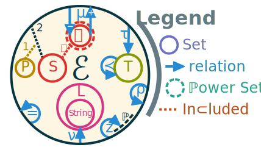

# Knowledge representation

Knowledge representation is at the intersection of maths, logic, language and computer sciences. Its research begins in the end of the 19^th^ century, with Cantor inventing set theory [@cantor_property_1874]. Then after a crisis in the begining of the 20^th^ century with Russel's paradox and Gödel's incompletude theorem, revised versions of the set theory become one of the fundations of mathematics. The most accepted version is the Zermelo–Fraenkel axiomatic set theory with the axiom of Choice (ZFC) [@fraenkel_foundations_1973; @ciesielski_set_1997]. This effort lead to a formalization of mathematics itself, at least to a certain degree.

Knowledge description systems rely on a syntax to interoperate systems and users to one another. The base of such languages comes from the formalization of automated grammars by @chomsky_three_1956. It mostly consist in a set of hierarchical rules aiming to deconstruct an input string into a sequence of terminal symbols. This deconstruction is called parsing and is a common operation in computer science. More tools for the formalization of computer language emerged soon after thanks to @backus_syntax_1959 while working on a programming language at IBM. This is how the Backus–Naur Form (BNF) meta-language was created ontop of Chomsky's formalization.

A similar process happened in the 1970's, when logic based knowledge representation gained popularity among computer scientists [@baader_description_2003]. Systems at the time explored notions such as rules and networks to try and organize knowledge into a rigourous structure. At the same time other systems were built arround First Order Logic (FOL). Then, around the 1990's, the research began to merge in search of common semantics in what led to the developpement of Description Logics (DL). This domain is expressing knowledge as a hierarchy of classes containing individuals.

From there and with the advent of the world wide web, engineers were on the lookout for standardization and interoperability of computer systems. One such standardization took the name of "semantic web" and aimed to created a widespread network of connected services sharing knowledge between one another in a common language. At the begining of the 21^st^ century, several languages were created, all based around World Wide Web Consortium (W3C) specifications called Resource Description Framework (RDF) [@klyne_resource_2004]. This language is based around the notion of statements as triples. Each can express a unit of knowledge. All the underlying theoritical work of DL continued with it and created more expressive derivatives. One such derivative is the family of languages called Web Ontology Language (OWL) [@horrocks_shiq_2003]. Ontologies and knowledge graphs are more recent names for the representation and definition of categories (DL classes), properties and relation between concepts, data and entities.

All these tools are the base for all modern knowledge representations. In the rest of this chapter, we discuss the fundamentals of each of the aspects of knowledge description, then we propose a knowledge description framework that is able to adapt to its usage.

## Fundamentals

First and foremost, we present the list of notations in this document. While trying to stick to traditional notations, we also aim for an unambiguious notation across several domains while remaining concise and precise. In 
@tbl:symbols we present the list of all symbols and relations. When possible we use the classical mathematical notations and we prefer lower case greek letters for relations. @Tbl:sets lists all important sets that we represent with uppercase letters.

**Symbol**                            **Description**
----------                            ---------------
$var : exp$                           The colon is a separator to be read as "such that".
$[exp]$                               Iverson's brackets: $[false]=0 \land [true]=1$.
$\{e : exp(e)\}$                      Set builder notation, all $e$ such that $exp(e)$ is true.
$\forall, \exists, !, \textsection$   Universal, existential, uniqueness and solution quantifiers.
$\langle e_1, e_2, e_n \rangle$       $n$-Tuple of various elements.
$e_s \xrightarrow{e_p} e_o$           Link or edge from $e_s$ to $e_o$ having $e_p$.
$l \downarrow a$                      Link $l$ partially supports step $a$.
$\pi \Downarrow a$                    Plan $\pi$ fully supports $a$.
$\emptyset$                           Empty set, also notted $\{\}$.
$\subset, \cup, \cap, \setminus$      Set inclusion, union, intersection and difference.
$e\in E$                              Element $e$ belongs in set $E$ also called choice operator.
$=, \neq$                             Equal and not equal.
$\lnot , \land, \lor$                 Negation (not), conjonction (and), disjonction (logical or).
$|E|$                                 Cardinal of set $E$.
$\sqsubset$                           Subsumption relation used for types.
$\prec$                               Precedance relation used for order.
$\top, \bot$                          Top and bottom symbols used as true and false respectively.
$\models$                             Entails, used for logical implication.
$f \circ g$                           Function composition.
$\otimes$                             Flaws in a partial plan. Several variants :
$\otimes_\downarrowbarred$            • unsupported subgoal.
$\otimes_\dagger$                     • causal threat to an existing causal link.
$\otimes_\circlearrowleft$            • cycle in the plan.
$\otimes_\ast$                        • decomposition of a compound action.
$\otimes_\origof$                     • alternative to an existing action.
$\otimes_\circledcirc$                • orphan action in the plan.
$\oplus, \ominus$                     Positive and negative resolvers.
$¢$                                   Cost of an action.
$\mathbb{i}, \mathbb{g}$              Initial and Goal step.
$\mathbb{P}(E)$                       Powerset, set of all subsets of $E$.
$\mathcal{P}(X)$                      Probability of event $X$.
$\mathit{pre}, \mathit{eff}$          Preconditions and effects of an action.
$\delta$                              Duration of an action.
$\mu^\pm(e)$                          Signed meta-relation. $\mu^+$ abstracts and $\mu^-$ reifies.
                                      $\mu$ alone gives the abstraction level.
$\nu(e)$                              Name of entity $e$.
$\pi$                                 Plan or method of compound action.
$\rho(e)$                             Parameters of entity $e$.
$\tau(e)$                             Type of entity $e$.
$\phi^\pm(e)$                         Signed incidence (edge) and adjacence (vertice) function for graphs. 
                                      $\phi^-$ gives the anterior (subject), $\phi^+$ the posterior (object) and
                                      $\phi^0$ gives the property of statement or cause of a causal link. 
                                      $\phi$ alone gives a triple corresponding to the edge.
$\chi^*(g)$                           Transitive cover of graph $g$. 

: List of symbols and relations. The symbol $\pm$ shows when the notation has signed variants. {#tbl:symbols}

**Name**      **Description**
----------    ---------------
$A$           Actions.
$C$           Causal links.
$D$           Domain of knowledge.
$E$           Entities.
$\mathcal{E}$ Edges of a graph.
$F$           Fluents.
$L$           Literals.
$O$           Observations.
$P$           Properties.
$Q$           Quantifiers.
$S$           Statements.
$T$           Types.
$V$           Vertex of a graph.
$\Pi$         Plans or method of compound action.

: List of important named sets. {#tbl:sets}

### Fundation of maths and logic systems

In order to understand knowledge representation, some mathematical and logical tools need to be presented. 

#### Fisrt Order Logic

The first mathematical notion we define is logic. More precisely First Order Logic (FOL) in the context of DL. FOL is based on boolean logic with the two values $\top$ *true* and $\bot$ *false* along with the classical boolean operators $\lnot$ *not*, $\land$ *and* and $\lor$ *or*. These are defined the following way :

* $\lnot \top = \bot$
* $a \land b \models (a = b = \top)$
* $\lnot(a \lor b) \models (a = b = \bot)$

With $a \models b$ being the logical implication also called entailement. To that, FOL adds a handfull of quantifiers:

* The *universal quantifier* $\forall$ meaning _"for all"_.
* The *existential quantifier* $\exists$ meaning _"it exists"_.
* The *uniqueness quantifier* $!\exists$ meaning _"it exists a unique"_.
* The *solution quantifier* $\textsection$ meaning _"those"_ [@hehner_practical_2012].

The last two quantifiers are optional in FOL but will be useful later on. It is interesting to note that most quantified expression can be express using the set builder notation discussed in the following section.

#### Set theory

Since we need to represent knowledge, we will handle more complex data than simple booleans. At the begining of his funding work on set theory, Cantor wrote:

> _A set is a gathering together into a whole of definite, distinct objects of our perception or of our thought—which are called elements of the set._ -- George @cantor_beitrage_1895

For Cantor, a set is a collection of concepts and percepts. In the rest of the document, we then define a set the following way:

::: {.definition #def:set name="Set"}
A collection of *distinct* objects, considered as an object in its own right. We define a set one of two way (always using braces):

* In extension by listing all the elements in the set: $\{1,2,4\}$
* In intension by specifying the rule that all elements follow: $\{n: n\in\mathbb{N} \land (n\mod2=0)\}$
:::

The member relation is noted $e \in \mathcal{S}$ to indicate that $e$ is an element of $\mathcal{S}$.
We note $\mathcal{S} \subset \mathcal{T} \models ((e \in \mathcal{S} \models e\in \mathcal{T}) \land \mathcal{S} \neq \mathcal{T})$, that a set $\mathcal{S}$ is a proper subset of a more general set $\mathcal{T}$.

We also define the union, intersection and difference as following:

* $\mathcal{S} \cup \mathcal{T} = \{e : e \in \mathcal{S} \lor e \in \mathcal{T} \}$
* $\mathcal{S} \cap \mathcal{T} = \{e : e \in \mathcal{S} \land e \in \mathcal{T} \}$
* $\mathcal{S} \setminus \mathcal{T} = \{e : e \in \mathcal{S} \land e \notin \mathcal{T} \}$

The most common axiomatic set theory is ZFC. In that definition of sets there are a few notions that comes from its axioms. By being able to distinguish elements in the set from one another we assert that elements have an identity and we can derive equality from there:

::: {.axiom name="Extensionality"}
$\forall x\forall y : \forall z(z\in x\Leftrightarrow z\in y)\models x=y$
:::

Another axiom of ZFC that is crucial in avoiding Russel's paradox ($x \in x$) is the following:

::: {.axiom name="Fondation"}
$\forall x : (x \neq \emptyset \models \exists y\in x,(y\cap x=\emptyset))$
:::

This axiom uses the empty set $\emptyset$ (also noted $\{\}$) as the set with no elements. Since two sets are equals if and only if they have precisely the same elements, the empty set is unique.

The definition by intention uses *set builder notaion* to define a set. It is composed of an expression and a predicate $p$ that will make any element $x$ in a domain set $D$ satisfying it part of the resulting set $B$, or as formulated in ZFC:

::: {.axiom name="Specification"}
$\forall p \forall D \exists B : \left(\forall x \in B : (x \in D \land p(x)) \right)$
:::

The last axiom of ZFC we use is to define the power set $\mathbb{P}(x)$ as the set containing all subsets of a set $x$:

::: {.axiom name="Power set"}
$\mathbb{P}(x) = \{y : y \subseteq x\}$
:::

With the symbol $x \subseteq y \models (x \subset y \lor x = y)$. These symbols have an interesting property as they are often used as a partial order over sets.

#### Graphs

Next in line, we need to define a few notion of graph theory.

::: {.definition #def:graph name="Graph"}
A graph is a mathematical structure $g=(V,\mathcal{E})$ consisting of vertices $V$ (also called nodes) and edges $\mathcal{E}$ (arcs) that links two vertices together. Each edge is basically a pair of vertices ordered or not depending if the the graph is directed or not.
:::

In the following, the signed symbols only applies to dirrected graphs.

We provide graphs with an adjacence function $\phi$ over any vertex $v \in V$ such that:

* $\phi(v) = \{ e \in \mathcal{E} : v \in e \}$
* $\phi^+(v) = \{ \langle v, v' \rangle \in \mathcal{E} : v' \in V \}$
* $\phi^-(v) = \{ \langle v', v \rangle \in \mathcal{E} : v' \in V \}$

And an incidence function using the same name over any edges $e = \langle v, v' \rangle \in \mathcal{E}$ such that:

* $\phi(e) =  \langle v, v' \rangle$
* $\phi^-(e) = v$
* $\phi^+(e) = v'$

Properties of graphs are better explained relative to their *transitive cover* $\chi^*$ of a graph $g = (V,\mathcal{E})$ defined as follow:

* $\chi(g) = (V,\mathcal{E}') : \mathcal{E}' = E \cup \{ \langle v_1, v_3 \rangle : \{ \langle v_1, v_2 \rangle, \langle v_2, v_3 \rangle \} \subset \mathcal{E} \}$
* $\chi^2 = \chi \circ \chi$
* $\chi^n = \bigcirc_{i=0}^n \chi$
* $\chi^* = \bigcirc^{\infty} \chi$

Now we present two additional notions on graphs.

::: {.definition #def:path name="Path"}
We say that vertices $v_1$ and $v_2$ are *connected* if it exists a path from one to the other. Said otherwise, there is a path from $v_1$ to $v_2$ if and only if $\langle v_1, v_2 \rangle \in \mathcal{E}_{\chi^*(g)}$.
:::

Similarly we define *cycles* as the existence of a path from a given vertex to itself. Some graphs can be strictly acyclical, enforcing the absence of cycles.

**TODO**: Needs diagrams

#### Hypergraphs

A generalization of graphs are **hypergraphs** where the edges are allowed to connect more than two vertices. An hypergraph is *$n$-uniform* when the edges are restricted to connect only $n$ vertices together. In that regard, classical graphs are 2-uniform hypergraphs.

**TODO**: Diagram of hypergraph

Hypergraphs have a special case where $\mathcal{E} \subset V$. This means that edges are allowed to connect to other edges. Informations about these kind of structures for knowledge reare hard to come by and rely mostly on a form of "folk wisdom" where knowledge is rarely published and mostly transmitted orally during lessons. One of the closest information is this forum post [@kovitz_terminology_2018] that associated this type of graph to port graphs [@silberschatz_port_1981]. 
Additional information was found in the form of a contribution of @vepstas_hypergraph_2008 on an encyclopedia article about hypergraphs. In that contribution, he says that a generalization of hypergraph allowing for edge-to-edge connections violates the axiom of fundation of ZFC by allowing edge-loops.

**TODO**: Diagram of edge-loops

This shows the limits of standard mathematics especially on the field of knowledge representation. Some strucutres needs higher dimensions than allowed by the one dimensional structure of ZFC and FOL.

However, it is important to not be mistaken: such non-standard set theories are more general than ZFC and therefore contains ZFC as a subset. All is a matter of restrictions.

#### Sheaf

In order to understand sheaves, we need to present a few auxiliary notions. Most of these definitions are adapted from [@vepstas_sheaves_2008]. The first of which is a seed.

::: {.definition #def:seed name="Seed"}
A seed correspond to a vertex along with the set of adjacent edges. Formally we note a seed $(v, \phi_g(v))$ that means that a seed build from vertex $v$ in the graph $g$ contains a set of adjacent edges $\phi_g(v)$. We call the vertex $v$ the *germ* of the seed.
:::

Now we can build a kind of partial graphs from seeds called sections.

::: {.definition #def:section name="Section"}
A section is a set of seeds that have their common edges connected. This means that if two seeds have an edge in common connecting both germs, then the seeds are connected in the section and the edges are merged.
:::

This tool was originally mostly meant for big data and categorization over large graphs. This is the reason for the next notion.

::: {.definition #def:quotient name="Graph Quotient"}
A quotient over a graph is the act of reducing a subgraph into a node while preserving the external connections. All internal structure becomes ignored and the subgraph now acts like a regular node.
:::

Porting that notion to sections instead of graphs allows us to define stalks.

::: {.definition #def:stalk name="Stalk"}
Given a projection $p:V \to V'$ over the germs of a section $s$, the stalk above the vertex $v' \in V'$ is the quotient of all seeds that have their germ follow $p(v) = v'$.
:::

Now we can add the final definition of sheaves.

::: {.definition #def:seaf name="Seaf"}
A seaf is a collection of sections, together with a projection function $p$ and gluing axioms that the projection should respect depending on the application.
:::

**TODO**: Diagrams and examples all the way.

### Grammar and Parsing

Grammar is an old tool that used to be dedicated to liguists. With the funding works of Chomsky and his Contex-Free Grammars (CFG), these tools became available to mathematicians and shortly after to computer scientists.

A CFG is a formal grammar that aims to generate a formal language given a set of hierarchical rules. Each rule is given a symbol as a name. From any finite input of text in a given alphabet, the grammar should be able to determine if the input is part of the language it generates.

In computer science, popular meta-language called BNF was created shortly after Chomsky's work on CFG. 
The syntax is of the following form :

```
<rule> ::= <other_rule> | <terminal_symbol> | "literals"
``` 

A terminal symbol is a rule that does not depend of any other rule. It is possible to use recursion, meaning that a rule will use itself in its definition. This actually allows for infinite languages. Despite its expressive power, BNF is often used in one of its extended form.

In this context, we present a widely used form of BNF syntax that is meant to be human readable despite not being very formal. We add the repetition operators `*` and `+` that respectively repeat 0 and 1 times or more the preceeding expression. We also add the negation operator `~` that matches only if the following expression does not match. We also add parentesis for grouping expression and brackets to group literals.

A regular grammar is static, it is set once and for all and will always produce the same language. In order to be more flexible we need to talk about dynamic grammars and their associated tools.

One of the main tool for both static and dynamic grammar, is a parser. It is the program that will interprete the input into whatever usage it is meant for. Most of the time, a parser will transform the input into another similarily structured language. It can be a storage inside objects or memory, or compiled into another format, or even just for syntax coloration. Since a lot of usage requires the same kind of function, a new kind of tool emerged to make the creation of a parser simpler. We call those tools parser or compiler generators [@paulson_semanticsdirected_1982]. They take a grammar description as input and gives the program of a parser of the generated language as an output.

For dynamic grammar, these tools can get more complicated. There are a few ways a grammar can become dynamic. The most straight-forward way to make a parser dynamic is to introduce code in the rule handling that will tweak variables affecting the parser itself [@souto_dynamic_1998]. This allows for handling context in CFG without needing to rewrite the grammar.

Another kind of dynamic grammar are grammar that can modify themselves. In order to do this a grammar is valuated with reified objects representing parts of itself [@hutton_monadic_1996]. These parts can be modified dynamically by rules as the input gets parsed [@renggli_practical_2010; @alessandro_ometa_2007]. This approach uses Parsing Expression Grammars (PEG)[@ford_parsing_2004] with Packrat parsing that Packrat parsing backtracks by ensuring that each production rule in the grammar is not tested more than once against each position in the input stream [@ford_packrat_2002]. While PEG are easier to implement and more efficient in practice than their classical conterparts [@loff_computational_2018; @henglein_peg_2017], it offset the computation load in memory making it actually less efficient in general [@becket_dcgs_2008].

Some tools actually just infer entire grammars from inputs and softwares [@hoschele_mining_2017; @grunwald_minimum_1996]. However, these kind of approaches require a lot of input data to perform well. They also simply provide the grammar after expensive computations.

#### Description Logics

On of the most standard and flexible way of representing knowledge for databases is by using ontologies. They are based mostly on the formalism of Description Logics (DL). It is based on the notion of classes (or types) as a way to make the knowledge hierarchically structured. A class is a set of individuals that are called instances of the classes. Classes got the same basic properties as sets but can also be constrained with logic formula. Constraints can be on anything about the class or its individuals. Knowledge is also encoded in relations that are predicates over attributes of individuals.

It is common when using DLs to store statements into three boxes [@baader_description_2003]: 

* The TBox for terminology (statements about types)
* The RBox for rules (statements about properties) [@burckert_terminologies_1994]
* The ABox for assertions (statements about individual entities)

These are used mostly to separate knowledge about general facts (intentional knowledge) from specific knowledge of individual instances (extensional knowledge).
The extra RBox is for "knowhow" or knowledge about entities behaviour. It restrict usages of roles (properties) in the ABox. The terminology is often hierarchically ordered using a subsumption relation noted $\sqsubset$. If we represent classes or type as a set of individuals then this relation is akin to the subset relation of set theory.

There are several versions and extensions of DL. They all varies in expressivity. Improving the expressivity of DL system often comes at the cost of less efficient inference engines that can even become undecidable for some extensions of DL.


### Ontologies and their Languages

Most AI problems needs a way to represent data. The classical way to represent knowledge has been more and more specialized for each AI community. Each their Domain Specific Language (DSL) that neatly fit the specific use it is intended to do. There was a time when the branch of AI wanted to unify knowledge description under the banner of the "semantic web". Today this effort led to a way to standardize web service description but haven't reached the consensus the founders had hoped for. From numerous works, a repeated limitation of the "semantic web" seams to come from the languages used. In order to guarantee performance of generalist inference engines, these languages have been restricted so much that they became quite complicated to use and quickly cause huge amounts of recurrent data to be stored because of some forbidden representation that will push any generalist inference engine into undecidability.

**TODO**: OWL is more expressive ?!? [@vanharmelen_handbook_2008 p850]

The most basic of these language is perhaps RDF Turtle [@beckett_turtle_2011]. It is based on tripples with an XML syntax and has a graph as its knowledge structure [@klyne_resource_2004]. A RDF graph is a set of RDF triples $\langle sub, pro, obj \rangle$ which fields are respectively called subject, property and object. It can also be seen as a partially labeled directed graph $(N, \mathcal{E})$ with $N$ being the set of RDF nodes and $\mathcal{E}$ being the set edges. This graph also comes with an incomplete $label : (N \cup \mathcal{E}) \to URI$ relation. Nodes without an URI are called blank nodes. It is important that, while not named, blank nodes have a distinct internal identifier from one another that allows to differentiate them.

Inference in RDF has been shown to be trivially undecidable [@motik_properties_2007]. However, this language is probably the most permissive and therefore expressive language of the "semantic web". Even with this expressivity, several works still deems it as not expressive enough, mostly due to the lack of classical constructs like lists, parameters and quantifiers that don't fit the triple representation of RDF.

One of the ways which have been explored to overcome these limitations is by adding a 4^th^ field in RDF. This field is meant for context and anotations. This field is used for informations about any statement represented as a triple, such as access rights, belief and probabilities, or most of the time the source of the data [@tolksdorf_semantic_2004]. One of the other use of the fourth field of RDF is to reify statements [@hernandez_reifying_2015]. Indeed by identifying each statement, it becomes possible to efficiently for statements about statements.

A completely different approach is done by @hart_opencog_2008 in his framework for Artificial General Intelligence (AGI) called OpenCog. The structure of the knowledge is based on a rhizome, collection of trees, linked to one another. This structure is called Atomspace. Each vertex in the tree is an atom, leaf-vertexes are nodes, the others are links. Atoms are immutable, indexed objects. They can be given values that can be dynamical and, since they are not part of the rhizome, are an order of magnitude faster to access. Atoms and values alike are typed.

The goal of such a structure is to be able to merge concepts from widely different domains of AI. The major drawback being that the whole system is very slow compared to pretty much any domain specific software.


## WORLD

As we have seen, most existing knowledge description systems have a common drawback: they are static. This means that they are either too inefficient or too specific. To fix this issue, a new knowledge representation system must be presented. The goal is to make a minimal language class that can adapt to its use to become as specifc as needed. If they become specific they must start from a generic base. Since that base language must be able to evolve to fit the most cases possible, it must be neutral and simple.

To summarize, that language must maximize the following criteria:

1. **Neutral**: Must not assume preferences and be localization .
2. **Permissive**: Must allow as many data representation as possible.
2. **Minimalist**: Must have the minimum amount of base axioms and as little native notions as possible.
4. **Adaptive**: Must be able to react to user input and be as flexible as possible.

In order to respect these requirements, we developed a framework for knowledge description.

WORLD Offers Reflexive Languages Definition. It is our answer to these criteria. WORLD is inspired by RDF Turtle and Description Logic.

### Knowledge Structure

WORLD extends the RDF graphs by adding another label to the edges of the graph to uniquely identify each statement. This basically turns the system into a quadruple storage even if this forth field is transparent to the user.

::: {.axiom #axi:structure name="Structure"} :::
A WORLD graph is a set of statements that transparently include their own identity. The closest representation of the underlying structure of WORLD is as follow :
$$
W = (E, S) :
  S = \left\{ s = \langle e_{sub},e_{pro},e_{obj} \rangle: 
    s \in D \models s \land D \right\}
$$

with:

* $e_{sub}, e_{obj} \in E$ being entities representing the *subject* and *object* of the *statement* $s$,
* $e_{pro} \in P$ being the *property* of the statement $s$,
* $D \subset S$ is the *domain* of the *world* $W$,
* $S, P \subset E$ with $S$ the set of statements and $P$ the set of properties,
:::::::::::::::::::::::::::::::::::::::::::::::

This means that $W$ is a graph with the set of entities $E$ as vertices and the set of statements $S$ as edges. This model also suppose that every statement $s$ must be true if they belong to the domain $D$. This graph is a directed 3-uniform H-hypergraph.

**TODO** Correct name + sheaf like + imutable

#### Consequences

**TODO** RDF graph as a projection

The base knowledge structure is more than simply convenience. The fact statements have their own identity changes the degrees of freedom of the representation. RDF has a way to represent reified statements that are basically blank nodes with properties that provide information about the subject, property and object of a designated statement. The problem is that, such statements are very differently represented and need 3 regular statements just to define. Using the forth field, it becomes possible to make statements about *any* statements. It becomes also possible to express modal logic about statements or to express, various traits like the probability or the access rights of a statements.

The knowledge structure holds several restrictions on the way to express knowledge. As a direct consequence, we can add several theorems to the logic system underlying WORLD. The @axi:structure is the only axiom of the system.

::: {.theorem #theo:identity name="Identity"} :::
Any entity is uniquely distinct from any other entity.
::::::::::::::::::::::::::::::::::

This theorem comes from the definition of mathematical sets and the extensionality axiom of the Z theory. Indeed it is stated that a set is a unordered collection of distinct objects. Distinction is possible if and only if intrinsic identity is assumed.

::: {.theorem #theo:consistency name="Consistency"} :::
Any statement in a given domain is consistent with any other statements of this domain.
:::::::::::::::::::::::::::::::::::::

Consistency comes from the need for a coherent knowledge database and is often a requirement of such constructs. This theorem also is a consequence of the @axi:structure: $s \in D \models s \land D$.

::: {.theorem #theo:uniformity name="Uniformity"} :::
Any object in WORLD is an entity. Any relations in WORLD are restricted to $E$.
::::::::::::::::::::::::::::::::::::

This also means that relations are closed under $E$.


#### Native properties

@Theo:identity leads to the need for two native properties in the system : *equality* and *name*.

The **equality relation** $= :  E \to E$, behaves like the classical operator. Since the knowledge database will be accessed through a text interface, we also need to add an explicit way to identify entities. This identification is done through the **name relation** $\nu: E \to String$ that affects a string literal to some entities. This lead us to introduce literals into WORLD that are also entities that have a native value (more on literal @later).

The @axi:structure puts a type restriction on property. Since it compartments $E$ using various named subsets, we must adequately introduce an explicit type system into WORLD. That type system requires a **type relation** $\tau: E \to T$. That relation is complete as all entities have a type. @Theo:uniformity causes the set of entities to be universal. Type theory, along with Description Logic (DL), introduce a **subsumption relation** $\prec: T \to T$ as a partial ordering relation to the types. In our case, the entity type is the greatest element of the lattice formed by the set of types with the subsumption relation $(T, \prec)$.

The uniformity of WORLD also allows some very interesting meta-constructs. That is why we also introduce a **meta relation** $\mu^\pm: E \rightleftharpoons^+_- D$. This allows to create domain from certain entities and to encapsulate domains into entities. $\mu^-$ is for reification and $\mu^+$ is for abstraction.

From the principle of adaptability and allowed under the meta relation, we can introduce a way for entities to be parametered and therefore having instances of their own. In order to do that, we introduce the **parameter relation** $\rho(e): E \to E$. This relation 

In @fig:typerel, we present all the native relations along with their domains and most subsets of $E$.

{#fig:typerel}

**TODO**: $\phi$ as subject and property and object relation + redo figure

### Dynamic Grammar

Since we need to respect the requirements of the problem, the RDF syntax cannot be used to express the knowledge. Indeed, RDF states native properties as English nodes with a specific URI that isn't neutral. It also isn't minimalist since it uses an XML syntax that is so verbose it is not respected even in the documents that defines RDF because it is too confusing and complex. The XML syntax is also quite restrictive and cannot evolve dynamically to adapt to the usage.

So we need to define a new language that is minimalist and neutral. At the same time the language must be permissive and dynamical. These two goals are incompatible and will end up needing different solutions. So the solution to the problem is to actually define two languages that fit the criteria : one minimalist and one adaptive. The issue is that we need not make a user learn two languages and the second kind of language must be very specific and that violates the principle of neutrality we try to respect.

The only solution is to make a mechanism to adapt the language as it is used. We start off with a simple framework $W_0$ that uses a grammar $g_0$.


#### The grammar $g_0$

The description of $g_0$ is pretty straightforward: it mostly is just a triple representation separated by whitespaces. The goal is to add a minimal syntax consistent with the @axi:structure. In @lst:grammar, we give a simplified version of $g_0$. It is written in a pseudo-BNF fashion. It is extended with the classical repetition operators `*` and `+` along with the negation operator `~`. All tokens have names in uppercase. We also add the following rule modifiers:

* `<~name>` are ignored for the parsing. However, the tokens are consumed and therefore acts like separator for the other rules.
* `<?name>` are inferred rules and tokens. They play a key role for the process of derivation explained in @sec:derivation.

```{#lst:grammar .java caption="Simplified pseudo-BNF description for basic WORLD." escapechar=$}
<~COMMENT: <INLINE: "//" (~["\n", "\r"])*>
|	<BLOCK: "/*" (~["*/"])*> > //Ignored
<~WHITE_SPACE: " "|"\t"|"\n"|"\r"|"\f">
<LITERAL: <INT> | <FLOAT> | <CHAR> | <STRING>> //Java definition$\label[line]{line:literal}$
<ID: <TYPE: <UPPERCASE>(<LETTERS>|<DIGITS>)* > $\label[line]{line:uppercase}$
|	<ENTITY:  <LOWERCASE>(<LETTERS>|<DIGITS>)*> 
| <SYMBOL: (~[<LITERALS>, <LETTERS>, <DIGITS>])*>>

<world> ::= <first> <statement>* <EOF>
<first> ::= <subject> <?EQUAL> <?SOLVE> <?EOS> $\label[line]{line:first}$
<statement> ::= <subject> <property> <object> <EOS> $\label[line]{line:statement}$
<subject> ::= <entity>
<property> ::= <ID> | <?meta_property>
<object> ::= <entity>
<entity> ::= <ID> | <LITERAL> | <?meta_entity>
```

In order to respect the principle of neutrality, the language must not suppose of any regional predisposition of the user. There are few exception for the sake of convenience and performance. The first exception is that the language is meant to be read from left to right and have an occidentally biased `subject verb object` triple description. Another exception is for literals that use the same grammar as in classical Java. This means that the decimal separator is the dot (`.`). This could be fixed in later version using dynamical definitions (see @later).

Even if sticking to the ASCII subset of characters is a good idea for efficiency, WORLD can work with UTF-8 and exploits the Unicode Character Database (UCD) for its token definitions [@unicodeconsortium_unicode_2018]. This means that WORLD comes keyword free and that the definition of each symbol is left to the user. Each notion and symbol is inferred (with the exception of the first statement, see @later).

In $g_0$, the first two token definitions are ignored. This means that comments and white-spaces will act as separation and won't be interpreted. Comments are there only for convenience since they do not serve any real purpose in the language. It was arbitrarily decided to use Java style comments. White-spaces are defined against UCD's definition of the separator category `Z&` [see @unicodeconsortium_unicode_2018a, chap. 4].

@Line:literal uses the basic Java definition for literals. In order to keep the Independence from any natural language, boolean literals are not natively defined (since they are English words).

Another aspect of that language independence is found starting at @line:uppercase where the definitions of `<UPPERCASE>`, `<LOWERCASE>`, `<LETTERS>` and `<DIGITS>` are defined from the UCD (respectively category `Lu`, `Ll`, `L&`, `Nd`). This means that any language's upper case can be used in that context. For performance and simplicity reasons we will only use ASCII in our examples and application.

The rule at @line:first is used for the definition of three tokens that are important for the rest of the input. `<EQUAL>` is the symbol for equality and `<SOLVE>` is the symbol for the solution quantifier (and also the language pendant of $\mu^-$). The most useful token `<EOS>` is used as a statement delimiter. This rule also permits the inclusion of other files if a string literal is used as subject. The underlying logic of this first statement will be presented in @later.

At @line:statement, we can see one of the most defining feature of $W_0$: statements. The input is nothing but a set of statements. Each components of the statements are entities. We defined two specific rules for the subject and object to allow for eventual run-time modifications. The property is more restricted in order to guarantee the non-ambiguity of the grammar.

#### Grammar derivation {#sec:derivation}

The syntax we described is only valid for $g_0$. As long as the input is conforming to these rules, the framework keeps the $W_0$ behavior. In order to access more features, one need to break a rule. We add a second outcome to paring failure : **derivation**. There are several kind of possible violations that will interrupt the normal parsing of the input :

* Violations of the `<first>` statement rule : This will cause a fatal error.
* Violations of the `<statement>` rule : This will cause a derivation if an unexpected additional token is found instead of `<EOS>`. If not enough tokens are present, a fatal error is triggered.
* Violations of the secondary rules (`<subject>`, `<entity>`, …) : This will give a fatal error except if there is also an excess of token in the current statement which will cause derivation to happen.

Derivation will cause the current input to be analyzed by a set of meta-rules.
The main restriction of these rules is given in $g_0$: each statement must be expressible using a triple notation. This means that the goal of the meta-rules is to find an interpretation of the input that is consistent with this rule and to augment $g_0$ by adding an expression to any `<meta_*>` rules. If the input has less than 3 entity for a statement then the parsing fails. When there is extra input in a statement, there is a few ways the infringing input can be reduced back to a triple.

##### Containers

The first meta-rule is to infer a container. A container is delimited by at least a left and right delimiter (they can be the same symbol) and an optional middle delimiter. We infer the delimiters using the @alg:container.

~~~ {.algorithm #alg:container name="Container meta-rule" startLine="1"}
\Function{container}{Token current}
  \State \Call{lookahead}{current, EOS} \Comment{Populate all tokens of the statement}
  \ForAll{token in horizon}
    \If{token is a new symbol}
      delimiters.\Call{append}{token}
    \EndIf
  \EndFor
  \If{\Call{length}{delimiters} <2 }
    \If{\Call{coherentDelimiters}{horizon, delimiters[0]} }
      \State \Call{inferMiddle}{delimiters[0]} \Comment{New middle delimiter in existing container}
      \State \Return Success
    \EndIf
    \State \Return Failure
  \EndIf
  \While{\Call{length}{delimiters} > 0}
    \ForAll{(left, middle, right) in \Call{sortedDelimiters}{delimiters}}\label[line]{line:sorteddelim}
      \If{\Call{coherentDelimiters}{horizon, left, middle, right} }\label[line]{line:coherentdelim}
        \State \Call{inferDelimiter}{left, right}
        \State \Call{inferMiddle}{middle} \Comment{Ignored if null}
        \State delimiters.\Call{remove}{left, middle, right}
        \Break
      \EndIf
    \EndFor
    \If{\Call{length}{delimiters} stayed the same }
      \Return Success
    \EndIf
  \EndWhile
  \State \Return Success
\EndFunction
~~~

The function sortedDelimiters at @line:sorteddelim is used to generate every ordered possibility and sort them using a few criteria. The default order is possibilities grouped from left to right. All coupled delimiters that are mirror of each other following the UCD are preferred to other possibilities.

Checking the result of the choice is very important. At @line:coherentdelim a function checks if the delimiters allows for triple reduction and enforce restrictions. For example, a property cannot be wrapped in a container. This is done in order to avoid a type mismatch later in the interpretation.

Once the inference is done, the resulting calls to inferDelimiter will add the rules listed in @lst:container to $g_0$. 
This function will create a `<container>` rule and add it to the definition of `<meta_entity>`. Then it will create a rule for the container named after the UCD name of the left delimiter (searching in the `NamesList.txt` file for an entry starting with "left" and the rest of the name or defaulting to the first entry). Those rules are added as a conjunction list to the rule `<container>`.
It is worthy to note that the call to inferMiddle will add rules to the token `<MIDDLE>` independently from any container and therefore, all containers share the same pool of middle delimiters.

```{#lst:container .java caption="Rules added to the current grammar for handling new container for parenthesis" escapechar=$}
<meta_entity> ::= <container>
<container> :: = <parentesis> | … 
<parentesis> ::= "(" [<naked_entity>] (<?MIDDLE> <naked_entity>)* ")"
<naked_entity> ::= <statement> | <entity>$\label{line:meta_statement}$
```

The rule at @line:meta_statement is added once and enables the use of meta-statements inside containers. This notion will be detailed in @later.

##### Parameters

If the previous rule didn't fix the parsing of the statement, we continue with the following meta-rule. Parameters are containers that are used after an entity. Every container can be used as parameters. We detail the analysis in @alg:parameter.

~~~ {.algorithm #alg:parameter name="Parameter meta-rule" startLine="1"}
\Function{parameter}{Entity[] statement}
  \State reduced = statement
  \While{\Call{length}{reduced} >3}
    \For{i from 0 to \Call{length}{reduced} - 1}
      \If{\Call{name}{reduced[i]} not null and \\ 
      \Call{type}{reduced[i+1]} = Container and \\
      \Call{coherentParameters}{reduced, i}}
        \State param = \Call{inferParameter}{reduced[i], reduced[i+1]}
        \State reduced.\Call{remove}{reduced[i], reduced[i+1]}
        \State reduced.\Call{insert}{param, i} \Comment{Replace parameterized entity}
        \Break
      \EndIf
    \EndFor
    \If{\Call{length}{statement} stayed the same }
      \Return Success
    \EndIf
  \EndWhile
  \State \Return Failure
\EndFunction
~~~

The goal is to match extra containers with the preceding named entity. The container is then combined with the preceding entity into a parameterized entity.

The call to inferParameter will add the rule in @lst:parameter, replacing `<?container>` with the name of the container used (for example `<parenthesis>`).

```{#lst:parameter .java caption="Rules added to the current grammar for handling parameters" escapechar=$}
<meta_entity> ::= <ID> <?container>
<meta_property> ::= <ID> <?container>
```

##### Operators

A shorthand for parameters is the operator notation. It allows to affect a single parameter to an entity without uing a container. It is most used for special entities like quantifiers or modificators. This is why once used the parent entity take a polymorphic type, meaning that type inference will not issue errors for any usage of them. Details of the way the operators are reduced is exposed in @alg:operator.

~~~ {.algorithm #alg:operator name="Operator meta-rule" startLine="1"}
\Function{operator}{Entity[] statement}
  \State reduced = statement
  \While{\Call{length}{reduced} >3}
    \For{i from 0 to \Call{length}{reduced} - 1}
      \If{\Call{name}{reduced[i]} not null and \\ 
      \Call{name}{reduced[i+1]} not null and \\
      (\Call{name}{reduced[i]} is a new symbol or \\
      reduced[i] has been parameterized before) and \\
      \Call{coherentOperator}{reduced, i}}
        \State op = \Call{inferOperator}{reduced[i], reduced[i+1]}
        \State reduced.\Call{remove}{reduced[i], reduced[i+1]}
        \State reduced.\Call{insert}{op, i} \Comment{Replace parameterized entity}
        \Break
      \EndIf
    \EndFor
    \If{\Call{length}{statement} stayed the same }
      \Return Success
    \EndIf
  \EndWhile
  \State \Return Failure
\EndFunction
~~~

From the call of inferOperator, comes new rules explicated in @lst:operator. The call also add the operator entity to an inferred token `<OP>`.

```{#lst:operator .java caption="Rules added to the current grammar for handling operators" escapechar=$}
<meta_entity> ::= <?OP> <ID>
<meta_property> ::= <?OP> <ID>
```

If all meta-rules fail, then the parsing fails and returns an error to the user.


### Contextual Interpretation

While parsing another important part of the processing is done after the success of a grammar rule. The grammar in WORLD is valuated, meaning that each rule has to return an entity. A set of functions are used to then populate the database with the right entities or retrieve an existing one that correspond to what is being parsed.

When parsing the rules `<entity>` and `<property>` will ask for the creation or retrieval of an entity. This mechanism will use the name of the entity and its type to retrieve an entity with the same name in a given scope.

#### Naming and Scope

When parsing an entity by name, the system will first request for an existing entity with the same name. If such an entity is retrieved it is returned instead of creating a new one. The validity of a name is limited by the notion of scope.

**FIXME**: add erasure of variable's name + correct symbol + reduce extra redaction

From @theo:consistency, it is supposed that only some statements have to be true. This along with the name property holds inside a construct we call a scope. This lead us to introduce the **scope operator** $\sigma : E \to \mathbb{P}(E)$ that affects to each entity to all entities representing its scope. Scopes are delimited by the meta relation as each abstraction level is separate from one another.

Scopes are delimited by containers and statements. This local context is useful when wanting to restrict the scope of the declaration of an entity. The main goal of such restriction is to allow for a similar mechanism as the RDF namespaces. This makes the use of variable (RDF blank nodes) possible.

The scope of an entity have three special values : 

* Variable: This scope restricts the scope of the entity to only the other entities in its scope.
* Local: This scope means that the parsing is still populating the scope of the entity. Its scope is limited to the currently parsing statement.
* Global: This scope means the name has no scope limitation.

The scope of an entity also contains all its parent entities, meaning all container or statement the entity is part of. This is used when chosing between the special values of the scope. The process is detailed in @alg:scope.

~~~ {.algorithm #alg:scope name="Determination of the scope of an entity" startLine="1"}
\Function{scope}{Entity $e$}
  \State Entity[] self = []
  \If{$\tau(e) = S$}
    \ForAll{$i \in \phi(e)$}
      self.\Call{append}{\Call{self}{$i$}} \Comment{Adding scopes nested in statement $e$}
    \EndFor
  \EndIf
  \ForAll{$i \in \mu^-(e)$}
    self.\Call{append}{\Call{self}{$i$}} \Comment{Adding scopes nested in container $e$}
  \EndFor
  \If{$\exists \rho(e)$}
    \State Entity[] param = \Call{scope}{$\rho(e)$}
    \ForAll{$i \in $ param}
      param.\Call{remove}{\Call{scope}{$i$}} \Comment{Remove duplicate scopes from parameters}
    \EndFor
    \ForAll{$i \in $ param}
      self.\Call{append}{\Call{self}{$i$}} \Comment{Adding scopes from paramters of $e$}
    \EndFor
  \EndIf
  \State $\sigma(e) \gets $ self
  \If{GLOBAL $\notin \sigma(e)$}
    $\sigma(e) \gets \sigma(e) \cup \{$LOCAL$\}$
  \EndIf
  \Return self
\EndFunction

\Function{self}{Entity $e$}
  \State Entity[] self = []
  \If{LOCAL $\in \sigma(e)$}
    \ForAll{$i \in \sigma(e)$}
      \If{$\exists p \in E : \rho(p) = i$} \Comment{$e$ is already a parameter of another entity $p$}
        \State $\sigma(e) \gets \sigma(e) \setminus \{$LOCAL$\}$
        \State $\sigma(p) \gets \sigma(p) \cup \sigma(e)$
        \State $\sigma(e) \gets \sigma(e) \cup \{$VARIABLE$, p\}$
      \EndIf
    \EndFor
    \State self.\Call{append}{$e$}
    \State self.\Call{append}{$\sigma(e)$}
  \EndIf
  \Return self
\EndFunction
~~~

The process happens for each entity created or requested by the parser. If a given entity is part of any other entity, the enclosing entity is added to its scope. When an entity is enclosed in any entity while already being a parameter of another entity, it becomes a variable.

#### Instanciation identification

When a parameterized entity is parsed, another process starts to identify if a compatible instance already exists. From @theo:identity, it is impossible for two entity to share the same identifier. This makes mandatory to avoid creating an entity that is equal to an existing one. Given the order of which parsing is done, it is not always possible to determine the parameter of an entity before its creation. In that case a later examination will merge the new entity onto the older one and discard the new identifier.

### Structure as a Definition

Even with the derivation features it is not possible to define most of the native properties. For that one need a light inference mechanism. This mecanism is part of the default inference engine. This engine only works on principle of structure as a definition. Since all names must be neutral from any language, that engine cannot rely on regular mechanism like configuration files with keys and values or predefined keywords.

To use correctly WORLD, one muist be familiar with the native properties and their structure or implement their own inference engine to override the default one.

#### Quantifiers

What are quantifiers ? In WORLD they differs from their mathematical counterparts. Quantifiers are special entities that are meant to be of a generic type that matches any entities including quantifiers. There are infinitely many quantifiers in WORLD but they are all derived from a special one called the *solution quantifier*. We mentioned it briefly durring the definition of the grammar $g_0$. It is the language pendant of $\mu^-$ and is used to extract and evaluate reified knowledge. 

For example, the statement `bob is <SOLVE>(x)` will give either a default container filled with every value that the variable `x` can take or if the value is unique, it will take that value. If there is no value it will default to `<NULL>`, the exclusion quantifier.

How are these other quantifiers defined ? We use a definition akin to Lindstöm quantifiers -@lindstrom_first_1966 which is a generalization of counting quantifiers [@gradel_twovariable_1997]. Meaning that a quantifier is defined as a constrained range over the quantified variable. We suppose five quantifiers as existing in WORLD as native entities.

* The **solution quantifier** `<SOLVE>` noted $\textsection$ in classical mathematics, makes a querry that turn the expression into the possible range of its variable.
* The **universal quantifier** `<ALL>` behaves like $\forall$ and forces the expression to affect every possible value of its variable.
* The **existential quantifier** `<SOME>` behaves like $\exists$ and forces the expression to match *at least one* value for its variable.
* The **uniqueness quantifier** `<ONE>` behaves like $!\exists$ and forces the expression to match *exactly one* value for its variable.
* The **exclusion quantifier** `<NULL>` behaves like $\lnot \exists$ and forces the expression to match none of the value of its variable.


The four last quantifiers are inspired from Aristotle's square of opposition [@dalfonso_generalized_2011].

In WORLD, quantifier are not always followed by a quantified variable and can be used as a value. In that case the variable is simply anonymous. We use the exclusion quantifier as a value to indicate that there are no value, sort of like `null` or `nil` in programming languages.

In @lst:lang, we present an example file that is meant to define most of the useful native properties along with default quantifiers.

```{#lst:lang .java caption="The default lang.w file." escapechar=$}
* = ? ;$\label{line:first}$
?(x) = x; //Optional definition
?~ = { };
?_ ~(=) ~;
?!_ = {_};$\label{line:endquantifier}$

(*e, !T) : (e :: T); *T : (T :: Type);$\label{line:typing}$
*T : (Entity / T);$\label{line:subsumption}$

:: :: Property(Entity, Type);
(___) :: Statement;
(~, !, _, *) :: Quantifier;
( )::Group;
{ }::Set;
[ ]::List;
< >::Tuple;
Collection/(Set,List,Tuple);
0 :: Integer; 0.0::Float;
'\0'::Character; ""::String;
Literal/(Boolean, Integer, Float, Character, String);

(*e, !(s::String)) : (e named s);$\label{line:naming}$
(*e(p), !p) : (e param p);$\label{line:param}$
*(s p o):(((s p o) subject s),((s p o) property p),((s p o) object o));$\label{line:incidence}$
```

At @line:first, we give the first statement that defines the solution quantifier's symbol. The reason this first statement is shaped like this is that global statements are always evaluated to be a true statement. This means that anything equaling the solution quantifier at this level will be evaluated as a domain. If it is a string literal, then it must be either a file path or URL or a valid WORLD expression. If it is a single entity then it becomes synonymous to the entire WORLD domain and therefore contains everything. We can infer that it becomes the universal quantifier.

All statements up to @line:endquantifier are quantifiers definitions. On the left side we got the quantifier symbol used as a parameter to the solution quantifier using the operator notation. On the right we got the domain of the quantifier. The exclusive quantifier has as a range the empty set. For the existantial quantifier we have only a restriction of it not having an empty range. At last, the uniqueness quantifier got a set with only one element matching its variable (noting that anonymous variables doesn't match necessarily other anonymous variables in the same statement).

#### Infering native properties

All native propserties can be infered by structure using quantified statements. Here is the structural definition for each of them:

* $=$ (at @line:first) is the equality relation given in the first statement.
* $\prec$ (at @line:subsumption) is the first property to relate a particuliar type relative to all types. That type becomes the entity type.
* $\mu^-$ (at @line:first) is the solution quantifier discussed above given in the first statement.
* $\mu^+$ is represented using containers.
* $\nu$ (at @line:naming) is the first property affecting a string literal uniquely to each entity.
* $\rho$ (at @line:param) is the first property to affect to all entity a possible parameter list.
* $\tau$ (at @line:typing) is the first property that matches every entity to a type.
* $\phi$ (at @line:incidence) is the first property to match for all statements:
  + $\phi^-$ its subject,
  + $\phi^0$ its property,
  + $\phi^+$ its object.

We limit the inference to one symbol to make it much simpler to implement and to retrieve but, except for false positives, there are no reason it should not be possible to define several notations for each relation.

### Extended Inference Mechanisms

In this section we present the default inference engine. It has only a few functionalities. It isn't meant to be universal and the goal of WORLD is to provide a framework that can be used by specialists to define and code exactly what tools they need.

Inference engines need to create new knowledge but this knowledge shouldn't be simply merged with the explicit domain. Since this knowledge is infered, it is not exactly part of the domain but must remain consistent with it. This knowledge is stored in a special scope dedicated to each inference engine. This way, inference engines can use defeasable logic or have dynamic inference from any knowledge insertion in the system.

#### Type inference

Type inference works on matching types in statements. The main mechanism consist in infering the type of properties in a restrictive way. Properties have a parameterized type with the type of their subject and object. The goal is to make that type match the inputed subject and object. 

For that we start by trying to match the types. If the types differs the process tries to reduce the more general type against the lesser one (subsumption wise). If they are incompatible, the inference uses some light defeasable logic to undo previous inferences. In that case the types are changed to the last common type in the subsumption tree.

However, this may not always be possible. Indeed, types can be explicitely specified as a safeguard against mistake. If that's the case, an error is raised and the parsing or knowledge insertion is interrupted.

#### Instanciation

Another inference tool is instanciation. Since entities can be parameterized, they can also be defined against their parameters. When those parameters are variables, it allows entities to be instanciated later.

This is a complicated process because entities are imutable. Indeed, parsing happens from left to right and therefore an entity is often created before all the instanciation informations are available. Even harder are completion of definition in several separate statements. In all case, a new entity is created and then the inference realize that it is either matching a previous definition and will need to be merged with the older entity or it is a new instance and need all properties duplicated and instanciated.

This gives us two mechanism to take into account: merging and instanciating.

Merging is pretty straightforward: the new entity is replaced with the old one in all of the knowledge graph. containers, parameterized entities, quantifiers and statements must be duplicated with the correct value and the original destroyed. This is a heavy and complicated process but seemingly the only way to implement such a case with immutable entities.

Instanciating is similar to merging but even more complicated. It starts with computing a relation that maps each variable that needs replacing with their grounded value. Then it duplicate all knowledge about the parent entity while applying the replacement map.

## Perpectives

Listing the contributions there are a couple that didn't made the cut. It is mainly ideas or projects that were too long to check or implement and needed more time to complete. WORLD is still a prototype, and even if the implementation seemed to perform well on a simple example, no benchmarks have been done on it.
It might be good to make a theoritical analysis of OWL compared to WORLD along with some benchmark results.

On the theoritical parts there are some works that seems worthy of exposure even if unfinished.


### Literal definition using Peano's axioms

The only real exceptions to the axioms and criterias are the first statement, the comments and the literals.

For the first statement, there is yet to find a way to express both inclusion, the equality relation and solution quantifier. If such a convinient expression exists, then the language can become almost entirely self described.

Comments can be seen as a special kind of containers. The difficult part is to find a clever way to differentiate them from regular containers and to ignore their content in the regular grammar. It might be possible to at first describe their structure but then they become parseable entities and fails at their purpose.

Lastly and perhaps the most complicated violation to fix: literals. It is quite possible to define literals by structure. First we can define boolean logic quite easily in WORLD as demonstrated by @lst:bool.

```{#lst:bool .java caption="Possible definition of boolean logic in WORLD." escapechar=$}
~(false) = true;$\label{line:negation}$
( false , true ) :: Boolean;$\label{line:boolean}$
true = ?; //conflicts with first statement !$\label{line:true}$
*a : ((a | true) = true);$\label{line:logic}$
*a : ((false | a) = a);
*a : ((a & false) = false); 
*a : ((true & a) = a);
```

Starting with @line:negation, we simply define the negation using the exclusive quantifier. From there we define the boolean type as just the two truth values. And now it gets complicated. We could either arbitrarily say that the false literal is always parameter of the exclusion quantifier or that it comes first on either two first statements but that would just violates minimalism even more. We could use the solution quantifier to define truth but that colide with the first statement definition. There doesn't seem to be a good answer for now.

From @line:logic going on, we state the definition of the logical operators $\land$ and $\lor$. The problem with this is that we either need to make a native property for those operator or the inference to compute boolean logic will be terribly ineficient.

We can use Peano's axioms -@peano_arithmetices_1889 to define integers in WORLD. The attempt at this definition is presented in @lst:peano.

```{#lst:peano .java caption="Possible integration of the Peano axioms in WORLD."}
0 :: Integer;
*n : (++(n) :: Integer);
(*m, *n) : ((m=n) : (++m = ++n));
*n : (++n ~= 0);
*n : ((n + 0) = n);
(*n, *m) : ((n + ++m)= ++(n + m));
*n : ((n × 0) = 0);
(*n, *m) : ((n × ++m) = (n + (n × m)));
```

We got several problems doing so. The symbols `*` and `/` are already taken in the default file and so would need replacement or we should use the non ASCII `×` and `÷` symbols for multiplication and division. Another more fundamental issue is as previously discussed for booleans: the inference would be excrutiatingly slow or we should revert to a kind of parsing similar to what we have already under the hood. The last problem is the definition of digits and bases that would quickly become exceedingly complicated and verbose.

For floating numbers this turns out even worse and complicated and such a description wasn't even attempted for now.

The last part concerns textual literals. The issue is the same as the one with comments but even worse. We get to interprete the content as literal value and that would necessitate a similar system as we already have and wouldn't improve the minimalist aspect of things much. Also we should define ways to escape characters and also to input escape sequences that are often needed in such case. And since WORLD isn't meant for programming that can become very verbose and complex.

### Advanced Inference

The inference in WORLD is very basic. It could be improved a lot more by simply checking the consistency of the database on most aspect. However, such a task seems to be very difficult or very slow. Since that kind of inference is undecidable in WORLD, it would be all a research problem just to find a performant inference algorithm.

Other kind of inference are more about convinience. For example one can erase singlets (containers with a single value) to make the database lighter and easier to maintain and query.

### Querries

We haven't really discussed querries in WORLD. They can be made using the main syntax and the solution quantifiers but efficiency of such querries is unknown. Making an efficient query engine is a big research project on its own.

For now a very simplified query API exists in the prototype and seems to perform well but further tests are needed to assess its scalability capacities.
