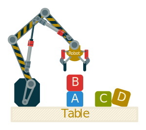
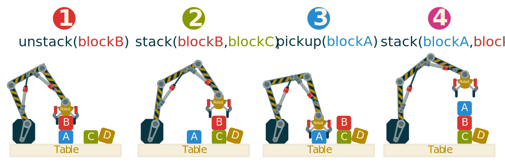
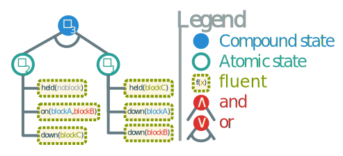
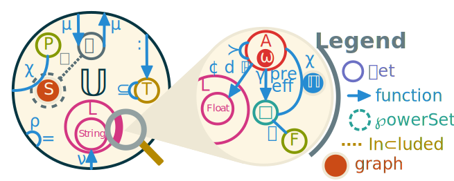
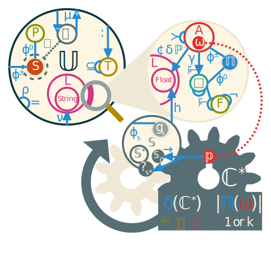
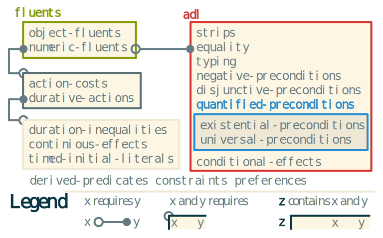

# General Planning Framework

When making artificial intelligence systems, an important feature is the ability to make decisions and act accordingly. To act, one should plan ahead. This is why the field of automated planning is being actively researched in order to find efficient algorithms to find the best course of action in any given situation. The previous chapter allowed to lay the bases of knowledge representation. How knowledge about the planning domains are represented is a main factor to take into account in order to conceive any planning algorithm.

Automated planning really started being formally investigated after the creation of the Stanford Research Institute Problem Solver (STRIPS) by @fikes_strips_1971. This is one of the most influential planner, not because of its algorithm but because of its input language. Any planning system needs a way to express the information related to the input problem. Any language done for this purpose is called an *action language*. STRIPS will be mostly remembered for its eponymous action language that is at the base of any modern derivatives.

All action language is based on mainly two notions: *actions* and *states*. A state is a set of *fluents* that describe aspects of the world modelized by the domain. Each action has a logic formula over states that allows its correct execution. This requirement is called *precondition*. The mirror image of this notion are possible *effects* which are logic formula that are enforced on the current state after the action is executed. The domain is completed with a problem, most of the time specified in a separate file. The problem basically contains two states: the *initial* and *goal* states.

## Illustration {#sec:plan_example}

To illustrate how automated planners works, we introduce a typical planning problem called **block world**. In this example, a robotic grabing arm tries to stack blocks on a table in a specific order. The arm is only capable of handling one block at a time. We suppose that the table is large enough so that all the blocks can be put on it without any stacks. @Fig:blockworld illustrates the setup of this domain.

{#fig:blockworld}

The possible actions are `pickup`, `putdown`, `stack` and `unstack`. There are at least three fluents needed: 

* one to state if a given block is `down` on the table,
* one to specify which block is `held` at any moment and
* one to describe which block is stacked `on` which block.

We also need a special block to state when `noblock` is held or on top of another block. This block is a constant.

The knowledge we just described is called *planning domain*.

In that example, the initial state is described as stacks and a set of blocks directly on the table. The goal state is usually the specification of one or many stacks that must be present on the table. This part of the description is called *planning problem*.

In order to solve it we must find a valid sequence of actions called a *plan*. If this plan can be executed in the initial state and result in the goal state it is called a *solution* of the planning problem. To be executed, each action must be done in a state satisfying its precondition and will alter that state according to its effects. A plan can be executed if all its action can be executed in the sequence of the plan. For example, in the block world domain we can have an initial state with the $blockB$ ontop of $blockA$ and the $blockC$ being on the table. In @fig:plan, we give a plan solution to the problem consisting of having the stack $\langle blockA, blockB, blockC \rangle$ from that initial state.

{#fig:plan}

Every automated planner aims to find at least one such solution in any way shape or form in the least amount of time with the best plan quality. The quality of a plan is often measured by how hard it is to execute, whether by its execution time or by the ressources needed to accomplish it. This metric is often called *cost* of a plan and is often simply the sum of the cost of its actions.

Automated planning is very diverse. A lot of paradigms shifts the definition of domain, actions and even plan to widely varying extents. This is the reason why making a general planning formalism was deamed so hard or even impossible:

> "_It would be unreasonable to assume there is one single compact and correct syntax for specifying all useful planning problems._" \hfill @sanner_relational_2010a

Indeed, the block world example domain we give is mostly theoritical since there are infinitely more subtelty into this problem such as mechatronic engineering, balancing issues and partial ability to observe the environement and predict its evolution as well as failure in the execution. In our example, we didn't mentioned the misplaced $blockD$ that could very well interefer with any exectution in unpredicted ways. This is why so many planning paradigms exists and why they are all so diverse: they try to address an infinitely complex problem, one sub-problem at a time. In doing so we lose the general view of the problem and by simply stating that this is the only way to resolve it we close ourself to other approaches that can become successful. Like once said:

> "_The easiest way to solve a problem is to deny it exists._" \hfill @asimov_gods_1973

However, In the next section we aim to create such a general planning formalism. The main goal is to provide the automated planning comunity with a general unifying framework it so badly need.

## Formalism

In this section, a general formalism of automated planning is proposed. The goal is to explain what is planning and how it works. First we must express the knowledge domain formalism, then we describe how problems are represented and lastly how a general planning algorithm can be envisioned.

### Planning domain

**Symbol**                            **Description**
----------                            ---------------
$F, \square, A$                       Sets of fluents, states and actions.
$\otimes, \odot^\pm$                  Sets of flaws and signed resolvers. Flaws have variants:
$\otimes^\downarrowbarred$            • unsupported subgoal.
$\otimes^\dagger$                     • causal threat to an existing causal link.
$\otimes^\circlearrowleft$            • cycle in the plan.
$\otimes^\ast$                        • decomposition of a compound action.
$\otimes^\curvearrowrightminus$       • alternative to an existing action.
$\otimes^{\bar{o}}$                   • orphan action in the plan.
$\bb{\Pi}, \bb{S}$                    Sets of plans and search space.
$\cal{l} \downdasharrow a$            Partial support of action $a$ by the causal link $\cal{l}$.
$\bb{\pi} \downarrow a$               Full support of action $a$ by plan $\bb{\pi}$
$\prec, \succ$                        Precedence and succession relation used for order.
$\Mapsto^*$                           General shortest path algorithm.
$h$                                   Search heuristic.
$\bb{p}$                              Planning problem.
$\gamma$                                   Constraints on the action.
$¢$                                   Cost of an action.
$d$                                   Duration of an action.
$\omega$                              Root operator.

: List of classical symbols and syntax for planning. {#tbl:planning}

In order to concieve a general formalism for planning domains, we base its definition on the formalism of SELF. This means that all part of the domain must be a member of the universe of discourse $\bb{U}$.

#### Fluents

First, we need to define the smallest unit of knowledge in planning, the fluents.

::: {.definition name="Fluent"} :::
A planning fluent is a predicate $f(arg_1, arg_2, …, arg_n) \in F$ where:

* $f$ is a relation.
* $arg_{i \in [1,n]} \in \bb{U}$ are the arguments (possibly quantified).
* $n = |f|$ is the arity of $f$.

Fluents are signed. Negative fluents are noted $\neg f$ and behave as a logical complement. We do not use the closed world hypothesis: fluents are only satisfied when another compatible fluent is provided.
:::::::::::::::::::::::::::::::::::

The name "fluent" comes from their fluctuating value. Indeed the truth value of a fluent is meant to vary with time and specifically by acting on it. In this formalism we represent fluents using either parameterized entities of using statements for binary fluents.

*Example*: In our example we have four predicates. They can form countless fluents like $held(no-block)$, $on(blockA, blockB)$ or $\neg down(blockA)$.
Their when expressing a fluent we suppose its truth value is $\top$ and denote falsehood using the negation $\neg$.

When expressing states, we need a formalism to express sets of fluents as formulaes.

::: {.definition name="State"} :::
A state is a set of fluent. It is provided with a truth value like a fluent and can behave like one. The truth value is the *conjunction* of all fluents within the state $\smwhtsquare \vdash \bigwedge_{f \in \smwhtsquare} f$ denoted by a small square $\smwhtsquare$. States can contain other states in which case their truth value is the *disjunction* of the member's truth value: $\smwhtsquare \vdash \bigvee_{\smwhtsquare' \in \smwhtsquare} \smwhtsquare'$. This creates an and/or tree with the branches being all *or vertices* except for the ones connecting to fluents that becomes *and vertices*. All leaves of the tree are fluents.
:::::::::::::::::::::::::::::::::::

*Example*: In the domain block world, we can express a couple of states as set of fluents:

* $\smwhtsquare_1 = \{held(noblock), on(blockA, blockB), down(blockC)\}$
* $\smwhtsquare_2 = \{held(blockC), down(blockA), down(blockB)\}$

In such a case, both state $\smwhtsquare_1$ and $\smwhtsquare_2$ have their truth value being the conjunction of all their fluents. In order to express a disjunction, one has to combine states in the following way: $\smwhtsquare_3 = \{\smwhtsquare_1, \smwhtsquare_2\}$. In that case $\smwhtsquare_3$ is the root of the and/or tree and all its direct children are or vertices. The states $\smwhtsquare_1$ and $\smwhtsquare_2$ have their children as *and vertices* since they are fluents.

{#fig:state_tree}

When planning, we need to make operations on states and fluents. Namely, we need to be able to *verify* them, *unify* them and *apply* them. These three operations are defined the following way :

* **Verify**: $\smwhtsquare \vdash f = \smwhtsquare \cup \{f\}$
* **Unify**: $\smwhtsquare \sqcup f = \{ x \mapsto y : x \in \rho(f) \land y \in \rho(f') \land  f' \in \smwhtsquare \land f' \sqcap f \}$ **FIXME**
* **Apply**: $f(\smwhtsquare) = \smwhtsquare \cup \{(\smwhtsquare \sqcup f)(f)\}$

---

Another important part of the behavior of fluents is their ability to match and to being unified.

Matching is the relation $f_1 :_\smwhtsquare f_2$ that affects any pair of fluents $\langle f_1, f_2 \rangle$ along with a context state $\smwhtsquare$ to another state containing the context augmented with unification constraints or $\emptyset$ if the two fluents are contradicting one another given the context. If the two fluents are equal or have a different function, they do not influence the context. Opposite fluents will always contradict. The quantified or variable arguments may cause contradiction or add a constraint into the context.

The actual unification relation $f_1 \vdash_\smwhtsquare f_2$ bind any matching fluents to another grounded fluent giving the constraints of the given context. 

Both relations are generalized to states by merging the result of the following way: 

$$\colonvdash(\smwhtsquare_r, \smwhtsquare_f) = \bigcup_{f_r \in \smwhtsquare_f, f_f \in \smwhtsquare_f} \colonvdash(f_r, f_f, \smwhtsquare_a)$$

with, $\smwhtsquare_r$ being the reference state and $\smwhtsquare_f$ being the formula state. The state $\smwhtsquare_a$ is an accumulator that is result of the partial union of the previous matching iterations.
This formula is the same for $:$ and $\vdash$. It is interesting to note that the relations doesn't need an additional context and share the same definition domain $\square^2 \to \square$ when taking states as arguments.

*Example*: Using previously defined example states $\smwhtsquare_{1,2,3}$, and adding the following:

* $\smwhtsquare_4(x) = \{held(noblock), down(x)\}$ and 
* $\smwhtsquare_5(y) = \{held(y), \neg down(y)\}$,

We can express a few example of fluent matching:

* $held(noblock) : held(x) = \{x=noblock\}$
* $\neg held(x) : held(x) = \emptyset$
* $held(blockA) :_{\smwhtsquare_1} held(x) = \emptyset$
* $down(blockD) :_{\smwhtsquare_1} down(x) = \smwhtsquare_1 \cup \{x=blockD\}$
* $down(blockC) :_{\smwhtsquare_1} down(blockC) = \smwhtsquare_1$

Unification of fluents goes quite simply:

* $held(noblock) \vdash held(x) = held(noblock)$
* $\neg held(x) \vdash held(x) = \emptyset$
* $held(blockC) \vdash_{\smwhtsquare_5(y)} held(y) = \{held(blockC), \neg down(blockC)\}$

We also can present matching on states:

* $\smwhtsquare_1 : \smwhtsquare_2 = \emptyset$
* $\smwhtsquare_1 : \smwhtsquare_4(x) = \smwhtsquare_1 \cup \{x=blockC\}$

And unification too:

* $\smwhtsquare_1 \vdash \smwhtsquare_4(x) = \smwhtsquare_1$

**FIXME: Type check and see if application is different.**

All these relations are used to check and apply actions.

#### Actions

Actions are the main mecanism beind automated planning, they describe what can be done and how it can be done.

::: {.definition #def:action name="Action"} :::
An action is a parametrized tuple $a(args)=\langle :, \vdash, \gamma, ¢, d, \bb{P}, \bb{\Pi} \rangle$ where:

* $:$ and $\vdash$ are states that are respectively the **preconditions and the effects** of the action.
* $\gamma$ is the state representing the **constraints**.
* $¢$ is the intrisic **cost** of the action.
* $\delta$ is the intrinsic **duration** of the action.
* $\bb{P}$ is the prior **probability** of the action succeeding.
* $\bb{\Pi}$ is a set of **methods** that decompose the action into smaller simpler ones.
::::::::::::::::::::::::::::::::::::::::::::::::::

Operators take many names in difference planning paradigm : actions, steps, tasks, etc. In our case we call operators, all fully lifted actions and actions are all the instances possibles (including operators).

In order to be more generalistic, we allow in the constraints description, any time constraints, equalities or inequalities, as well as probabilistic distributions. These constratints can also express derived predicates. It is even possible to place arbitrary constraints on order and selection of actions.

Actions are often represented as state operators that can be applied in given state to alter it. The application of actions is done by using the actions as relations $a : \square \to \square$ defined as follow: $a(\smwhtsquare) = \smwhtsquare \vdash_{\smwhtsquare : a} a$

$$a(\smwhtsquare) = 
\begin{cases}
  \emptyset,& \text{if } \smwhtsquare : a =\emptyset\\
  \smwhtsquare \vdash a,& \text{otherwise}
\end{cases}$$

*Example*: A useful action we can define from previously defined states is the following:

$$pickup(x) = \langle \smwhtsquare_4(x), \smwhtsquare_5(x), (x: Block), 1.0¢, 3.5s, 75\%, \emptyset \rangle$$

That action can pickup a block $x$ in $3.5$ seconds using a cost of $1.0$ with a prior success probability of $75\%$.

#### Domain

{#fig:color}

The domain specifies the allowed operators that can be used to plan and all the fluents they use as preconditions and effects.

::: {.definition name="Domain"} :::
A domain $\cal{D}$ is a set of **operators** which are fully lifted *actions*, along with all the relations and entities needed to describe their preconditions and effects.
:::::::::::::::::::::::::::::::::::

*Example*: In the previous examples the domain was named block world. It consists in four actions: $pickup, putdown, stack$ and $unstack$. Usually the domain is self contained, meaning that all fluents, types, constants and operators are contained in it.

### Planning problem

The aim of an automatted planner is to find a plan satisfying the goal. This plan can be of multiple forms, and there can even be multiple plans that meet the demand of the problem.

#### Solution

::: {.definition name="Partial Plan / Method"} :::
A partially ordered plan is an *acyclic* directed graph $\bb{\pi} = (A_{\bb{\pi}}, E)$, with:

* $A_{\bb{\pi}}$ the set of **steps** of the plan as vertices. A step is an action belonging in the plan. $A_{\bb{\pi}}$ must contain an initial step $a_{\bb{\pi}}^0$ and goal step $a_{\bb{\pi}}^*$ as convinience for certain planning paradigms.
* $E$ the set of **causal links** of the plan as edges.
We note $l = a_s \xrightarrow{\smwhtsquare} a_t$ the link between its source $a_s$ and its target $a_t$ caused by the set of fluents $\smwhtsquare$. If $\smwhtsquare = \emptyset$ then the link is used as an ordering constraint.
:::::::::::::::::::::::::::::::::

This definition can express any kind of plans, either temporal, fully or partially ordered or even lose hierarchical plans (using the methods of the actions). It can even express diverse planning results.

In our framework, *ordering constraints* are defined as the transitive cover of causal links over the set of steps. We note ordering constraints: $a_a \succ a_s$, with $a_a$ being *anterior* to its *successor* $a_s$. Ordering constraints cannot form cycles, meaning that the steps must be different and that the successor cannot also be anterior to its anterior steps:
$a_a \neq a_s \land a_s \not \succ a_a$.
If we need to enforce order, we simply add a link without specifying a cause. The use of graphs and implicit order constraints help to simplify the model while maintaining its properties. Totally ordered plans are done by specifying links between all successive actions of the sequence.

*Example*: In the @sec:plan_example, we described a classical fully ordered plan, illustrated in @fig:plan. A partially ordered plan has a tree-like structure except that it also meet in a "sink" vertex (goal step). We explicit this structure in @fig:poplan.

{#fig:poplan}

#### Problem

With this formalism, the problem is very simplified but still general.

::: {.definition name="Problem"} :::
The planning problem is defined as the **root operator** $\omega$ which methods are potential solutions of the problem. Its preconditions and effects are respectively used as initial state and goal description.
::::::::::::::::::::::::::::::::::::

As actions are very general, it is interesting to make the problem and domain space homogenous by using an action to describe any problem. 

Most of the specific notions of this framework are optionnal. Any planner using it will probably define what features it supports when compiling input domains and problems.

All notions explained so far are represented in the @fig:color adding to the SELF Venn diagram.

### Planning algorithm

The general planning algorithm can be described as a guided exploration of a search space. The detailed structure of the search space as well as search iterators are dependant on the planning paradigm used.

#### Search space

::: {.definition name="Planner"}
A planning algorithm, often called planner, is an exploration of a search space $\bb{S}$ partially ordered by an iterator $\phi^+_{\bb{S}}$ guided by a heuristic $h$. From any problem $\bb{p}$ every planner can derive two informations imediately: 

* the starting point $\bb{s}_0 \in \bb{S}$ and
* the solution predicate $?_{\bb{s}^*}$ that gives the validity of any potential solution in the search space.

Formally the problem can be exprimed as a pathfinding problem in the dirrected graph $g_{\bb{S}}$ formed by the vertex set $\bb{S}$ and the adjacence function $\phi^+_{\bb{S}}$. The set of solutions is therefore expressed as:

$$\bb{S}^* = 
\left \{ \bb{s}^* : 
  \langle \bb{s}_0, \bb{s}^* \rangle \in E_{\chi^+(g_{\bb{S}})} 
  \land ?_{\bb{s}^*})  
\right \}$$
:::

In automated planning there are also other considerations about the search. 

#### Diversity

Sometimes, it is necessary to find alternatives. Since re-planning from scratch is computationally demanding, it is better to find several solutions at once. This approach is called *diverse planning*. It aims to find $k$ solutions that deviates from one another significantly. This simply make the process return when either it found $k$ solutions or when it determined that $k > |\bb{S}^*|$.

#### Temporality

Another aspect of planning lies in its timming. Indeed sometimes acting needs to be done before a dealine and planning is useful only durring a finite timeframe. We add a predicate that specifies time constraints over algorithms $t : \bb{A} \to \bb{A}$. This constraint has three main type of application:

* $t_\acidfree$:  Optimal search without time limitation, finding the best solution everytime.
* $t_\chrono$: Anytime search, finding a solution and improving its quality until stopped.
* $t_\timeout$: Real-time search, being able to give a solution in a given time even if it is an approximation.

#### General planner

A general planner $\bb{C}^*[\bb{S},\phi^+_{\bb{S}},h,\to](\cal{D},\bb{p})$ is an algorithm that can plan any formalism of automated planning. It takes two set of parameters:

* **Formalism dependant parameters**
  + $\bb{S}$ the search space
  + $\phi^+_{\bb{S}}$ the search iterator
  + $h$ the heuristic
  + $\to$ the problem transformation function
* **Domain depedant parameters**
  + $\cal{D}$ the *planning domain*
  + $\bb{p}$ the *planning problem*

The heuristic $h(\bb{s})$ gives off the shortest predicted distance to any point of the solution space. The exploration is guided by it by minimizing its value.

Other informations must be added to any problem $\bb{p}$ in the form of constraints:

$$\left( t(\bb{C}) \veeonwedge |\bb{\Pi}(\omega)| = k \right) \in c(\omega)$$

The value for $k$ is extracted from the problem and the temporality is expressed using either $\land$, $\lor$ or $\land \bot \lor$ instead of $\veeonwedge$.

The transformation function $\bb{p} \to \langle \bb{s}_0, ?_{\bb{s}^*} \rangle$ gives the starting point $\bb{s}_0$ and the solution predicate $?_{\bb{s}^*}$. This predicate is derived from the problem description and its contraints.

For the algorithm itself, we simply use a parameterized instance of the K* algorithm [@aljazzar_heuristic_2011, alg. 1]. This algorithm uses the classical algorithm A* to explore the graph while using Dijkstra on some sections to find the $k$ shortest paths. The parameters are as follow: $K^*(g_{\bb{S}}, \bb{s}_0, ?_{\bb{s}^*}, h)$. The solution predicate contains the expression of the restriction of $k$ solutions, therefore, it superseeds the need for the $k$ parameter. We also add the heuristic $h$ to guide the A* part of the algorithm.

Of course this algorithm is merely an example of a general planner algorithm. Its efficiency hasn't been tested.

{#fig:gplanner}

## Classical Formalisms

One of the most comprehensive work on sumarizing the automated planning domain was done by @ghallab_automated_2004. This book explains the different planning paradigm of its time and gives formal description of some of them. This work has been updated later [@ghallab_automated_2016] to reflect the changes occuring in the planning community.

### State-transition planning

The most classical representation of automated planning is using the state transition approach: actions are operators on the set of states and a plan is a finite-state automaton.
We can also see that problem description as either a graph exploration problem or even a constraint satisfaction problem. In any way that problem is isomorph to its original formulation and most efficient algorithms use a derivative of A* exploration techniques on the state space.

This makes this kind of planning quite simple to instantiate from the general planner: 
$$\bb{C}_{state} = \bb{C}^* \left[ \square, \bigcup_{a \in A} a(\bb{s}), h, :(\omega), \vdash(\omega) \right]$$

For this formalism, we often set $k=1$ and $t(\bb{C}_{state}) = t_\acidfree$ as is customary in classical planning. It can also be specified as a backward search by inverting the application of $a$ with $a^{-1}$ and having the starting state as $:(\omega)$ and solution predicate as $\vdash(\omega)$.

State based planning usually supose total knowledge of the state space and action behavior.
No concurency or time constraints are expressed and the state and action space must be finite as well as the resulting state graph. This process is also deterministic and doesn't allow uncertainty. The result of such a planning is a totally ordered sequence of actions called a plan. The total order needs to be enforced even if it is unecessary.

All those features are important in practice and lead to other planning paradigms that are more complex than classical state based planning.

### Plan space planning

Plan Space Planning (PSP) is a form of planning that use plan space as its search space. It starts with an empty plan and try to iteratively refine that plan into a solution. 

$$\bb{C}_{psp} = \bb{C}^* \left[ \bb{\Pi}, \bigcup_{f \in \otimes(\bb{s})}^{r \in \odot^\pm_f} r(\bb{s}), h, \left(\{a_{\bb{\pi}}^0, a_{\bb{\pi}}^*\},\{a_{\bb{\pi}}^0\rightarrow a_{\bb{\pi}}^*\} \right), \otimes(\bb{s}) = \emptyset \right]$$

with $a_{\bb{\pi}}^0$ and $a_{\bb{\pi}}^*$ being the intial and goal steps of the plan $\bb{s}_0$ such that $\vdash(a_{\bb{\pi}}^0) = :(\omega)$ and $:(a_{\bb{\pi}}^*) = \vdash(\omega)$. The iterator is all the possible resolutions of all flaws on any plan $\bb{s}$ and the solution predicate is true when the plan has no more flaws.

Details about flaws, resolver and the overall Partial Order Causal Links (POCL) algorithm will be presented @later.

This approach usually can give a partial plan if we set $t(\bb{C}_{psp}) < t(\exists \bb{\pi} \in \bb{\Pi} \land ?_{\bb{s}}(\bb{\pi}))$. This plan is not a solution but can eventually be engineered into having approximative properties relative to a solution.

### Case based planning

Another plan oriented planning is called Case-Based Planning (CBP). This kind of planning relies on a library of already complete plans and try to find the most appropriate one to repair.

$$\bb{C}_{cbp} = \bb{C}^* \left[ \cal{L}^{\bb{\pi}}, \odot(\bb{s}), h, \sigma^*(\cal{L}^{\bb{\pi}}, \omega), \bb{s}(:(\omega)) \Downarrow \vdash(\omega) \right ]$$

with $\cal{L}^{\bb{\pi}}$ being the plan library. The planner selects efficiently a plan that fit the best with the intial and goal state of the problem. This plan is then repaired and validated iteratively. The problem with this approach is that it may be unable to find a valid plan or might need to populate and maintain a good plan library. For such case an auxiliary planner is used (preferably diverse with $k>1$).

### Probabilistic planning

**Symbol**         **Description**
----------         ---------------
$\bb{P}(\cal{e})$  Probability of event $\cal{e}$.
$\cal{O}$          Set of observations.
$\rupee$           Reward function.

: List of classical symbols and syntax for probabilities. {#tbl:proba}

**FIXME** Reward using rupee symbol $\rupee$

Probabilistic planning tries to deal with uncertainty by generating a policy instead of a plan. The initial problem holds probability laws that govern the execution of any actions. It is sometimes accompagnated with a reward function instead of a deterministic goal.

$$\bb{C}_{prob} = \bb{C}^* \left[ \square \times A, \bb{s}_{+1} = \bigcup_{a \in A}^{a(\smwhtsquare) \neq \emptyset} \langle \pi_{\langle \smwhtsquare', a' \rangle \to a'(\smwhtsquare')}\sigma(\bb{s}_{+1}), a \rangle, h_\rupee, \bigcup_{a \in A}^{a(:(\omega)) \neq \emptyset} \langle :(\omega), a \rangle , \smwhtsquare \vdash \omega \right]$$

The state $\smwhtsquare$ is a state chosen from the frontiere. The frontiere is updated at each iteration with the application of a non-deterministically chosen pair of the last policy insertion. The search stops when all elements in the frontiere are goal states.

### Hierarchical planning

Hierarchical Task Networks (HTN) are a totally different kind of planning paradigm. Instead of a goal description, HTN uses a root task that needs to be decomposed. The task decomposition is an operation that replaces a task (action) by one of its methods $\Pi$.

$$\bb{C}_{htn} = \bb{C}^* = \left [ \bb{\Pi}, \left(\sigma\{a\in A_{\bb{s}} : \bb{\Pi}_a \neq \emptyset\} \to\sigma(\bb{\Pi}_a)\right)(\bb{s}), h, \omega, \forall a \in A_{\bb{s}} : \bb{\Pi}(a) = \emptyset \right ]$$

## Existing Languages and Frameworks

### Classical

After STRIPS, one of the first language to be introduced to express planning domains like ADL [@pednault_adl_1989]. That formalism adds negation and conjunction into literals to STRIPS. It also drops the closed world hypothesis for an open world one: anything not stated in conditions (initial or action effects) is unknown.

The current standard was strongly inspired by @penberthy_ucpop_1992 and his UCPOP planner. Like STRIPS, UCPOP had a planning domain language that was probably the most expressive of its time. It differs from ADL by merging the add and delete lists in effects and to change both preconditions and effects of actions into logic formula instead of simple states.

The PDDL language was created for the first major automated planning competition hosted by AIPS in 1998 [@ghallab_pddl_1998]. It came along with a syntax and solution checker writen in Lisp. It was introduced as a way to standardize notation of planning domains and problems so that libraries of standard problems can be used for benchmarks. The main goal of the language was to be able to express most of the planning problems of the time.

With time, the planning competitions became known under the name of International Planning Competitions (IPC) regularly hosted by the ICAPS conference. With each installment, the language evolved to address issues encountered the previous years. The current version of PDDL is 3.1 [@kovacs_bnf_2011]. Its syntax, goes similarly as described in @lst:pddl_syntax.

```{#lst:pddl_syntax .lisp caption="Simplified explanation of the syntax of PDDL." escapechar=$}
(define (domain <domain-name>)
  (:requirements :<requirement-name>)
  (:types <type-name>)
  (:constants <constant-name> - <constant-type>)
  (:predicates (<predicate-name> ?<var> - <var-type>))
  (:functions	(<function-name> ?<var> - <var-type>) - <function-type>)

  (:action <action-name>
	     :parameters (?<var> - <var-type>)
	     :precondition (and (= (<function-name> ?<var>) <value>) (<predicate-name> ?<var>))
	     :effect
	     (and (not (<predicate-name> ?<var>))
		   (assign (<function-name> ?<var>) ?<var>)))
```

PDDL uses the functional notation style of LISP. It defines usually two files: one for the domain and one for the problem instance. The domain describes constants, fluents and all possible actions. The problem lays the initial and goal states description.

For example, consider the classic block world domain expressed in @lst:block_pddl. It uses a predicate to express whether a block is on the table because several blocks can be on the table at once. However it uses a 0-ary function to describe the one block allowed to be held at a time. The description of the stack of blocks is done with an unary function to give the block that is on top of another one. To be able to express the absence of blocks it uses a constant named `no-block`. All the actions described are pretty straightforward: `stack` and `unstack` make sure it is possible to add or remove a block before doing it and `pick-up` and `put-down` manages the handling operations.

```{#lst:block_pddl .lisp caption="Classical PDDL 3.0 definition of the domain Block world" escapechar=$}
(define (domain BLOCKS-object-fluents)
  (:requirements :typing :equality :object-fluents)
  (:types block)
  (:constants no-block - block)
  (:predicates (on-table ?x - block))
  (:functions	(in-hand) - block
		(on-block ?x - block) - block) ;;what is in top of block ?x

  (:action pick-up
	     :parameters (?x - block)
	     :precondition (and (= (on-block ?x) no-block) (on-table ?x) (= (in-hand) no-block))
	     :effect
	     (and (not (on-table ?x))
		   (assign (in-hand) ?x)))

  (:action put-down
	     :parameters (?x - block)
	     :precondition (= (in-hand) ?x)
	     :effect
	     (and (assign (in-hand) no-block)
		   (on-table ?x)))

  (:action stack
	     :parameters (?x - block ?y - block)
	     :precondition (and (= (in-hand) ?x) (= (on-block ?y) no-block))
	     :effect
	     (and (assign (in-hand) no-block)
	   	  (assign (on-block ?y) ?x)))

  (:action unstack
	     :parameters (?x - block ?y - block)
	     :precondition (and (= (on-block ?y) ?x) (= (on-block ?x) no-block) (= (in-hand) no-block))
	     :effect
	     (and (assign (in-hand) ?x)
		  (assign (on-block ?y) no-block))))
```
However, PDDL is far from an universal standard. Some efforts have been made to try and standardize the domain of automated planning in the form of optional requirements. The latest of the PDDL standard is the version 3.1 [@kovacs_bnf_2011]. It has 18 atomic requirements as represented in @fig:pddl_req. Most requirements are parts of PDDL that either increase the complexity of planning significantly or that require extra implementation effort to meet.

{#fig:pddl_req}

Even with that flexibility, PDDL is unable to cover all of automated planning paradigms. This caused most subdomains of automated planning to be left in a state similar to before PDDL: a zoo of languages and derivatives that aren't interoperable. The reason for this is the fact that PDDL isn't expressive enough to encode more than a limited variation in action and fluent description.

Another problem is that PDDL isn't made to be used by planners to help with their planning process. Most planners will totally separate the compilation of PDDL before doing any planning, so much so that most planners of the latest IPC used a framework that translates PDDL into a useful form before planning, adding computation time to the planning process. The list of participating planners and their use of language is presented in @tbl:ipc.

Name          Trans Pre Lang     Base      Rank
----          ----- --- ----     ----      ----
Delfi         Yes   Yes C++      FD        1
Complementary Yes   Yes C++      FD        2
Planning-PDBs Yes   Yes C++      FD        3
Scorpion      Yes   Yes C++      FD        4
FDMS          Yes   Yes C++      FD        5
DecStar       Yes   Yes C++      LAMA      6
Metis         Yes   Yes C++      FD        7
MSP           Yes   Yes Lisp     FD        8
Symple        Yes   Yes C++      FD        9
Ma-plan       No    Yes C        None      10

: Planners participating in the Classic track of the 2018 International Planning Competition (IPC). The table states whether the planner used a translation and a preprocessing system to handle PDDL. Most of the planners are based on FastDownward directly. {#tbl:ipc}

The domain is so diverse that attempts to unify it haven't succeeded so far. The main reason behind this is that some paradigms are vastly different from the classical planning description. Sometimes just adding a seamingly small feature like probabilities or plan reuse can make for a totally different problem. In the next section we describe planning paradigms and how they differ from classical planning along with their associated languages.

### Temporality oriented

When planning, time can become a sensitve constraint. Some critical tasks may required to be completed within a certain time. Actions with durations are already a feature of PDDL 3.1. However, PDDL might not provide support for external events (i.e. events occuring independant from the agent). To do this one must use another language.

#### PDDL+

PDDL+ is an extension of PDDL 2.1 that handles process and events [@fox_pddl_2002]. It can be viewed as similar to PDDL 3.1 continious effects but it differs on the expressivity. A process can have an effect on fluents at any time. They can happen either from the agent's own doing or being purely environemental. It might be possible in certain cases to modelize this using the durative actions, continious effects and timed initial literals of PDDL 3.1.

In @lst:pddl_plus, we reproduce an example from @fox_pddl_2002. It shows the syntax of durative actions in PDDL+. The timed precondition are also available in PDDL 3.1, but the `increase` and `decrease` rate of fluents is an exclusive feature of PDDL+.

```{#lst:pddl_plus .lisp caption="Example of PDDL+ durative action from Fox's paper." escapechar=$}
(:durative-action downlink
    :parameters (?r - recorder ?g - groundStation)
    :duration (> ?duration 0)
    :condition (and (at start (inView ?g))
                    (over all (inView ?g))
                    (over all (> (data ?r) 0)))
    :effect (and (increase (downlinked)
                      (* #t (transmissionRate ?g)))
                 (decrease (data ?r)
                      (* #t (transmissionRate ?g)))))
```
The main issue with durative actions is that time becomes a continous ressource that may change the values of fluents. The search for a plan in that context has a higher complexity than regular planning.

### Probabilistic

Sometimes, acting can become unpredictable. An action can fail for many reasons, from logical errors down to physical constraints. This call for a way to plan using probabilities with the ability to recover from any predicted failures. PDDL doesn't support using probabilities. That is why all IPC's tracks dealing with it always used another language than PDDL.

#### PPDDL

PPDDL is such a language. It was used during the 4^th^ and 5^th IPC for its probabilistic track [@younes_ppddl_2004]. It allows for probabilistic effects as demonstrated in @lst:ppddl. The planner must take into account the probability when chosing an action. The plan must be the most likely to succeed. But even with the best plan, failure can occur. This is why probabilistic planning often gives policies instead of a plan. A policy dictates the best choice in any given state, failure or not. While this allows for much more resilient execution, computation of policies are exponentially harder than classical planning. Indeed the planner needs to take into account every outcome of every action in the plan and react accordingly.

```{#lst:ppddl .lisp caption="Example of PPDDL use of probabilistic effects from Younes' paper." escapechar=$}
(define (domain bomb-and-toilet)
    (:requirements :conditional-effects :probabilistic-effects)
    (:predicates (bomb-in-package ?pkg) (toilet-clogged)
                  (bomb-defused))
    (:action dunk-package
             :parameters (?pkg)
             :effect (and (when (bomb-in-package ?pkg)
                                (bomb-defused))
                          (probabilistic 0.05 (toilet-clogged)))))
```

#### RDDL

Another language used by the 7^th^ IPC's uncertainty track is RDDL [@sanner_relational_2010a]. This language has been choosen because of its ability to express problems that are hard to encode in PDDL or PPDDL. Indeed, RDDL is capable of expressing Partially Observable Markovian Decision Process (POMDP) and Dynamic Bayesian Networks (DBN) in planning domains. This along with complex probability laws allows for easy implementation of most probabilistic planning problems. Its syntax differs greatly from PDDL, and seems closer to scala or C++. 
An example is provided in @lst:rddl from @sanner_relational_2010a. In it, we can see that actions in RDDL doesn't need preconditions or effects. In that case the reward is the closest information to the classical goal and the action is simply a parameter that will influence the probability distribution of the events that conditioned the reward.

``` {#lst:rddl .cpp caption="Example of RDDL syntax by Sanner." escapechar=$}
////////////////////////////////////////////////////////////////////////
// A simple propositional 2-slice DBN (variables are not parameterized).
//
// Author: Scott Sanner (ssanner [at] gmail.com)
////////////////////////////////////////////////////////////////////////
domain prop_dbn {
  	
	requirements = { reward-deterministic };
      	
	pvariables { 
		p : { state-fluent,  bool, default = false };
		q : { state-fluent,  bool, default = false };
		r : { state-fluent,  bool, default = false }; 
		a : { action-fluent, bool, default = false }; 
	};
  
	cpfs {
		// Some standard Bernoulli conditional probability tables
		p´ = if (p ^ r) then Bernoulli(.9) else Bernoulli(.3);
						
		q´ = if (q ^ r) then Bernoulli(.9) 
						else if (a) then Bernoulli(.3) else Bernoulli(.8);

		// KronDelta is like a DiracDelta, but for discrete data (boolean or int)
		r´ = if (~q) then KronDelta(r) else KronDelta(r <=> q);										
	};

	// A boolean functions as a 0/1 integer when a numerical value is needed	
	reward = p + q - r; // a boolean functions as a 0/1 integer when a numerical value is needed
}
        
instance inst_dbn {

	domain = prop_dbn;	
	init-state { 
		p = true;  // could also just say 'p' by itself 
		q = false; // default so unnecessary, could also say '~q' by itself
		r;         // same as r = true
	};
  
	max-nondef-actions = 1;
	horizon  = 20;
	discount = 0.9;
}
```

### Multi-agent

Planning can also be a collective effort. In some cases, a system must account for other agents trying to either cooperate or compete in achieving similar goals. The problem that arise is coordination. How to make a plan meant to be executed with several agents concurently ? Several multi-agent action languages have been proposed to answer that question.

#### MAPL

Another extension of PDDL 2.1, MAPL was introduced to handle synchronization of actions [@brenner_multiagent_2003]. This is done using modal operators over fluents. In that regard, MAPL is closer to the PDDL+ extension proposed earlier. It introduce durative actions that will later be integrated into the PDDL 3.0 standard. MAPL also introduce a synchronization mechanism using speech as a comunication vector. This seems very specific as explicit comunication isn't a requirement of collaborative work. @Lst:mapl is an example of the syntax of MAPL domains. PDDL 3.0 seems to share a similar syntax.

``` {#lst:mapl .lisp caption="Example of MAPL syntax by Brenner." escapechar=$}
(:state-variables
  (pos ?a - agent) - location
  (connection ?p1 ?p2 - place) - road
  (clear ?r - road) - boolean)
(:durative-action Move
  :parameters (?a - agent ?dst - place)
  :duration (:= ?duration (interval 2 4))
  :condition
    (at start (clear (connection (pos ?a) ?dst)))
  :effect (and
    (at start (:= (pos ?a) (connection (pos ?a) ?dst)))
    (at end (:= (pos ?a) ?dst))))
```

#### MA-PDDL

Another aspect of multi-agent planning is the ability to affect tasks and to manage interactions between agents efficiently. For this MA-PDDL seems more adapted than MAPL. It is an extension of PDDL 3.1, that makes easier to plan for a team of heteroneous agents [@kovacs_multiagent_2012]. In the example in @lst:ma-pddl, we can see how action can be affected to agents. While it makes the representation easier, it is possible to obtain similar effect by passing an agent object as parameter of an action in PDDL 3.1. More complex expressions are possible in MA-PDDL, like referencing the action of other agents in the preconditions of actions or the ability to affect different goals to different agents. Later on, MA-PDDL was extended with probabilistic capabilities inspired by PPDDL [@kovacs_converting_2013].

``` {#lst:ma-pddl .lisp caption="Example of MA-PDDL syntax by Kovacs." escapechar=$}
(define (domain ma-lift-table)
(:requirements :equality :negative-preconditions 
               :existential-preconditions :typing :multi-agent) 
(:types agent) (:constants table)
(:predicates (lifted (?x - object) (at ?a - agent ?o - object))
(:action lift :agent ?a - agent :parameters ()
:precondition (and (not (lifted table)) (at ?a table) 
              (exists (?b - agent)
               (and (not (= ?a ?b)) (at ?b table) (lift ?b)))) 
:effect (lifted table)))
```

### Hierarchical

Another approach to planning is using Hierarchical Tasks Networks (HTN) to resolve some planning problem. Instead of searching to satisfy a goal, HTNs try to find a decomposition to a root task that fit the initial state requirements and that generate an executable plan.

#### UMCP

One of the first planner to support HTN domains was UCMP by @erol_umcp_1994. It uses Lisp like most of the early planning systems. Apparently PDDL was in part inspired by UCMP's syntax. Like for PDDL, the domain file describes action (called operators here) and their preconditions and effects (called postconditions). The syntax is demonstrated in @lst:ucmp. The interesting part of that language is the way decomposition is handled. Each task is expressed as a set of methods. Each method has an expansion expression that specifies how the plan should be constructed. It also has a pseudo precondition with modal operators on the temporality of the validity of the literals.

``` {#lst:ucmp .lisp caption="Example of the syntax used by UCMP." escapechar=$}
(constants a b c table) ; declare constant symbols
(predicates on clear) ; declare predicate symbols
(compound-tasks move) ; declare compound task symbols
(primitive-tasks unstack dostack restack) ; declare primitive task symbols
(variables x y z) ; declare variable symbols

(operator unstack(x y)
          :pre ((clear x)(on x y))
          :post ((~on x y)(on x table)(clear y)))
(operator dostack (x y)
          :pre ((clear x)(on x table)(clear y))
          :post ((~on x table)(on x y)(~clear y)))
(operator restack (x y z)
          :pre ((clear x)(on x y)(clear z))
          :post ((~on x y)(~clear z)(clear y)(on x z)))

(declare-method move(x y z)
                :expansion ((n restack x y z))
                :formula (and (not (veq y table))
                              (not (veq x table))
                              (not (veq z table))
                              (before (clear x) n)
                              (before (clear z) n)
                              (before (on x y) n)))

(declare-method move(x y z)
                :expansion ((n dostack x z))
                :formula (and (veq y table)
                              (before (clear x) n)
                              (before (on x y) n)))
```

#### SHOP2

The next HTN planner is SHOP2 by @nau_shop2_2003. It remains to this day, one of the reference implenentation of an HTN planner. The SHOP2 formalism is quite similar to UCMP's: each method has a signature, a precondition formula and eventually a decomposition description. This decomposition is a set of methods like in UCMP. The methods can be also partially ordered allowing more expressive plans. An example of the syntax of a method is given in @lst:shop2.

```{#lst:shop2 .lisp caption="Example of method in the SHOP2 language." escapechar=$}
(:method
  ; head
    (transport-person ?p ?c2)
  ; precondition
    (and
      (at ?p ?c1)
      (aircraft ?a)
      (at ?a ?c3)
      (different ?c1 ?c3))
  ; subtasks
    (:ordered
      (move-aircraft ?a ?c1)
      (board ?p ?a ?c1)
      (move-aircraft ?a ?c2)
      (debark ?p ?a ?c2)))
```

#### HDDL

A more recent example of HTN formalism comes from the PANDA framework by @bercher_hybrid_2014. This framework is considered the current standard of HTN planning and allows for great flexibility in domain description. PANDA takes previous formalism and generalize them into a new language exposed in @lst:hddl. That language was called HDDL after its most used file extention.

```{#lst:hddl .lisp caption="Example of HDDL syntax as used in the PANDA framework." escapechar=$}
(define (domain transport)
  (:requirements :typing :action-costs)
  (:types
        location target locatable - object
        vehicle package - locatable
        capacity-number - object
  )
  (:predicates 
     (road ?l1 ?l2 - location)
     (at ?x - locatable ?v - location)
     (in ?x - package ?v - vehicle)
     (capacity ?v - vehicle ?s1 - capacity-number)
     (capacity-predecessor ?s1 ?s2 - capacity-number)
  )

  (:task deliver :parameters (?p - package ?l - location))
  (:task unload :parameters (?v - vehicle ?l - location ?p - package))

  (:method m-deliver
    :parameters (?p - package ?l1 ?l2 - location ?v - vehicle)
    :task (deliver ?p ?l2)
     :ordered-subtasks (and
      (get-to ?v ?l1)
      (load ?v ?l1 ?p)
      (get-to ?v ?l2)
      (unload ?v ?l2 ?p))
  )
  (:method m-unload
    :parameters (?v - vehicle ?l - location ?p - package ?s1 ?s2 - capacity-number)
    :task (unload ?v ?l ?p)
    :subtasks (drop ?v ?l ?p ?s1 ?s2)
  )

  (:action drop
    :parameters (?v - vehicle ?l - location ?p - package ?s1 ?s2 - capacity-number)
    :precondition (and
        (at ?v ?l)
        (in ?p ?v)
        (capacity-predecessor ?s1 ?s2)
        (capacity ?v ?s1)
      )
    :effect (and
        (not (in ?p ?v))
        (at ?p ?l)
        (capacity ?v ?s2)
        (not (capacity ?v ?s1))
      )
  )
)
```

#### HPDDL

A very recent language proposition was done by @ramoul_mixedinitiative_2018. He proposes HPDDL with a simple syntax similar to the one of UCMP. In @lst:hpddl we give an example of HPDDL method. Its expressive power seems similar to that of UCMP and SHOP. Except for a possible commercial integration with PDDL4J [@pellier_pddl4j_2017], there doesn't seem to have any advantages compared to earlier works.

``` {#lst:hpddl .lisp caption="Example of HPDDL syntax as described by Ramoul." escapechar=$}
(:method do_navigate
  :parameters(?x - rover ?from ?to - waypoint)
  :expansion((tag t1 (navigate ?x ?from ?mid))
             (tag t2 (visit ?mid))
             (tag t3 (do_navigate ?x ?mid ?to))
             (tag t4 (unvisited ?mid)))
  :constraints((before (and (not (can_traverse ?x ?from ?to)) (not (visited ?mid))
                            (can_traverse ?x ?from ?mid)) t1)))
```

### Ontological

Another old idea was to merge automated planning and other artificial intelligence fields with knowledge representation and more specifically ontologies. Indeed, since the "semantic web" is already widespread for service description, why not make planning compatible with it to ease service composition ?

#### WebPDDL

This question finds it first answer in 2002 with WebPDDL. This language, explicited in @lst:webpddl, is meant to be compatible with RDF by using URI identifiers for domains [@mcdermott_representing_2002]. The syntax is inspired by PDDL, but axioms are added as constraints on the knowledge domain. Actions also have a return value and can have variables that aren't dependant on their parameters. This allows for greater expressivity than regular PDDL, but can be partially emulated using PDDL 3.1 constraints and object fluents.

```{#lst:webpddl .lisp caption="Example of WebPDDL syntax by Mc Dermott." escapechar=$}
(define (domain www-agents)
  (:extends (uri "http://www.yale.edu/domains/knowing")
            (uri "http://www.yale.edu/domains/regression-planning")
            (uri "http://www.yale.edu/domains/commerce"))
  (:requirements :existential-preconditions :conditional-effects)
  (:types Message - Obj Message-id - String)
  (:functions  (price-quote ?m - Money)
               (query-in-stock ?pid - Product-id)
               (reply-in-stock ?b - Boolean) - Message)
  (:predicates (web-agent ?x - Agent)
               (reply-pending a - Agent id - Message-id msg - Message)
               (message-exchange ?interlocutor - Agent
                                 ?sent ?received - Message
                                 ?eff - Prop)
               (expected-reply a - Agent sent expect-back - Message))
  (:axiom
      :vars (?agt - Agent ?msg-id - Message-id ?sent ?reply - Message)
      :implies (normal-step-value (receive ?agt ?msg-id) ?reply)
      :context (and (web-agent ?agt)
                    (reply-pending ?agt ?msg-id ?sent)
                    (expected-reply ?agt ?sent ?reply)))
  (:action send
      :parameters (?agt - Agent ?sent - Message)
      :value (?sid - Message-id)
      :precondition (web-agent ?agt)
      :effect (reply-pending ?agt ?sid ?sent))
  (:action receive
    :parameters (?agt - Agent ?sid - Message-id)
    :vars (?sent - Message ?eff - Prop)
    :precondition (and (web-agent ?agt) (reply-pending ?agt ?sid ?sent))
    :value (?received - Message)
    :effect (when (message-exchange ?agt ?sent ?received ?eff) ?eff)))
```

#### OPT

This previous work was updated by @mcdermott_opt_2005. The new version is called OPT and allows for some further expressivity. It can express hierarchical domains with links between actions and even advanced data structure. The syntax is mostly an update of WebPDDL. In @lst:opt, we can see that the URI were replaced by simpler names, the action notation was simplified to make the parameter and return value more natural. Axioms were replaced by facts with a different notation.

```{#lst:opt .lisp caption="Example of the updated OPT syntax as described by Mc Dermott." escapechar=$}
(define (domain www-agents)
  (:extends knowing regression-planning commerce)
  (:requirements :existential-preconditions :conditional-effects)
  (:types Message - Obj Message-id - String )
  (:type-fun (Key t) (Feature-type (keytype t)))
  (:type-fun (Key-pair t) (Tup (Key t) t))
  (:functions (price-quote ?m - Money)
              (query-in-stock ?pid - Product-id)
              (reply-in-stock ?b - Boolean) - Message)
  (:predicates (web-agent ?x - Agent)
               (reply-pending a - Agent id - Message-id msg - Message)
               (message-exchange ?interlocutor - Agent
                                 ?sent ?received - Message
                                 ?eff - Prop)
               (expected-reply a - Agent sent expect-back - Message))
  (:facts
    (freevars (?agt - Agent ?msg-id - Message-id
               ?sent ?reply - Message)
      (<- (and (web-agent ?agt)$\iffalse>\fi$
               (reply-pending ?agt ?msg-id ?sent)
               (expected-reply ?agt ?sent ?reply))
               (normal-value (receive ?agt ?msg-id) ?reply))))
  (:action (send ?agt - Agent ?sent - Message) - (?sid - Message-id)
    :precondition (web-agent ?agt)
    :effect (reply-pending ?agt ?sid ?sent))
  (:action (receive ?agt - Agent ?sid - Message-id) - (?received - Message)
    :vars (?sent - Message ?eff - Prop)
    :precondition (and (web-agent ?agt)
                       (reply-pending ?agt ?sid ?sent))
    :effect (when (message-exchange ?agt ?sent ?received ?eff) ?eff)))
```

## Color and general planning representation

From the general formalism of planning proposed earlier, it is possible to create an instanciation of the SELF language for expressing planning domains. This extension was the primary goal of creating SELF and uses almost all features of the language.

### Framework

In order to describe this planning framework into SELF, we simply put all fields of the actions into properties. Entities are used as fluents, and the entire knwoledge domain as constraints. We use parameterized types as specified @before.

```{#lst:planning .java caption="Content of the file \"planning.w\"" escapechar=$}
"lang.w" = ? ; //include default language file.
Fluent = Entity;
State = (Group(Fluent), Statement);
BooleanOperator = (&,|);
(pre,eff, constr)::Property(Action,State);$\label{line:preeff}$
(costs,lasts,probability) ::Property(Action,Float);$\label{line:attributes}$
Plan = Group(Statement);$\label{line:plan}$
-> ::Property(Action,Action); //Causal links$\label{line:causallinks}$
methods ::Property(Action,Plan);
```

The file presented in @lst:planning, gives the definition of the syntax of fluents and actions in SELF. The first line includes the default syntax file using the first statement syntax. The fluents are simply typed as entities. This allows them to be either parameterized entities or statements. States are either a set of fluent or a logical statement between states or fluents. When a state is represented as a set, it represent the conjonction of all fluents in the set.

Then at @line:preeff, we define the preconditions, effects and constraints formalism. They are represented as simple properties between actions and states. This allows for simple expression of commonly expressed formalism like the ones found in PDDL. @Line:attributes expresses the other attributes of actions like cost, duration and prior probability of success.

Plans are needed to be represented in the files, especially for case based and hierarchical paradims. They are expressed using statements for causal link representation. The property `->` is used in these statements and the causes are either given explicitely as parameters of the property or they can be infered by the planner. We add a last property to express methods relative to their actions.

### Example domain

Using the classical example domain used earlier we can write the following file in @lst:block_world.

```{#lst:block_world .java caption="Blockworld writen in SELF to work with Color" escapechar=$}
"planning.w" = ? ; //include base terminology $\label{line:include}$

(! on !, held(!), down(_)) :: Fluent;$\label{line:arity}$

pickUp(x) pre (~ on x, down(x), held(~));$\label{line:pickup}$
pickUp(x) eff (~(down(x)), held(~));

putDown(x) pre (held(x));
putDown(x) eff (held(~), down(x));

stack(x, y) pre (held(x), ~ on y);
stack(x, y) eff (held(~), x on y);

unstack(x, y) pre (held(~), x on y);
unstack(x, y) eff (held(x), ~ on y);
```

At line @line:include, We need to include the file defined in @lst:planning. After that @line:arity defines the allowed arrity of each relation/function used by fluents. This restricts eventually the cardinality between parameters (one to many, many to one, etc).

@Line:pickup encodes the action $pickup$ defined earlier. It is interesting to note that instead of using a constant to denote the absence of block, we can use an anonymous exclusive quantifier to make sure no block is held. This is quite useful to make concice domains that stays expressive and intuitive.

### Differences with PDDL

SELF+Color is more consice than PDDL. It will infere most types and declaration. Variables are also infered if they are used more than once in a statement and also part of parameters.

While PDDL uses a fixed set of extensions to specify the capabilities of the domain, SELF uses inclusion of other files to allow for greater flexibility. In PDDL, everything must be declared while in SELF, type inference allows for usage without definition. It is interesting to note that the use of variables names `x` and `y` are arbitrary and can be changed for each statement and the domain will still be functionally the same. The line 3 in @lst:block_pddl is a specific feature of SELF that is absent in PDDL. It is possible to specify constraints on the cardinality of properties. This limits the number of different combination of values that can be true at once. This is typically done in PDDL using several predicate or constraints.

Most of the differences can be sumarized saying that 'SELF do it once, PDDL needs it twice'. This doesn't only mean that SELF is more compact but also that the expressivity allows for a drastic reduction of the search space if taken into account. @thiebaux_defense_2005 advocate for the recognition of the fact that expressivity isn't just a convinience but is crucial for some problem and that treating it like an obstacle by trying to compile it away only makes the problem worse. If a planner is agnostic to the domain and problem, it cannot take advantages of clues that the instanciation of an action or even its name can hold [@babli_use_2015].

Whatever the time and work that an expert spend on a planning domain it will always be incomplete and fixed. SELF allows for dynamical extension and even adresses the use of reified actions as parameters. Such a framework can be useful in multi-agent systems where agents can commnicate composite actions to instruct another agent. It can also be useful for macro-action learning that allows to learn hierarchical domains from repeating observations. It can also be used in online planning to repair a plan that failed. And at last this mechanism can be used for explanation or inference by making easy to map two similar domains together. (lots of @citation).

Also another difference between SELF and PDDL is the underlying planning framework. We presented the one of SELF but PDDL seems to suppose a more classical state based formalism. For example the fluents are of two kind depending if they are used as precondition or effects. In the first case, the fluent is a formula that is evaluated like a predicate to know if the action can be executed in any given state. Effects are formula enforcing the values of existing fluent in the state. SELF just suppose that the new knowledge is enforcing and that the fluents are of the same kind since verification about the coherence of the actions are made prior to its application in planning.


