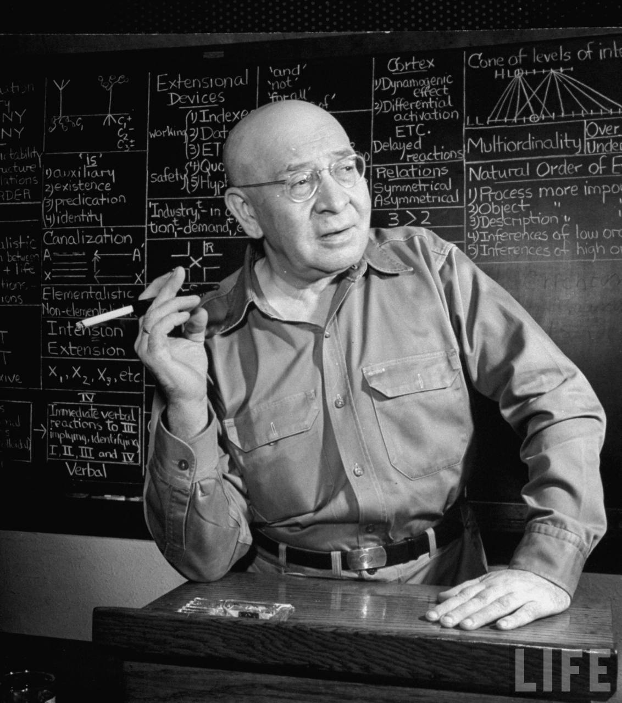
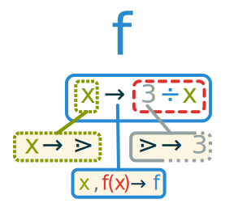
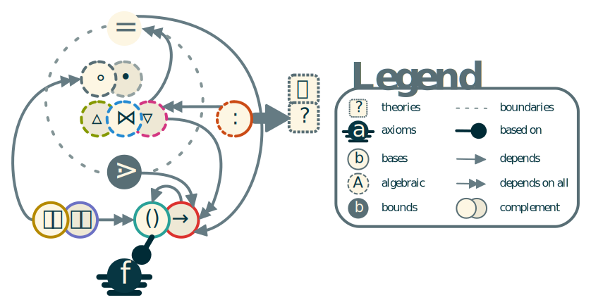

# Fondation and Tools

Mathematics and logic are at the heart of all formal sciences, including computer science. Some of the most important problems in mathematics are the consistency and formalization issues. Research on these issues starts at the end of the 19^th^ century, with Cantor inventing set theory ^[@cantor_property_1874]. Then after a crisis in the beginning of the 20^th^ century with Russel's paradox and Gödel's incompletude theorem, revised versions of the set theory become one of the foundations of mathematics. The most accepted version is the Zermelo-Fraenkel axiomatic set theory with the axiom of Choice (ZFC) ^[@fraenkel_foundations_1973; @ciesielski_set_1997]. This effort leads to a formalization of mathematics itself, at least to a certain degree.

Any knowledge must be expressed using a medium like language. Natural languages are quite expressive and allows for complex abstract ideas to be communicated between individual. However, in science we encounter the first issues with such a language. It is culturally biaised and improperly convey formal notions and proof constructs.
This is one of the main conclusion of the works of @korzybski_science_1958 on general semantics. The original goal of Korzybski was to pinpoint the errors that led humans to fight each other in WWI. He affirmed that the language is inaddapted to convey information reliably about objective facts or scientific notions.
 There is a decrepancy between the natural language and the underlying structure of the reality. {.margin} This issue is exacerbated in mathematics as the ambiguity in the definition of a term can be the cause for a contradiction and make the entire theory inconsistent.
 
> _"Mathematics may be defined as the subject in which we never know what we are talking about, nor whether what we are saying is true."_ ^[@russell_mysticism_1917]

In this first chapter we analyse the issue and propose our solution. Then we use our fondation to build some important mathematical notions used later to formalize data structures and algorithms.

## Properties

From this point we can apply some of these ideas to mathematics to analyse what properties a fondation of mathematics must hold.

### Abstraction

> **abstraction** (n.d.): _The process of formulating generalized ideas or concepts by extracting common qualities from specific examples_ ^[@collinsenglishdictionary_abstraction_2014]

The idea behind abstraction is to simplify the representation of (potentially infinitely) complex instances. This mechanism is at the base of any knowledge representation system. Indeed, it is unecessarily expensive to try to represent all properties of an object. An efficient way to reduce that knowledge representation is to prune away all irrelevent properties while also only keeping the one that will be used in the context. *This means that abstraction is a loosy process*. Information is lost when abstracting from an object.

Since this is done using a language as a medium, this language is a *host language*. Abstraction will refer to an instance using a *term* (also called symbol) of the host language. Since abstraction is a generalization process, if the host language is expressive enough, abstraction can be applied to already abstracted knowledge. The number of underlying abstraction needed for a term is called its *abstraction level*. Very general notions have a higher abstraction level and we usually represent reality using the null abstraction level. In practice abstraction uses terms of the host language to bind to a referenced instance in a lower abstraction level. This forms a structure that is strongly hierarchical with higher abstraction level terms on top.

::: example
We can describe an individual organism with a name that is associated to this specific individual. If we name a dog "Rex" we abstract a lot of information about a complex dynamical living being. We can also abstract from a set of qualities of the specimen to build higher abstraction. For example its species would be _Canis lupus familiaris_ from the _Canidae_ family. Sometimes several terms can be used at similar abstraction level like the commonly used denomination "dog" in this case. {.margin}
:::

Terms are only a part of that structure. It is possible to combine several terms into a *formula* (also called proposition or statement). 

### Formalization

> **formal** (adj.): _Relating to or involving outward form or structure, often in contrast to content or meaning._ ^[@americanheritagedictionary_formal_2011]

Formalization is the act to make formal. The word "formal" comes from Latin _fōrmālis_, from _fōrma_, meaning form, shape or structure. This is the same base as for the word "formula". In mathematics and *formal sciences* the act of formalization is to reduce knowledge down to formula. Like stated previously, a formula combines several terms. But a formula must follow rules at different levels:

* *Lexical* by using terms belonging in the host language.
* *Syntaxic* as it must follow the grammar of the host language.
* *Semantic* as it must be internally consistant and meaningful.

The information conveied from a formula can be reduced to one element: its semantic structure. Like its ethymology suggest a formula is simply a structured statement about terms. This structure holds its meaning. Along with using abstraction, it becomes possible to abstract a formula and to therefore make a formula about other formulae should the host language allowing it.

::: example
The formula using English "dog is man's best friend" combines terms to hold a structure between words. It is lexically correct since it uses English words and gramatically correct since it can be grammatically decomposed as (n. v. n. p. adj. n.). In that the (n.) stands for noumn, (v.) for verb, (adj.) for adjective and (p.) for possessive. Since the verb "is" is the third person singular present indicative of "be", and the adjective is the superlative of "good", this form is correct in the English language. From there the semantic aspect is correct too but that is too subjective and extensive to formalize here. We can also build a formula about a formula like "this is a common phrase" using the referencial pronoun "this" to refer to the previous formula.
:::

However, there is a strong limitation of a formalization. Indeed, a complete formalization cannot occur about the host language. It is possible to express formulae about the host language but *it is impossible to completely describe the host language using itself*. This comes from two principal reasons. As abstraction is a loosy process one cannot completely describe a language that can evolve and be infinitely complex. And even when taking a simple language, there is a problem with describing the different levels of rules to process the language using itself. This supposes of a knowledge of the language _a priori_. This is contradictory and therefore impossible to achieve.

When abstracting a term, it may be useful to add informations about the term to define it properly. That is why most formal system require a *definition* of each term using a formula. This definition is the main piece of semantic information on a term and is used when needing to evaluate a term in a different abstraction level. However, this is causing yet another problem.

### Circularity

> **circularity** (n.d.): _Defining one word in terms of another that is itself defined in terms of the first word._ ^[@americanheritagedictionary_circularity_2011]

Defining a term requires using a formula in the host language to express the abstracted properties of the generalization. The problem is that most terms will have *circular* definitions. Like stated this means that every knowledge system will have some circularity in their definitions. This means that it is impossible to have a complete definition of a formal system without needing another formal system to describe its base.

::: example
Using definitions from the @americanheritagedictionary_circularity_2011, we can find that the term "word" is defined using the word "meaning" that is in turn defined using the term "word". Such circularity can happen using an arbitrarily long chain of definition that will form a cycle in the dependancies.
:::

This problem is very important as it is overlooked in most fondations of mathematics. This also makes Russel's paradox unavoidable in such systems since there are always an infinite descent in the definition relation. Also, since a formalization cannot fully be self defined, another host language is generally used, sometimes without being acknoledged. This causes cycles in the dependancies of languages and theories in mathematics.

The only practical way to make some of this circularity disapear is to base a fondation of mathematics using natural language as host language for defining the most basic terms. This allows to aknowledge the problem in an instinctive way while being aware of it while building the theory.

## Fonctional theory of mathematics

We aim to find the smallest possible set of axioms allowing to describe a fondation of mathematics. The following theory is a proposition for a possible fondation that takes into account the previously described constraints. It is inspired by category theory, and typed lambda calculus @citation.

In this part, as an introduction to the fundamentals of maths and logic, we propose another view of that fondation based on functions. The unique advantage of it lays in its explicit structure that have emergent reflexive properties. It also holds a coherent algebra that have a strong expressive power. This approach is loosly based on category theory. However it differs in its priorities and formulation.

Our theory is axiomatic, meaning it is based on fundamental logical proposition called axioms. Those forms the base of the logical system and therefore are accepted without any need for proof. The following axiom is the mandatory undefinable notion created from natural language. It is the explicit base of the formalism.

::: {.axiom #axi:function name="Function"}
Lets be functions that associates a unique function (image) to each function (argument).
:::

That axioms states that the formalism is based on *functions*. Any function can be used in anyway as long as it has a single argument and return only one value at a time which are also functions.

Next we need to lay off the base definitions of the formalism.

### Formalism definition

This functional algebra at the base of our fondation is inspired by *operator algebra* @citation. The problem with the operator algebra is that it supposes vectors and real numbers to work properly.

Since any formalism has circular definition we will have two way of definining each notions: using natural language as host language or by using notions that will be defined later. The main definitions we will express are using natural language but we'll add the formula using future notion as side notes. The goal is to explicitely separate fully defined notions from the circular base while giving the dependancies between notions to ease future improvements.

Here we define the basic notions of our functional algebra that dictates the rules of the formalism we are defining.

::: {.definition #def:currying name="Currying"}
Currying is the opperation named after the mathematician Haskell Brooks Curry that allows multiple arguments functions in a simpler monoidal formalism. A monome is a function that takes only one argument and has only one value, as in our main axiom.

The operation of *currying* is a function $\llp\rrp$ that associates to each function $f$ another function that recursively partially applies $f$ with one argument at a time.^[$\llp f\rrp = (x \to \llp f(x)\rrp)$]

If we take a function $h$ such that when applied to $x$ gives the function $g$ that takes an argument $y$, *uncurrying* is the function $\llbp \rrbp$ so that $f(x,y)$ behaves the same way as $\llbp h\rrbp(x)(y)$^[$\llbp f\rrbp = \llbp x, y \to f(x)(y) \rrbp^+$].
:::

::: {.definition #def:application name="Application"}
We note the application of $f$ with an argument $x$ as $f(x)$. The application allows to recover the image $y$ of $x$ which is the value that $f$ associates with $x$^[$y = f(x)$].

We call *partial application* the application using an insufficient number of arguments to any function $f$. This results in a function that takes less arguments with the first ones being fixed by the partial application. It is interesting to note that currying is simply a recursion of partial applications.

From now on we will note $f(x, y, z, …)$ any function that takes multiple arguments but will suppose that they are implicitly curryied. If a function only takes two arguments, we can also use the infix notation e.g. $x f y$ for its application.
:::

::: example
Applying this to basic arithmetics for illustration, it is possible to create a function that will triple its argument by doing a partial application of the multiplication function $×(3)$ ^[$×(3)=x\to3×x$] so we can write the operation to triple the number $2$ as $×(3)(2)$ or $×(2,3)$ or with the infix notation $2×3$.
:::

::: {.definition #def:association name="Association"}
Lets be the *association function* $(\to)$ such that, for any two function $x$ and $f(x)$, $x \to f(x)$ has $f$ as value.^[$(\to) = x ,f(x) \to f$]
:::

::: {.definition #def:specification name="Specification"}
The *function of specification* (noted $:$) is a function that restricts the validity of an expression given a predicate.^[$(:) = f, ? \to f \triangledown (\cal{D}(? = \bot) \mapsto \cal{D}(\bullet f))$] It can be intuitively be read as _"such that"_.
:::

The specification operator is extensively used in classical mathematics but informally, it is often seen as an extension of natural language and can be quite ambiguous. In the present document any usage of $(:)$ in any mathematical formula will follow the previously discussed definition.

::: {.definition #def:null name="Null"}
The *null function* is the function between nothing and nothing. We note it $\none$.^[$\none = \none \to \none$]
:::

::: {.definition #def:identity name="Identity"}
The *identity function* is the function that associates any function to itself noted $(=)$.^[$(=) = x \to x$] This function is therefore transparent as by definition $=(x)$ is the same as $x$. A more useful form of this function is as a binary predicate (see @later).
^[$(=) = (x, x \to \top) \bowtie (x, y \to \bot)$] The predicate can work in two ways: *equation* and *affectation*. 

* As an **equation**, the predicate tests whether two function are the same. 
* The **affectation** allows to assert that two functions have the same identity making them an alias to one another. An affectation is often used to define a new function.
:::

In the rest of the document, classical equality and the identity function will refer to the same notion.

### Literals and Variables

In our formalism, we use the null function to define notions of variables and literals.

::: {.definition #def:literal name="Literal"}
A literal is a function that associates nothing with itself. This consists of any fonction $l$ writen as $\gtrdot \to l$.^[$l = \gtrdot \to l$] This means that the function have only itself as an immutable value. We call *constants* function that have no arguments and have as value either another constant or a literal.
:::

::: example
A good example of that would be the yet to be defined natural numbers. We can define the literal $3$ as $3 = \gtrdot \to 3$.
:::

::: {.definition #def:variable name="Variable"}
A variable is a function that associates itself to nothing. This consists of any fonction $x$ writen as $x \to \gtrdot$.^[$x = x \to \gtrdot$] This means that the function takes itself as argument and takes the value of the argument on a specific domain (also called type).
:::

This definition means that a variable requires an input that can then be hold as a possible value when evaluating.

An interesting property of this notation is that $\gtrdot$ is both a variable and a constant. When defining currying, we annotated with the formalism $\llp f \rrp = f \to (x \to \llp f(x) \rrp)$. The obvious issue is the absence of stopping condition in that recursive expression. While the end of the recursion doesn't technically happens, in practice from the way variables and literals are defined, the recursion chain either ends up becoming a variable or a constant because it is undefined when currying a nullary function.

### Functional algebra

Inspired by relational algebra and by category theory, we present an highly expressive and compact functional algebra. In the @fig:function we illustrate the different operators of this algebra and their properties.

{#fig:function}

The first operator of this algebra allows to combine several functions into one.

::: {.definition #def:combination name="Combination"}
The *combination function* $\bowtie$ is the function that associates any two function $f_1$ and $f_2$ to a new function that associates any functions associated by **either** functions. ^[$f_1 \bowtie f_2 = x \to y$ with $f_1(x) = y$ **or** $f_2(x) = y$.]
:::

::: example
For two functions $f_1=1\to 2$ and $f_2=2\to 3$ the combination $f_3 = f_1 \bowtie f_2$ will have the following properties: $f_3(1)=2$ and $f_3(2)=3$.
:::

::: {.definition #def:superposition name="Superposition"}
The *superposition function* $\vartriangle$ is the function that associates any two functions $f_1$ and $f_2$ to a new function that associates any function associated by **both** functions.
^[$f_1 \vartriangle f_2 = x \to y$ with $f_1(x) = f_2(x) = y$.]
:::

::: example
Re-using the functions of the previous example we can note that $f_3 \vartriangle f_1 = f_1$ because $1 \to 2$ is the only combination that both functions associates.
:::

::: {.definition #def:subposition name="Subposition"}
The *subposition function* is the function $\triangledown$ that associates any two functions $f_1$ and $f_2$ to a new function $f_1 \triangledown f_2$ that associates anything associated by the first function $f_1$ but **not** by the second functionb $f_2$.
:::

We can also note a few properties of these functions:

* $f \vartriangle f = f$
* $f \vartriangle \gtrdot = \gtrdot$
* $f_1 \vartriangle f_2 = r_2 \vartriangle f_1$
* $f \triangledown f = \gtrdot$
* $f \triangledown \gtrdot = f$

Intuitively these fonctions are the fonctional equivalent of the union, intersection and difference from set theory. In our formalism we will define the set operations from these.

The following operators are the classical operations on functions.

::: {.definition #def:composition name="Composition"}
The *composition function* is the function that associates any two functions $f_1$ and $f_2$ to a new function such that: $f_1 \circ f_2 = x \to f_1(f_2(x))$.
:::

::: {.definition #def:inverse name="Inverse"}
The *inverse function* is the function that associates any function to its inverse such that if $y = f(x)$ then $x = \bullet(f)(y)$.

We can also use an infix version of it with the composition of functions:
$f_1 \bullet f_2 = f_1 \circ \bullet(f_2)$.
:::

These properties are akin to multiplication and division in arithmetics.

* $f \circ \gtrdot = \gtrdot$ ($\gtrdot$ is the absorbing element)
* $f \circ = = f$ ($=$ is the neutral element)
* $\bullet(\gtrdot) = \gtrdot$ and $\bullet(=) = =$
* $f_1 \circ f_2 \neq f_2 \circ f_1$

From now on we will use numbers and classical arithmetics as we had defined them. However, we consider defining them from a fondation point of view, later using set theory and Peano's axioms.

In classical mathematics, the inferse of a fonction $f$ is often wrote as $f^{-1}$. Therefore we can define the transitivity of the $n$th degree as the power of a fonction such that:

* $f^{-1} = \bullet f$
* $f^0 = (=)$
* $f^1 = f$
* $f^n = f^{n-1} \circ f$

We also call *arity* the number of arguments (or the currying order) of a function noted $|f|$.

### Properties

Since our goal is to minimize the formal basis of our system as well as identifying the circularity issues, we provide a dependancy graph in @fig:dependancies.

{#fig:dependancies}

The algebra formed by the previously defined operations on functions is a semiring $(\bb{F}, \bowtie, \circ)$ with $\bb{F}$ ceing the set of all functions. Indeed, $\bowtie$ is a commutative monoid having $\none$ as its identity element and $\circ$ is a monoid with $(=)$ as its identity element. Also the composition of the combination is the combination of the composition and therefore $\circ$ distributes over $\bowtie$. At last, using partial application $\circ(\none) = \none$

This fondation is now ready to define other fields of mathematics. We start with logic as it is a very basic formalism in mathematics. Then we redefine the ZFC set theory using our formalism as a base. And finally we will present derived mathematical tools to represent data structures and their properties.

## First Order Logic

In this section, we present First Order Logic (FOL). All notations are presented in @tbl:logic. FOL is based on boolean logic with the two literals $\top$ *true* and $\bot$ *false*. 

A function $?$ that have as only values either $\top$ or $\bot$ is called a **predicate**.^[$\cal{D}(\bullet ?) = \{\bot, \top\}$]

We define the classical logic *entailment* as $\vdash = (\bot, x \to \top) \bowtie (\top, x \to x)$

Then we define the classical boolean operators $\lnot$ *not*, $\land$ *and* and $\lor$ *or* as:

* $\lnot = (\bot \to \top) \bowtie (\top \to \bot)$, the negation associates true to false and false to true.
* $\land = x \to ((\top \to x) \bowtie (\bot \to \bot))$, the conjonction is true when all its arguments are simultaneously true.
* $\lor = x \to ((\top \to \top) \bowtie (\bot \to x))$, the disjonction is true if all its arguments are not false.

The last two operators are curried function and can take any number of arguments as necessary and recursively apply their definition.

Functions that takes an expression as parameter are called *modifiers*. FOL introduce a useful kind of modifer used to modalize expressions: *quantifiers*. Quantifiers takes an expression and a variable as arguments. Classical quantifiers are also predicates: they restrict the values that the variable can take.

The classical quantifiers are:

* The *universal quantifier* $\forall$ meaning _"for all"_.^[$\forall = \textsection(\land)$]
* The *existential quantifier* $\exists$ meaning _"it exists"_.^[$\exists = \textsection(\lor)$]

They are sometimes extended with :

* The *uniqueness quantifier* $\exists!$ meaning _"it exists a unique"_.^[$\exists! = \textsection(=(1) \circ +)$]
* The *exclusive quantifier* $\nexists$ meaning _"it doesn't exist"_.^[$\nexists = \textsection(\lnot \circ \land)$]

An another exotic quantifier that isn't a predicate can be proven useful [@hehner_practical_2012]:

* The *solution quantifier* $\textsection$ meaning _"those"_.^[$\textsection = f, x, ? \to \lBrace f(x) : ? \rBrace$]

The last three quantifiers are optional in FOL but will be conducive later on. It is interesting to note that most quantified expression can be expressed using the set builder notation discussed in the following section.

## Set Theory

Since we need to represent knowledge, we will handle more complex data than simple booleans. The first theory we will define is the set theory. It is used as the classical fondation of mathematics. It is so important to mathematics that most other proposed fondation of mathematics invoke the concept of sets even before their first formula to describe the kind of notions they are introducing. The issue is then to define the sets themselves. At the beginning of his funding work on set theory, Cantor wrote: {.margin}

> "_A set is a gathering together into a whole of definite, distinct objects of our perception or of our thought--which are called elements of the set._" ^[Georg @cantor_beitrage_1895]

For Cantor, a set is a collection of concepts and percepts. In our case both notions are grouped in what we call *objects*, *entities* that are all ultimately *functions* in our formalism.

### Base Definitions

We define a set using the notations in @tbl:set.

::: {.definition #def:set name="Set"}
A collection of *distinct* objects considered as an object in its own right. We define a set one of two ways (always using braces):

* In extension by listing all the elements in the set: $\{0,1,2,3,4\}$
* In intension by specifying the rule that all elements follow: $\{n : ?(n)\}$
:::

The function $:$ is to be red as "such as" is used for the *set builder notation* (see @later) and for typing (see @later).

**TODO**: Find a good formalization for it.

Using our fonctional fondation, we can define any set as a predicate $\cal{S} = e \to \top$ with $e$ being a member of $\cal{S}$. This allows us to define the member function noted $e \in \cal{S}$ to indicate that $e$ is an element of $\cal{S}$.^[$\in = e, \cal{S} \to \cal{S}(e)$]

Another, useful definition using sets is the *domain* of a function $f$ as the set of all arguments for which the function is defined. We call *co-domain* the domain of the inverse of a function. We can note them $f: \cal{D}(f) \mapsto \cal{D}(\bullet f)$. In the case of our functional version of sets, they are their own domain.

### Set Operations

Along with defining the domains of functions using sets, we can use function on sets. In this section, basic set operations are presented. The first one is the subset.

:::{.definition #def:subset name="Subset"}
A subset is a part of a set that is integrally contained within it. We note $\cal{S} \subset \cal{T} \vdash ((e \in \cal{S} \vdash e\in \cal{T}) \land \cal{S} \neq \cal{T})$, that a set $\cal{S}$ is a proper subset of a more general set $\cal{T}$.
:::

**TODO** Put as definitions.

We also define the union, intersection and difference as following:

* $\cal{S} \cup \cal{T} = \{e : e \in \cal{S} \lor e \in \cal{T} \}$
* $\cal{S} \cap \cal{T} = \{e : e \in \cal{S} \land e \in \cal{T} \}$
* $\cal{S} \setminus \cal{T} = \{e : e \in \cal{S} \land e \notin \cal{T} \}$

An interesting way to visualize relationsips with sets is by using Venn diagrams. In @fig:venn we present the classical set operations.

{#fig:venn}

These diagrams have a lack of expressivity regarding complex operations on sets. Indeed, from their plannar form it is complicated to express numerous sets having intersection and disjunctions. One exemple is the cartesian product that is defined as $\cal{S} \times \cal{T} = \{\langle e_{\cal{S}}, e_{\cal{T}} \rangle : e_{\cal{S}} \in \cal{S} \land e_{\cal{T}}\in \cal{T}\}$. This is the set equivalent of currying as $\cal{S} \times \cal{T} = e_{\cal{S}}, e_{\cal{T}} \to \cal{S}(e_{\cal{S}}) \land \cal{T}(e_{\cal{T}})$. The $\langle\rangle$ notation is used for tuples, that are another view on currying by replacing several arguments using a single one as an ordered list.

:::{.definition #def:mapping name="Mapping"}
The mapping notation $\lBrace \rBrace$ is a function such that $\lBrace f(x): x \in \cal{S} \rBrace$ will give the result of applying all elements in set $\cal{S}$ as arguments of the function using the uncurrying operation recursively.
:::

::: example
The classical sum operation on numbers can be noted $\sum_{i=1}^3 2i = \lBrace +(2*i) : i \in [1, 3] \rBrace = +(2*1)(+(2*2)(2*3))$.
:::

---

From the cartesian product we can also define the set power recursively by $\cal{S}^1 = \cal{S}$ and $\cal{S}^n = \cal{S} \times \cal{S}^{n-1}$.

### The ZFC Theory

The most common axiomatic set theory is ZFC. In that definition of sets there are a few notions that comes from its axioms. By being able to distinguish elements in the set from one another we assert that elements have an identity and we can derive equality from there:

::: {.axiom #axi:extensionality name="Extensionality"}
$\forall\cal{S} \forall\cal{T} : \forall e((e\in\cal{S})=(e\in\cal{T})) \vdash \cal{S}=\cal{T}$
:::

Another axiom of ZFC that is crucial in avoiding Russel's paradox ($\cal{S} \in \cal{S}$) is the following:

::: {.axiom #axi:fondation name="Foundation"}
$\forall \cal{S} : (\cal{S} \neq \emptyset \vdash \exists \cal{T}\in \cal{S},(\cal{T}\cap \cal{S}=\emptyset))$
:::

This axiom uses the empty set $\emptyset$ (also noted $\{\}$) as the set with no elements. Since two sets are equals if and only if they have precisely the same elements, the empty set is unique.

The definition by intention uses the set builder notation to define a set. It is composed of an expression and a predicate $?$ that will make any element $e$ in a set $\cal{T}$ satisfying it part of the resulting set $\cal{S}$, or as formulated in ZFC:

::: {.axiom #axi:specification name="Specification"}
$\forall ? \forall \cal{T} \exists \cal{S} : \left(\forall e \in \cal{S} : (e \in \cal{T} \land ?(e)) \right)$
:::

The last axiom of ZFC we use is to define the power set $\wp(\cal{S})$ as the set containing all subsets of a set $\cal{S}$:

::: {.axiom #axi:powerset name="Power set"}
$\wp(\cal{S}) = \{\cal{T} : \cal{T} \subseteq \cal{S}\}$
:::

With the symbol $\cal{S} \subseteq \cal{T} \vdash (\cal{S} \subset \cal{T} \lor \cal{S} = \cal{T})$. These symbols have an interesting property as they are often used as a partial order over sets.

## Graphs

**Symbol**                    **Description**
----------                    ---------------
$g=(V,E)$                     Graph $g$ with set of vertices $V$ and edges $E$.
$\phi^{\pm|n|*}(e|v)$         Incidence (edge) and adjacence (vertex) function for graphs:
$\phi$                        • A tuple or set representing the edge or all adjacent edges of a vertex.
$\phi^-$                      • Source vertex (subject) or set of all incoming edges of a vertex. 
$\phi^+$                      • Target vertex (object) or set of all outgoing edges of a vertex.
$\phi^0$                      • Label of edges and vertex : property of a statement or cause of a causal link.
$\chi(g)^+$                   Transitive closure of graph $g$.
$\div$                        Graph quotient.

: List of classical symbols and syntax for graphs. {#tbl:graph}

With set theory, it is possible to introduce all of standard mathematics. A field of interest for this thesis is the study of the structure of data. Most of these structures uses graphs and isomorphic derivatives.

::: {.definition #def:graph name="Graph"}
A graph is a mathematical structure $g$ which is defined by its *connectivity function* $\chi$ that is a combination of the classical adjacency and incidency functions of the graph. We can define it by self reference in the following way:

* *Adjacency*: $\chi_a = v \to \{ e: v \in \chi(e) \}$^[Also: $\chi_a = \bullet \chi_i$]
* *Incidency*: $\chi_i = e \to \{ v: e \in \chi(v) \}$

$$\chi = \chi_a \bowtie \chi_i$$

We usually note a graph $g=(V,E)$ with the set of vertices $V$ (also called nodes) and edges $E$ (arcs) that links two vertices together. Each edge is basically a pair of vertices ordered or not depending on if the graph is directed or not.^[$E= \sigma\wp(V^2)$]
The incidency can then be defined using the set definition of the edges: $\chi_i = e \to e$
:::

::: example
{#fig:transitive}

A graph is often represented with lines or arrows linking points together like illustrated in @fig:transitive. In that figure, the vertices $v_1$ and $v_2$ are connected through an undirected edge. Similarly $v_3$ connects to $v_4$ but not the opposite since they are bonded with a directed edge. The vertex $v_8$ is also connected to itself.
:::

----

From that definition, some other relations are needed to express most properties of graphs. In the following, the signed symbol only applies to directed graphs.
 
We provide graphs with an adjacence function $\phi$ over any vertex $v \in V$ such that:

* $\phi(v) = \{ e : e\in E \land v \in e \}$
* $\phi^+(v) = \{ \langle v \rightarrow v' \rangle \in E : v' \in V \}$ and $\phi^-(v) = \{ \langle v' \rightarrow v \rangle \in E : v' \in V \}$

This relation gives the set of incoming or outgoing edges from any vertex. In non directed graphs, the relation gives edges adjacent to the vertex. For example: in @fig:transitive, $\phi(v_1) = \{ \langle v_1, v_2 \rangle \}$. In that example, using directed graph notation we can note $\phi^+(v_3) = \{ \langle v_3 \rightarrow v_4 \rangle \}$.

Using types, it is possible to reuse the same symbol to define an incidence function over any edges $e = \langle v, v' \rangle$ such that:

* $\phi(e) =  \langle v, v' \rangle$
* $\phi^-(e) = v$ and $\phi^+(e) = v'$

Most of the intrinsic information of a graph is contained within its structure. Exploring its properties require to study the "shape" of a graph and to find relationships between vertices. That is why graph properties are easier to explain using the *transitive cover* $\chi^+$ of any graph $g = (V,e)$ defined as follows:

* $\chi(g) = (V,e') : e' = e \cup \{ \langle v_1, v_3 \rangle : \{ \langle v_1, v_2 \rangle, \langle v_2, v_3 \rangle \} \subset e \}$
* $\chi^+ = \chi^\infty$

This transitive cover will create another graph in which two vertices are connected through an edge if and only if it exists a path between them in the original graph $g$. We illustrate this process in @fig:transitive. Note how there is no edge in $\chi(g)$ between $v_5$ and $v_6$ and the one in $\chi^2(g)$ is directed towards $v_5$ because there is no path back to $v_6$ since the edge between $v_3$ and $v_4$ is directed.

::: {.definition #def:path name="Path"}
We say that vertices $v_1$ and $v_2$ are *connected* if it exists a path from one to the other. Said otherwise, there is a path from $v_1$ to $v_2$ if and only if $\langle v_1, v_2 \rangle \in E_{\chi^+(g)}$.
:::

The notion of connection can be extended to entire graphs. An undirected graph $g$ is said to be *connected* if and only if $\forall e \in V^2 ( e \in E_{\chi^+(g)})$.

Similarly we define *cycles* as the existence of a path from a given vertex to itself. For example, in @fig:transitive, the cycles of the original graph are colored in blue. Some graphs can be strictly acyclical, enforcing the absence of cycles.

A **tree** is a special case of a graph. A tree is an acyclical connected graph. If a special vertex called a *root* is chosen we call the tree a *rooted tree*. It can then be a directed graph with all edge pointing away from the root. When progressing away from the root, we call the current vertex *parent* of all exterior *children* vertices. Vertex with no children are called *leaves* of the tree and the rest are called *branches*. 

An interesting application of trees to FOL is called *and/or trees* where each vertex has two sets of children: one for conjunction and the other for disjunction. Each vertex is a logic formula and the leaves are atomic logic propositions. This is often used for logic problem reduction. In @fig:andor we illustrate how and/or trees are often depicted.

{#fig:andor}

Another notion often used for reducing big graphs is the quotiening as illustrated in @fig:quotient.

::: {.definition #def:quotient name="Graph Quotient"}
A quotient over a graph is the act of reducing a subgraph into a node while preserving the external connections. All internal structure becomes ignored and the subgraph now acts like a regular node. We note it $\div_f(g)= (\pi_f(V), \{ \pi_f(e) : e \in E\})$ with $f$ being a function that maps any vertex either toward itself or toward its quotiened vertex.
:::

We can also combine several graphs into one using fusion: $g_1 + g_2 = (V_1 \cup V_2, E_1 \cup E_2)$.

{#fig:quotient}

### Hypergraphs

A generalization of graphs are **hypergraphs** where the edges are allowed to connect to more than two vertices. They are often represented using Venn-like representations but can also be represented with edges "gluing" several vertex like in @fig:hypergraph.

An hypergraph is said to be *$n$-uniform* if the edges are restricted to connect to only $n$ vertices together. In that regard, classical graphs are 2-uniform hypergraphs.

{#fig:hypergraph}

Hypergraphs have a special case where $E \subset V$. This means that edges are allowed to connect to other edges. In @fig:hypergraph, this is illustrated by the edge $e_3$ connecting to three other edges. Information about these kinds of structures for knowledge representation is hard to come by and rely mostly on a form of "folk wisdom" within the mathematics community where knowledge is rarely published and mostly transmitted orally during lessons. One of the closest information available is this forum post [@kovitz_terminology_2018] that associated this type of graph to port graphs [@silberschatz_port_1981]. Additional information was found in the form of a contribution of @vepstas_hypergraph_2008 on an encyclopedia article about hypergraphs. In that contribution, he says that a generalization of hypergraph allowing for edge-to-edge connections violate the @axi:fondation of ZFC by allowing edge-loops. Indeed, like in @fig:hypergraph, an edge $e_9 = \{e_{10}\}$ can connect to another edge $e_{10} = \{ e_9 \}$ causing an infinite descent inside the $\in$ relation in direct contradiction with ZFC.

This shows the limits of standard mathematics especially on the field of knowledge representation. Some structures needs higher dimensions than allowed by the one-dimensional structure of ZFC and FOL.
However, it is important not to be mistaken: such non-standard set theories are more general than ZFC and therefore contains ZFC as a special case. All is a matter of restrictions.

## Sheaf

**Symbol**                          **Description**
----------                          ---------------
$\textbullet, \varstar, \multimap$  Germ, seed and connector.
$\cal{F}$                           Sheaf (from French *faisceau*).

: List of symbols and syntax for sheaves. {#tbl:sheaf}

In order to understand sheaves, we need to present a few auxiliary notions. Most of these definitions are adapted from [@vepstas_sheaves_2008]. The first of which is a seed.

{#fig:seed}

::: {.definition #def:seed name="Seed"}
A seed corresponds to a vertex along with the set of adjacent edges. Formally we note a seed $\varstar = (\textbullet, \phi_g(\textbullet))$ that means that a seed build from the vertex $\textbullet$ in the graph $g$ contains a set of adjacent edges $\phi_g(\textbullet)$. We call the vertex $\textbullet$ the *germ* of the seed. The edges in a seed does not connect to the other vertices but keep the information and are able to match the correct vertices through typing (often a type of a single individual). We call the edges in a seed *connectors*.
:::

Seeds are extracts of graphs that contains all information about a vertex. Illustrated in the @fig:seed, seeds have a central germ (represented with discs) and connectors leading to a typed vertex (outlined circles). Those external vertices are not directly contained in the seed but the information about what vertex can fit in them is kept. It is useful to represent connectors like jigsaw puzzle pieces: they can match only a restricted number of other pieces that match their shape.

From there, it is useful to build a kind of partial graph from seeds called sections.

::: {.definition #def:section name="Section"}
A section is a set of seeds that have their common edges connected. This means that if two seeds have an edge in common connecting both germs, then the seeds are connected in the section and the edges are merged. We note $g_\varstar = (●, ⌕)$ the graph formed by the section.
:::

In @fig:seed, a section is represented. It is a connected section composed of seeds along with the additional seeds of any vertices they have in common. They are very similar to subgraph but with an additional border of typed connectors. This tool was originally mostly meant for big data and categorization over large graphs. As graph quotient is often used in that domain, it was ported to sections instead of graphs allows us to define stalks.

::: {.definition #def:stalk name="Stalk"}
Given a projection function $f:●\to ●'$ over the germs of a section $\varstar$, the stalk above the vertex $\textbullet' \in ●'$ is the quotient of all seeds that have their germ follow $f(\textbullet) = \textbullet'$.
:::

The quotienning is used in stalks for their projection. Indeed, as shown in @fig:seed, the stalks are simply a collection of seeds with their germs quotiened into their common projection. The projection can be any process of transformation getting a set of seeds in one side and gives object in any base space called the image. Sheaves are a generalization of this concept to sections.

{#fig:sheaf}

::: {.definition #def:sheaf name="Sheaf"}
A sheaf is a collection of sections, together with a projection. We note it $\cal{F} = \langle G_{\varstar}, \pi_g \rangle$ with the function $g$ being the gluing axioms that the projection should respect depending on the application. The projected sheaf graph is noted $g_{\cal{F}} = \sum_{g_{\varstar} \in G_{\varstar}}\div_g(g_{\varstar})$ as the fusion of all quotiened sections.
:::

By merging common vertices into a section, we can build stack fields. These fields are simply a subcategory of sheaves. Illustrated in @fig:sheaf, a sheaf is a set of section with a projection relation.
