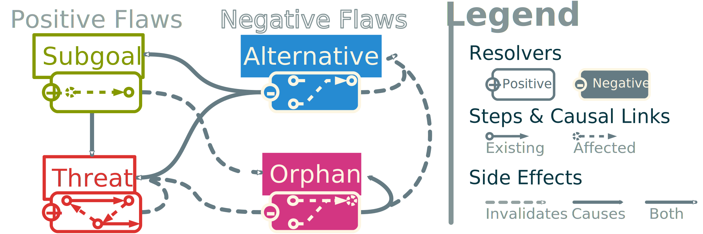

# Online and Flexible Planning Algorithms

Since automated planning comes in a variety of paradigms, so does the planners algorithms. In this chapter we present some of them for repairing plans and for giving intermediate answers. This is with the goal to make an efficient real-time planner for intent recognition.

## Existing Algorithms

In order to make such a planner, few paradigms are interesting and quite useful. The first one is PSP, that allows to refine plans into solutions.

### Plan Space Planning

Every PSP algorithms works in a similar way: their search space is the set of all plans and its iteration operation is plan refinement. This means that every PSP planner searches for *flaws* in the current plan and then computes a set of *resolvers* that potentially fix it. The PSP approach has two main advantages: 

1. It is very flexible since it allows for custom definition for flaws in the plan and ways to fix them and
2. It allows delayed comitment and makes it possible to cut the search tree early on.

It however has also several inconvinients:

1. Since it manipulates plans, the data structure operations are much more complex and therefore requires more overhead.
2. Backtracking is required in some cases and ammount to a drastically decreased efficiency.

#### Existing PSP planners

Related works already tried to explore new ideas to make PSP an attractive alternative to regular state-based planners like the appropriately named "Reviving partial order planning" [@nguyen_reviving_2001] and VHPOP [@younes_vhpop_2003]. More recent efforts [@coles_popf2_2011; @sapena_combining_2014] are trying to adapt the powerful heuristics from state-based planning to PSP's approach. An interesting approach of these last efforts is found in [@shekhar_learning_2016] with meta-heuristics based on offline training on the domain. Yet, we clearly note that only a few papers lay the emphasis upon plan quality using PSP [@ambite_planning_1997].

#### Definitions

In @sec:general_psp we have formalized how PSP works in the general planning formalism. However, since this formalism is very new, it isn't used by the rest of the comunity. This means that we still need to define the classical PSP algotrithm.

The main notion of PSP is the notion of flaws in a plan.

::: {.definition #def:flaws name="Flaws"}
Flaws have a *proper fluent* $f$ and a causing step often called the *needer* $a_n$. Flaws in a partial plan are either:

* **Subgoals**, *open conditions* that are yet to be supported by another step $a_n$ often called *provider*. We note subgoals $\downarrowbarred_f a_n$.
* **Threats**, caused by steps that can break a causal link with their effects. They are called *breakers* of the threatened link. A step $a_b$ threatens a causal link $l_t = a_p \xrightarrow{f} a_n$ if and only if $\neg f \in \mathit{eff}(a_b) \land a_b \not\succ a_p \land a_n \not\succ a_b$. Said otherwise, the breaker can cancel an effect of a providing step $a_p$, before it gets used by its needer $a_n$. We note threats $a_b \olcross l_t$.
:::

### Plan repair

In order to make an efficient online planner, we must be able to capitalize on previously computed plans. This leads to the idea of plan repair or case based planning for online planning.

Classical PSP algorithms don't take as an input an existing plan but can be enhanced to fit plan repairing, as for instance in [@vanderkrogt_plan_2005]. Usually, PSP algorithms take a problem as an input and use a loop or a recursive function to refine the plan into a solution. We can't solely use the refining recursive function to be able to use our existing partial plan. This causes multiples side effects if the input plan is suboptimal. This problem was already explored as of LGP-adapt [@borrajo_multi-agent_2013] that explains how re-using a partial plan often implies replanning parts of the plan.

### HTN

HTN is often combined with classical approaches since it allows for a more natural expression of domains making expert knowledge easier to encode. These kinds of planners are named **decompositional planners** when no initial plan is provided [@fox_natural_1997].
Most of the time the integration of HTN simply consists in calling another algorithm when introducing a composite operator during the planning process. The DUET planner by Gerevini _et al._ [-@gerevini_combining_2008] does so by calling an instance of a HTN planner based on task insertion called SHOP2 [@nau_shop2_2003] to decompose composite actions.
Some planners take the integration further by making the decomposition of composite actions into a special step in their refinement process. Such works include the discourse generation oriented DPOCL [@young_dpocl_1994] and the work of Kambhampati _et al._ [-@kambhampati_hybrid_1998] generalizing the practice for decompositional planners.

In our case, we chose a class of hierarchical planners based on Plan-Space Planning (PSP) algorithms [@bechon_hipop_2014; @dvorak_flexible_2014; @bercher_hybrid_2014] as a reference approach. The main difference here is that the decomposition is integrated into the classical POCL algorithm by only adding new types of flaws. This allows keeping all the flexibility and properties of POCL while adding the expressivity and abstraction capabilities of HTN.

## Lollipop

### Operator Graph

One of the main contributions of the present paper is our use of the concept of *operator graph*. First of all, we define this notion.

An operator graph $O^\Pi$ of a set of operators $O$ is a labeled directed graph that binds two operators with the causal link $o_1 \xrightarrow{f} o_2$ iff there exists at least one unifying fluent $f \in eff(o_1) \cap pre(o_2)$.

This definition was inspired by the notion of domain causal graph as explained in [@gobelbecker_coming_2010] and originally used as a heuristic in [@helmert_fast_2011]. Causal graphs have fluents as their nodes and operators as their edges. Operator graphs are the opposite: an *operator dependency graph* for a set of actions. A similar structure was used in [@smith_postponing_1993] that builds the operator dependency graph of goals and uses precondition nodes instead of labels.
Cycles in this graph denote the dependencies of operators. We call *co-dependent* operators that form a cycle. If the cycle is made of only one operator (self-loop), then it is called *auto-dependent*.

While building this operator graph, we need a **providing map** that indicates, for each fluent, the list of operators that can provide it. This is a simpler version of the causal graphs that is reduced to an associative table easier to update. The list of providers can be sorted to drive resolver selection (as detailed in @sec:selection). A **needing map** is also built but is only used for operator graph generation. We note $\mathcal{D}^\Pi$ the operator graph built with the set of operators in the domain $\mathcal{D}$. In the @fig:operatorgraph, we illustrate the application of this mechanism on our example from @fig:example. Continuous lines correspond to the *domain operator graph* computed during domain compilation time.

{#fig:operatorgraph}

The generation of the operator graph is detailed in @alg:operatorgraph. It explores the operators space and builds a providing and a needing map that gives the provided and needed fluents for each operator. Once done it iterates on every precondition and searches for a satisfying cause to add the causal links to the operator graph.

\footnotesize
\Function{addVertex}{Operator $o$}
    \State \Call{cache}{$o$} \Comment{Update of the providing and needing map}
    \If {binding} \Comment{boolean that indicates if the binding was requested}
        \State \Call{bind}{$o$}
    \EndIf
\EndFunction
\Function{cache}{Operator $o$}
    \ForAll{$eff \in eff(o)$} \Comment{Adds $o$ to the list of providers of $eff$}
        \State \Call{add}{$providing, eff, o$}
    \EndFor
    \State … \Comment{Same operation with needing and preconditions}
\EndFunction
\Function{bind}{Operator $o$}
    \ForAll{$pre \in pre(o)$}
        \If{$pre \in providing$}
            \ForAll{$\pi \in$ \Call{get}{$providing$, $pre$}}
                \State Link $l \gets$ \Call{getEdge}{$\pi$, $o$} \Comment{Create the link if needed}
                \State $l \gets l \cup \{pre\}$ \Comment{Add the fluent as a cause}
            \EndFor
        \EndIf
    \EndFor
    \State … \Comment{Same operation with needing and effects}
\EndFunction

To apply the notion of operator graphs to planning problems, we just need to add the initial and goal steps to the operator graph. In @fig:operatorgraph, we depict this insertion with our previous example using dotted lines. However, since operator graphs may have cycles, they can't be used directly as input to POP algorithms to ease the initial backchaining. Moreover, the process of refining an operator graph into a usable one could be more computationally expensive than POP itself.

In order to give a head start to the LOLLIPOP algorithm, we propose to build operator graphs differently with the algorithm detailed in @alg:safeoperatorgraph. A similar notion was already presented as "basic plans" in [@sebastia_graph-based_2000]. These "basic" partial plans use a more complete but slower solution for the generation that ensures that each selected steps are *necessary* for the solution. In our case, we built a simpler solution that can solve some basic planning problems but that also make early assumptions (since our algorithm can handle them). It does a simple and fast backward construction of a partial plan driven by the providing map. Therefore, it can be tweaked with the powerful heuristics of state search planning.

\footnotesize
\Function{safe}{Problem $\mathcal{P}$}
    \State Stack<Operator> $open \gets [G]$
    \State Stack<Operator> $closed \gets \emptyset$
    \While{$open \neq \emptyset$}
        \State Operator $o \gets$ \Call{pop}{$open$} \Comment{Remove $o$ from $open$}
        \State \Call{push}{$closed$, $o$}
        \ForAll {$pre \in pre(o)$}
            \State Operators $p \gets$ \Call{getProviding}{$\pi$, $pre$} \Comment{Sorted by usefulness}
            \If{$p = \emptyset$} \Comment{(see section~\ref{sec:selection})} <!-- Markdown breaks inside LaTeX commands … obviously-->
                \State $S \gets S \setminus \{\pi\}$
                \Continue
            \EndIf
            \State Operator $o' \gets$ \Call{getFirst}{$\pi$} \label{line:safefirst}
            \If{$o' \in closed$}
                \Continue
            \EndIf
            \If{$o' \not \in S$}
                \State \Call{push}{$open$, $o'$}
            \EndIf
            \State $S \gets S \cup \{o'\}$
            \State Link $l \gets$ \Call{getEdge}{$o'$, $o$} \Comment{Create the link if needed}
            \State $l \gets l \cup \{pre\}$ \Comment{Add the fluent as a cause}
        \EndFor
    \EndWhile
\EndFunction

This algorithm is useful since it is specifically used on goals. The result is a valid partial plan that can be used as input to POP algorithms.

### Negative Refinements

The classical POP algorithm works upon a principle of positive plan refinements. The two standard flaws (subgoals and threats) are fixed by *adding* steps, causal links, or variable binding constraints to the partial plan. Online planning needs to be able to *remove* parts of the plan that are not necessary for the solution.
Since we assume that the input partial plan is quite complete, we need to define new flaws to optimize and fix this plan. These flaws are called *negative* as their resolvers apply subtractive refinements on partial plans.

An alternative is a negative flaw that occurs when there is a better provider choice for a given link.
An alternative to a causal link $a_p \xrightarrow{f} a_n$ is a provider $a_b$ that has a better *utility value* than $a_p$.

The **utility value** of an operator is a measure of usefulness at the heart of our ranking mechanism detailed in @sec:selection. It uses the incoming and outgoing degrees of the operator in the domain operator graph to measure its usefulness.

Finding an alternative to an operator is computationally expensive. It requires searching a better provider for every fluent needed by a step. To simplify that search, we select only the best provider for a given fluent and check if the one used is the same. If not, we add the alternative as a flaw. This search is done only on updated steps for online planning. Indeed, the safe operator graph mechanism is guaranteed to only choose the best provider (@alg:safeoperatorgraph at @line:safefirst). Furthermore, subgoals won't introduce new fixable alternative as they are guaranteed to select the best possible provider.

An orphan is a negative flaw that occurs when a step in the partial plan (other than the initial or goal step) is not participating in the plan. Formally, $a_o$ is an orphan iff $a_o \neq I \land a_o \neq G \land \left( d_\pi^+(a_o) = 0 \right) \lor \forall l \in L_\pi^+(a_o), l=\emptyset$.

With $d_\pi^+(a_o)$ being the *outgoing degree* of $a_o$ in the directed graph formed by $\pi$ and $L_\pi^+(a_o)$ being the set of *outgoing causal links* of $a_o$ in $\pi$. This last condition checks for *hanging orphans* that are linked to the goal with only bare causal links (introduced by threat resolution).

The introduction of negative flaws requires modifying the resolver definition (cf. @def:resolver).

A signed resolver is a resolver with a notion of sign. We add to the resolver tuple the sign of the resolver noted $s \in \{+, -\}$.

<!--An alternative notation for the signed resolver is inspired by the causal link notation with simply the sign underneath:
$$r = a_s \xrightarrow[+/-]{f} a_t$$-->

The solution to an alternative is a negative refinement that simply removes the targeted causal link. This causes a new subgoal as a side effect, that will focus on its resolver by its rank (explained in @sec:selection) and then pick the first provider (the most useful one).
The resolver for orphans is the negative refinement that is meant to remove a step and its incoming causal link while tagging its providers as potential orphans.

{#fig:sideeffects}

The side effect mechanism also needs an upgrade since the new kind of flaws can interfere with one another. This is why we extend the side effect definition (cf. @def:sideeffect) with a notion of sign.

A signed side effect is either a regular *causal side effect* or an *invalidating side effect*. The sign of a side effect indicates if the related flaw needs to be added or removed from the agenda.

The @fig:sideeffects exposes the extended notion of signed resolvers and side effects. When treating positive resolvers, nothing needs to change from the classical method. When dealing with negative resolvers, we need to search for extra subgoals and threats. Deletion of causal links and steps can cause orphan flaws that need to be identified for removal.

In the method described in [@peot_threatremoval_1993], a **invalidating side effect** is explained under the name of *DEnd* strategy. In classical POP, it has been noticed that threats can disappear in some cases if subgoals or other threats were applied before them. For our mechanisms, we decide to gather under this notion every side effect that removes the need to consider a flaw. For example, orphans can be invalidated if a subgoal selects the considered step. Alternatives can remove the need to compute further subgoal of an orphan step as orphans simply remove the need to fix any flaws that concern the selected step.

These interactions between flaws are decisive for the validity and efficiency of the whole model, that is why we aim to drive flaw selection in a rigorous manner.

### Usefullness Heuristic

Resolvers and flaws selection are the keys to improving performances. Choosing a good resolver helps to reduce the branching factor that accounts for most of the time spent on running POP algorithms [@kambhampati_design_1994 ]. Flaw selection is also important for efficiency, especially when considering negative flaws which can conflict with other flaws.

Conflicts between flaws occur when two flaws of opposite sign target the same element of the partial plan. This can happen, for example, if an orphan flaw needs to remove a step needed by a subgoal or when a threat resolver tries to add a promoting link against an alternative. The use of side effects will prevent most of these occurrences in the agenda but a base ordering will increase the general efficiency of the algorithm.

Based on the @fig:sideeffects, we define a base ordering of flaws by type. This order takes into account the number of flaw types affected by causal side effects.

1. **Alternatives** will cut causal links that have a better provider. It is necessary to identify them early since they will add at least another subgoal to be fixed as a related flaw.
2. **Subgoals** are the flaws that cause most of the branching factor in POP algorithms. This is why we need to make sure that all open conditions are fixed before proceeding on finer refinements.
3. **Orphans** remove unneeded branches of the plan. Yet, these branches can be found out to be necessary for the plan to meet a subgoal. Since a branch can contain many actions, it is preferable to leave the orphan in the plan until they are no longer needed. Also, threats involving orphans are invalidated if the orphan is resolved first.
4. **Threats** occur quite often in the computation. Searching and solving them is computationally expensive since they need to check if there are no paths that fix the flaw already. Many threats are generated without the need of resolver application [@peot_threatremoval_1993]. That is why we rank all related subgoals and orphans before threats because they can add causal links or remove threatening actions that will fix the threat.

Resolvers need to be ordered as well, especially for the subgoal flaws. Ordering resolvers for a subgoal is the same operation as choosing a provider. Therefore, the problem becomes "how to rank operators?". The most relevant information on an operator is its usefulness and hurtfulness. These show how much an operator will help and how much it may cause branching after selection.

Degrees are a measurement of the usefulness of an operator. Such a notion is derived from the incoming and outgoing degrees of a node in a graph.

We note $d_\pi^+(o)$ and $d_\pi^-(o)$ respectively the outgoing and incoming degrees of an operator in a plan $\pi$. These represent the number of causal links that goes out or toward the operator. We call proper degree of an operator $d^+(o) = |eff(o)|$ and $d^-(o) = |pre(o)|$ the number of preconditions and effects that reflect its intrinsic usefulness.

There are several ways to use the degrees as indicators. *Utility value* increases with every $d^+$, since this reflects a positive participation in the plan. It decreases with every $d^-$ since actions with higher incoming degrees are harder to satisfy. The utility value bounds are useful when selecting special operators. For example, a user-specified constraint could be laid upon an operator to ensure it is only selected as a last resort. This operator will be affected with the smallest utility value possible. More commonly, the highest value is used for initial and goal steps to ensure their selection.

Our ranking mechanism is based on scores noted $s^\pm(o)$. A score contains two components: a positive subscore array that acts as a participation measurement and a negative subscore array that represents the dependencies of the operator. Each component of the score is an array of *subscores*.

The first step is the computation of the **base scores**. They are computed according to the following:

* $s^+(o)$ contains only $d_{\mathcal{D}^\Pi}^+(o)$, the positive degree of $o$ in the domain operator graph. This will give a measurement of the predicted usefulness of the operator.
* $s^-(o)$ containing the following subscores:
    1. $d^-(o)$ the proper negative degree of $o$. Having more preconditions can lead to a potentially higher need for subgoals.
    2. $\sum_{c \in C_o(\mathcal{D}^\Pi)}|c|$ with $C_o(\mathcal{D}^\Pi)$ being the set of cycles where $o$ participates in the domain operator graph. If an action is co‑dependent (cf. @sec:operatorgraph) it may lead to a dead-end as its addition will cause the formation of a cycle.
    3. $|C_o^s(\mathcal{D}^\Pi)|$ is the number of self-cycle ($0$ or $1$) $o$ participates in. This is usually symptomatic of a *toxic operator* (cf. @def:toxic). Having an operator behaving this way can lead to backtracking because of operator instantiation.
    4. $\left|pre(o) \setminus L_{\mathcal{D}^\Pi}^-(o)\right|$ with $L_{\mathcal{D}^\Pi}^-(o)$ being the set of incoming causal links of $o$ in the domain operator graph. This represents the number of open conditions. This is symptomatic of action that can't be satisfied without a compliant initial step.

Once these subscores are computed, the ranking mechanism starts the second phase, which computes the **realization scores**. These scores are potential bonuses given once the problem is known. It first searches the *inapplicable operators* that are all operators in the domain operator graph that have a precondition that isn't satisfied with a causal link. Then it searches the *eager operators* that provide fluents with no corresponding causal link (as they are not needed). These operators are stored in relation with their inapplicable or eager fluents.

The third phase starts with the beginning of the solving algorithm, once the problem has been provided. It computes the **effective realization scores** based on the initial and goal steps. It will increment $s_1^+(o)$ for each realized eager links (if the goal contains the related fluent) and decrement $s_4^-(o)$ for each inapplicable preconditions realized by the initial step.

Last, the **final score** of each operator $o$, noted $h(o)$, is computed from positive and negative scores using the following formula: 

$$h(o) = \sum_{n=1}^{|s^\pm(o)|}{\pm p_n^\pm s^\pm_n(o)}$$

A parameterized coefficient is associated to each subscore. It is noted $p_n^\pm$ with $n$ being the index of the subscore in the array $s^\pm$. This respects the criteria of having a bound for the *utility value* as it ensures that it remains positive with $0$ as a minimum bound and $+\infty$ for a maximum. The initial and goal steps have their utility values set to the upper bound to ensure their selections over other steps.

Choosing to compute the resolver selection at operator level has some positive consequences on the performances. Indeed, this computation is much lighter than approaches with heuristics on plan space [@shekhar_learning_2016] as it reduces the overhead caused by real time computation of heuristics on complex data. In order to reduce this overhead more, the algorithm sorts the providing associative array to easily retrieve the best operator for each fluent. This means that the evaluation of the heuristic is done only once for each operator. This reduces the overhead and allows for faster results on smaller plans.

### Algorithm

The LOLLIPOP algorithm uses the same refinement algorithm as described in @alg:pop. The differences reside in the changes made on the behavior of resolvers and side effects. In @line:resolverapplication of @alg:pop, LOLLIPOP algorithm applies negative resolvers if the selected flaw is negative. In @line:sideeffectapplication, it searches for both signs of side effects. Another change resides in the initialization of the solving mechanism and the domain as detailed in @alg:lollipopinit. This algorithm contains several parts. First, the domainInit function corresponds to the code computed during the domain compilation time. It will prepare the rankings, the operator graph, and its caching mechanisms. It will also use strongly connected component detection algorithm to detect cycles. These cycles are used during the base score computation (@line:basescore). We add a detection of illegal fluents and operators in our domain initialization (@line:isillegal). Illegal operators are either inconsistent or toxic.

\footnotesize
\Function{domainInit}{Operators $O$}
    \State operatorgraph $\mathcal{D}^\Pi$
    \State Score $S$
    \ForAll{Operator $o \in O$}
        \If{\Call{isIllegal}{$o$}} \Comment{Remove toxic and useless fluents} \label{line:isillegal}
            \State $O \gets O \setminus \{o\}$  \Comment{If entirely toxic or useless}
            \Continue
        \EndIf
        \State \Call{addVertex}{$o, \mathcal{D}^\Pi$} \Comment{Add and bind all operators}
        \State \Call{cache}{$p, o$} \Comment{Cache operator in providing map}
    \EndFor
    \State Cycles $C \gets$ \Call{stronglyConnectedComponent}{$\mathcal{D}^\Pi$} \Comment{Using DFS}
    \State $S \gets$ \Call{baseScores}{$O$, $\mathcal{D}^\Pi$} \label{line:basescore}
    \State $i \gets$ \Call{inapplicables}{$\mathcal{D}^\Pi$}
    \State $e \gets$ \Call{eagers}{$\mathcal{D}^\Pi$}
\EndFunction
\Function{lollipopInit}{Problem $\mathcal{P}$}
    \State \Call{realize}{$S, \mathcal{P}$} \Comment{Realize the scores}
    \State \Call{cache}{$providing, I$} \Comment{Cache initial step in providing …}
    \State \Call{cache}{$providing, G$} \Comment{… as well as goal step}
    \State \Call{sort}{$providing, S$} \Comment{Sort the providing map}
    \If{$L = \emptyset$}
        \State $\mathcal{P}^\Pi \gets$ \Call{safe}{$\mathcal{P}$} \Comment{Computing the safe operator graph if the plan is empty}
    \EndIf
    \State \Call{populate}{$a$, $\mathcal{P}$} \Comment{populate agenda with first flaws} \label{line:populate}
\EndFunction
\Function{populate}{Agenda $a$, Problem $\mathcal{P}$}
    \ForAll{Update $u \in U$} \Comment{Updates due to online planning}
        \State Fluents $F \gets eff(u.new) \setminus eff(u.old)$ \Comment{Added effects}
        \ForAll{Fluent $f \in F$}
            \ForAll{Operator $o \in$ \Call{better}{$providing$, $f$, $o$}}
                \ForAll{Link $l \in L^+(o)$}
                    \If{$f \in l$}
                        \State \Call{addAlternative}{$a$, $f$, $o$, $l_{\leftarrow}$, $\mathcal{P}$} \Comment{With $l_{\leftarrow}$ the target of $l$}
                    \EndIf
                \EndFor
            \EndFor
        \EndFor
        \State $F \gets eff(u.old) \setminus eff(u.new)$ \Comment{Removed effects}
        \ForAll{Fluent $f \in F$}
            \ForAll{Link $l \in L^+(u.new)$}
                \If{\Call{isLiar}{$l$}}
                    \State $L \gets L \setminus \{l\}$
                    \State \Call{addOrphans}{$a$, $u$, $\mathcal{P}$}
                \EndIf
            \EndFor
        \EndFor
        \State … \Comment{Same with removed preconditions and incomming liar links}
    \EndFor
    \ForAll{Operator $o \in S$}
        \State \Call{addSubgoals}{$a$, $o$, $\mathcal{P}$}
        \State \Call{addThreats}{$a$, $o$, $\mathcal{P}$}
    \EndFor
\EndFunction

An operator $a$ is contradictory iff $\exists f \{f, \lnot f \} \in eff(o) \lor \{f, \lnot f \} \in pre(o)$

Toxic operators have effects that are already in their preconditions or empty effects. An operator $o$ is toxic iff $pre(o) \cap eff(o) \neq \emptyset \lor eff(o) = \emptyset$

Toxic actions can damage a plan as well as make the execution of POP algorithm longer than necessary. This is fixed by removing the toxic fluents ($pre(a) \nsubseteq eff(a)$) and by updating the effects with $eff(a) = eff(a) \setminus pre(a)$. If the effects become empty, the operator is removed from the domain.

The lollipopInit function is executed during the initialization of the solving algorithm. We start by realizing the scores, then we add the initial and goal steps in the providing map by caching them. Once the ranking mechanism is ready, we sort the providing map. With the ordered providing map, the algorithm runs the fast generation of the safe operator graph for the problem's goal.

The last part of this initialization (@line:populate) is the agenda population that is detailed in the populate function. During this step, we perform a search of alternatives based on the list of updated fluents. Online updates can make the plan outdated relative to the domain. This forms liar links :

A liar link is a link that doesn't hold a fluent in the preconditions or effect of its source and target. We note:
$$a_i \xrightarrow{f} a_j | f \notin eff(a_i) \cap pre(a_j)$$

A liar link can be created by the removal of an effect or preconditions during online updates (with the causal link still remaining).

We call lies the fluents that are held by links without being in the connected operators. To resolve the problem, we remove all lies. We delete the link altogether if it doesn't bear any fluent as a result of this operation. This removal triggers the addition of orphan flaws as side effects.

While the list of updated operators is crucial for solving online planning problems, a complementary mechanism is used  to ensure that LOLLIPOP is complete. User provided plans have their steps tagged. If the failure has backtracked to a user-provided step, then it is removed and replaced by subgoals that represent each of its participation in the plan. This mechanism loops until every user provided steps have been removed.

### Theoretical and Empirical Results

As proven in [@penberthy_ucpop_1992], the classical POP algorithm is *sound* and *complete*.

First, we define some new properties of partial plans. The following properties are taken from the original proof. We present them again for convenience.

A partial plan $\pi$ is fully supported if each of its steps $o \in S$ is fully supported. A step is fully supported if each of its preconditions $f \in pre(o)$ is supported. A precondition is fully supported if there exists a causal link $l$ that provides it. We note:
$$\Downarrow \pi \equiv
\begin{array}{l}
    \forall o \in S \thickspace \forall f \in pre(o) \thickspace \exists l \in L_\pi^-(o): \\
        \left(f \in l \land \not \exists t \in S (l_{\rightarrow} \succ t \succ o \land \lnot f \in eff(t))\right)
\end{array}$$
with $L_\pi^-(o)$ being the incoming causal links of $o$ in $\pi$ and $l_{\rightarrow}$ being the source of the link.

A partial plan is a **valid solution** of a problem $\mathcal{P}$ iff it is *fully supported* and *contains no cycles*. The validity of $\pi$ regarding a problem $\mathcal{P}$ is noted $\pi \models \left( \mathcal{P} \equiv \Downarrow \pi \land \left(C(\pi) = \emptyset \right) \right)$ with $C(\pi)$ being the set of cycles in $\pi$.

#### Proof of Soundness

In order to prove that this property applies to LOLLIPOP, we need to introduce some hypothesis:

* operators updated by online planning are known.
* user provided steps are known.
* user provided plans don't contain illegal artifacts. This includes toxic or inconsistent actions, lying links and cycles.

Based on the @def:partialplanvalidity we state that:
$$
\left(
\begin{array}{l}
    \forall pre \in pre(G): \\
    \Downarrow pre \land
    \begin{array}{l}
        \forall o \in L_\pi^-(G)_{\rightarrow} \thickspace \forall pre' \in pre(o): \\
        \left(\Downarrow pre'\land C_o(\pi) = \emptyset\right)
    \end{array}
\end{array}
\right) \implies \pi \models \mathcal{P}$$ {#eq:recursivevalidity}
where $L_\pi^-(G)_{\rightarrow}$ is the set of direct antecedents of $G$ and $C_o(\pi)$ is the set of fluents containing $o$ in $\pi$.

This means that $\pi$ is a solution if all preconditions of $G$ are satisfied. We can satisfy these preconditions using operators iff their preconditions are all satisfied and if there is no other operator that threatens their supporting links.

First, we need to prove that @eq:recursivevalidity holds on LOLLIPOP initialization. We use our hypothesis to rule out the case when the input plan is invalid. The @alg:safeoperatorgraph will only solve open conditions in the same way subgoals do it. Thus, safe operator graphs are valid input plans.

Since the soundness is proven for regular refinements and flaw selection, we need to consider the effects of the added mechanisms of LOLLIPOP.
The newly introduced refinements are negative, they don't add new links:

$$\forall f \in \mathcal{F}(\pi) \thickspace \forall r \in r(f): C_\pi(f.n) = C_{f(\pi)}(f.n)$$ {#eq:nocycle}
with $\mathcal{F}(\pi)$ being the set of flaws in $\pi$, $r(f)$ being the set of resolvers of $f$, $f.n$ being the needer of the flaw and $f(\pi)$ being the resulting partial plan after application of the flaw. Said otherwise, an iteration of LOLLIPOP won't add cycles inside a partial plan.

The orphan flaw targets steps that have no path to the goal and so can't add new open conditions or threats. The alternative targets existing causal links. Removing a causal link in a plan breaks the full support of the target step. This is why an alternative will always insert a subgoal in the agenda corresponding to the target of the removed causal link. Invalidating side effects also don't affect the soundness of the algorithm since the removed flaws are already solved. This makes:
$$
\forall f \in \mathcal{F}^-(\pi): \Downarrow \pi \implies \Downarrow f(\pi)
$$ {#eq:conssupport}
with $\mathcal{F}^-(\pi)$ being the set of negative flaws in the plan $\pi$. This means that negative flaws don't
 compromise the full support of the plan.

[@Eq:nocycle;@eq:conssupport] lead to @eq:recursivevalidity being valid after the execution of LOLLIPOP. The algorithm is sound.

#### Proof of Completeness

The soundness proof shows that LOLLIPOP's refinements don't affect the support of plans in term of validity. It was proven that POP is complete. There are several cases to explore to transpose the property to LOLLIPOP:

If the input plan is a valid solution, LOLLIPOP returns a valid solution.

With [@eq:nocycle; @eq:conssupport] and the proof of soundness, the conservation of validity is already proven. \qedhere

If the input plan is incomplete, LOLLIPOP returns a valid solution if it exists.

Since POP is complete and the @eq:conssupport proves the conservation of support by LOLLIPOP, then the algorithm will return a valid solution if the provided plan is an incomplete plan and the problem is solvable. \qedhere

If the input plan is empty and the problem is solvable, LOLLIPOP returns a valid solution.

This is proven using @lem:incompletevalidity and POP's completeness. However, we want to add a trivial case to the proof: $pre(G) = \emptyset$. In this case the @line:emptygoal of the @alg:pop will return a valid plan. \qedhere

If the input plan is in a dead-end, LOLLIPOP returns a valid solution.

Using input plans that can be in an undetermined state is not covered by the original proof. The problem lies in the existing steps in the input plan. Still, using our hypothesis we add a failure mechanism that makes LOLLIPOP complete. On failure, the needer of the last flaw is deleted if it wasn't added by LOLLIPOP. User defined steps are deleted until the input plan acts like an empty plan. Each deletion will cause corresponding subgoals to be added to the agenda. In this case, the backtracking is preserved and all possibilities are explored as in POP. \qedhere

Since all cases are covered, this proves the property of completeness.

#### Experimental Results {#sec:results}

The experimental results focused on the properties of LOLLIPOP for online planning. Since classical POP is unable to perform online planning, we tested our algorithm considering the time taken for solving the problem for the first time. We profiled the algorithm on a benchmark problem containing each of the possible issues described earlier.

{#fig:experiment}

In @fig:experiment, we expose the planning domain used for the experiments.
During the domain initialization, the actions $u$ and $v$ are eliminated from the domain since they serve no purpose in the solving process. The action $x$ is stripped of its negative effect because it is inconsistent with the effect $2$.

As the solving starts, LOLLIPOP computes a safe operator graph (full lines in @fig:experimentplan). As we can see this partial plan is nearly complete already. When the main refining function starts it receives an agenda with only a few flaws remaining.

{#fig:experimentplan}

Then the main refinement function starts (time markers **1**). LOLLIPOP selects as resolver a causal link from $a$ to satisfy the open condition of the goal step.
Once the first threat between $a$ and $t$ is resolved the second threat is invalidated. On a second execution, the domain changes for online planning with $6$ added to the initial step. This solving (time markers **2**) add as flaw an alternative on the link from $c$ to the goal step. A subgoal is added that links the initial and goal step for this fluent. An orphan flaw is also added that removes $c$ from the plan. Another solving takes place as the goal step doesn't need $3$ as a precondition (time markers **3**). This causes the link from $a$ to be cut since it became a liar link. This adds $a$ as an orphan that gets removed from the plan even if it was hanging by the bare link to $t$.

The measurements exposed in @tbl:results were made with an Intel® Core™ i7-4720HQ with a 2.60GHz clock. Only one core was used for the solving. The same experiment done only with the chronometer code gave a result of $70 ns$ of error. We can see an increase of performance in the online runs because of the way they are conducted by LOLLIPOP.

**Experiment**  | *Single*      | *Online 1*    |   *Online 2*
----------------|:--------------|:--------------|:------------
**Time ($ms$)** | $0.86937$     | $0.38754$     |   $0.48123$

: Average times of $1.000$ executions on the problem. The first column is for a simple run on the problem. Second and third columns are times to replan with one and two changes done to the domain for online planning. {#tbl:results}

## HEART

### Domain Compilation

### Abstraction in POP

### Planning in cycle

### Properties of Abstract Planning

### Computational Profile

## Planning Improvements

### Heuristics using Semantics

### Macro-Action learning

## Recognition

### Existing approcahes

### Rico

#### Probabilities and approximations

We define a probability distribution over dated states of the world. That distribution is in part given and fixed and the rest needs computation. **TODO : that's super bad…**

Here is the list of given prior probabilities and asumptions :

* $P(O)=\prod_{o\in O} P(o)$
* $P(\mathcal{G}) = \sum_{G\in \mathcal{G}}P(G) = 1$ since we assume that the agent must be pursuing one of the goals.
* $P(G|\pi) = 1$ for a plan $\pi$ appliable in $I$ that achieves $G$.

From dirrect application of Bayes theorem and the previous assomptions, we have :

$$ P(\pi|O) = \frac{P(O|\pi) P(\pi)}{P(O)} = \frac{P(O|\pi) P(\pi|G) P(G)}{P(O)}$$ {#eq:plan-obs}

$$ P(G|O) = \frac{P(O|G)P(G)}{P(O)}$$ {#eq:goal-obs}

From the total probability formula :

$$P(O|G) = \sum_{\pi \in \Pi_G} P(O|\pi) P(\pi|G)$$ {#eq:obs-goal}$$P(O|G) = \sum_{\pi \in \Pi_G} P(O|\pi) P(\pi|G)$$ {#eq:obs-goal}
